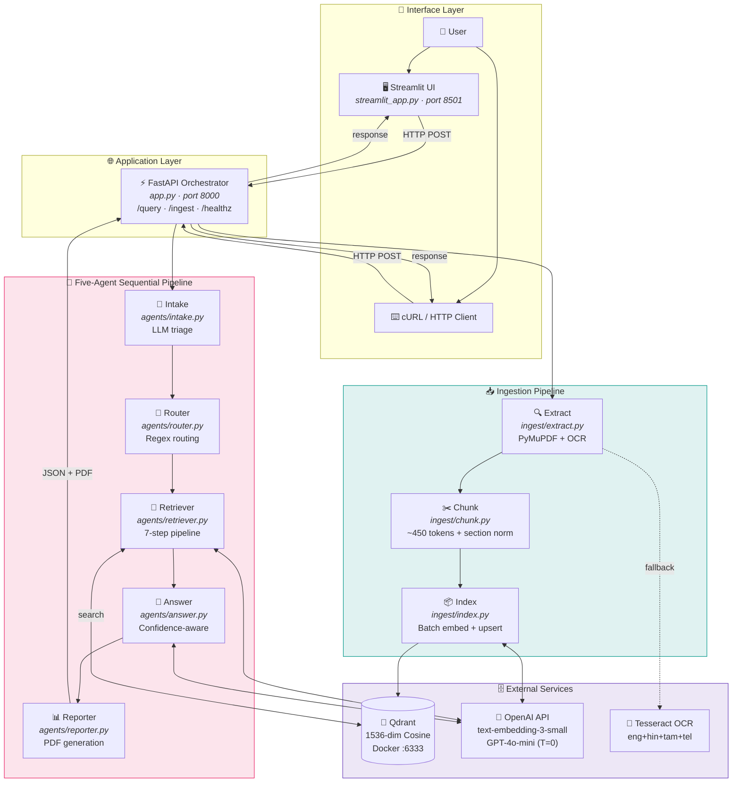
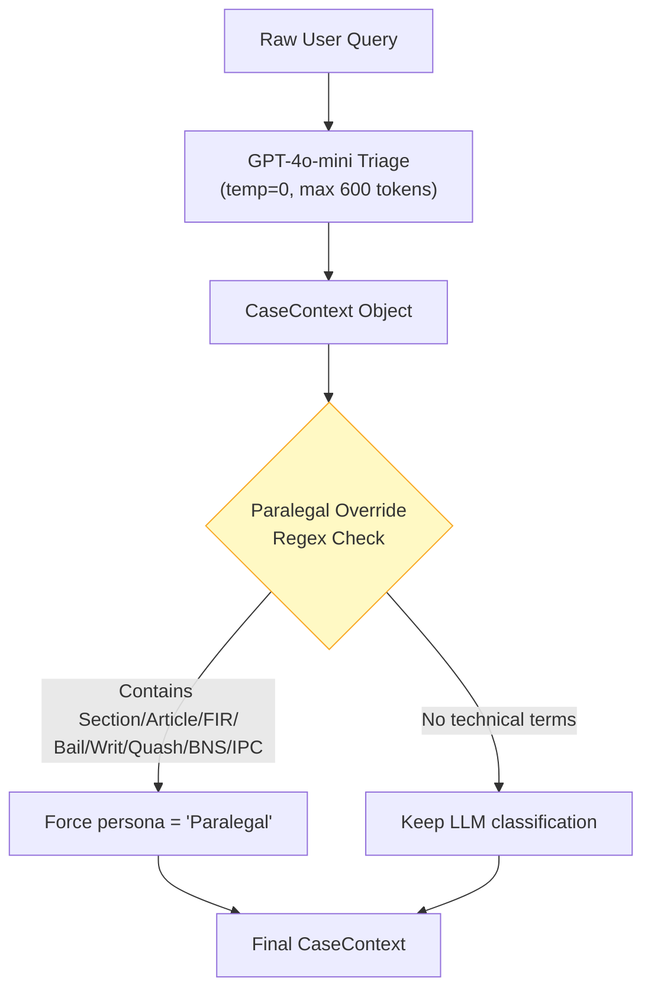
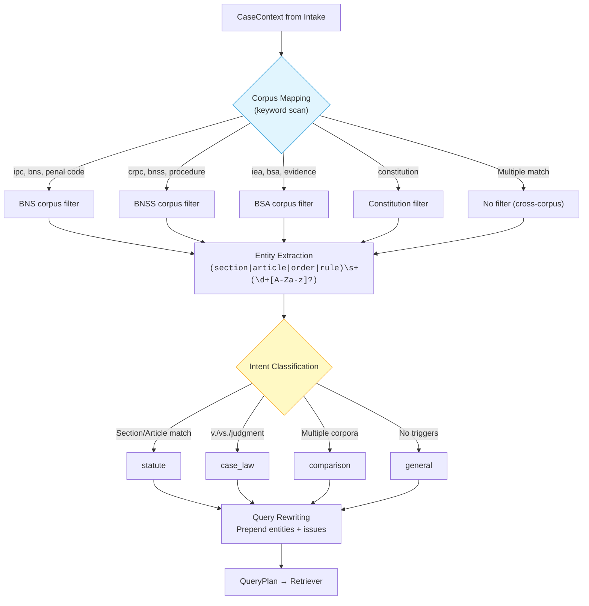
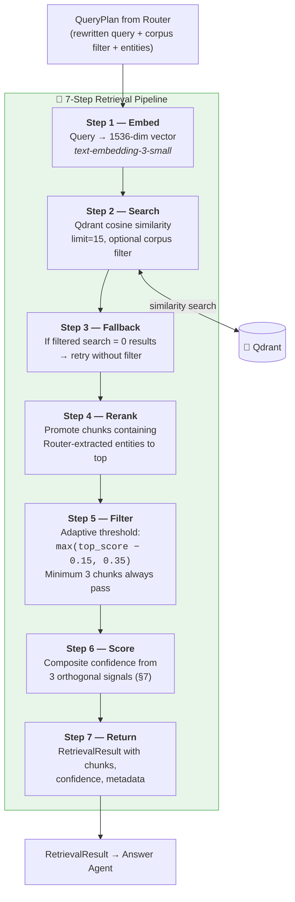
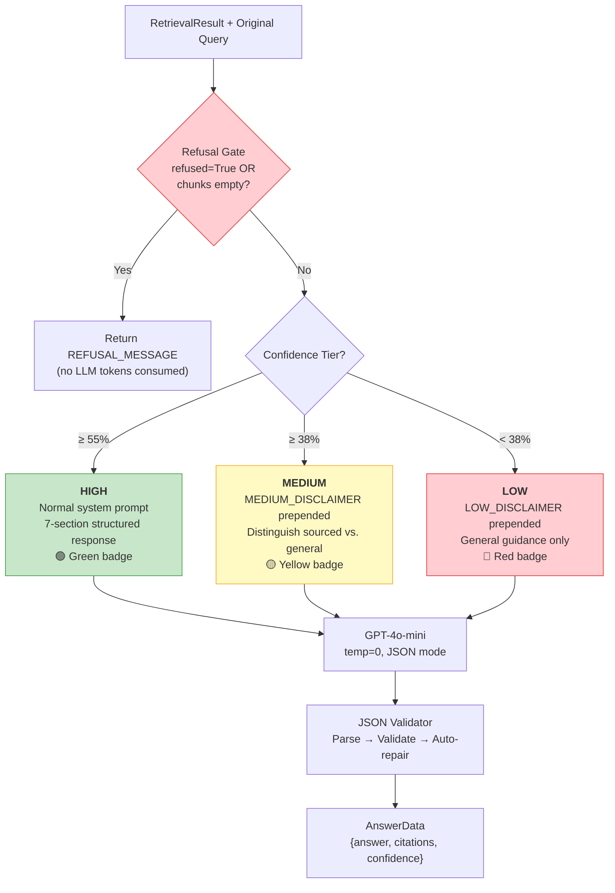
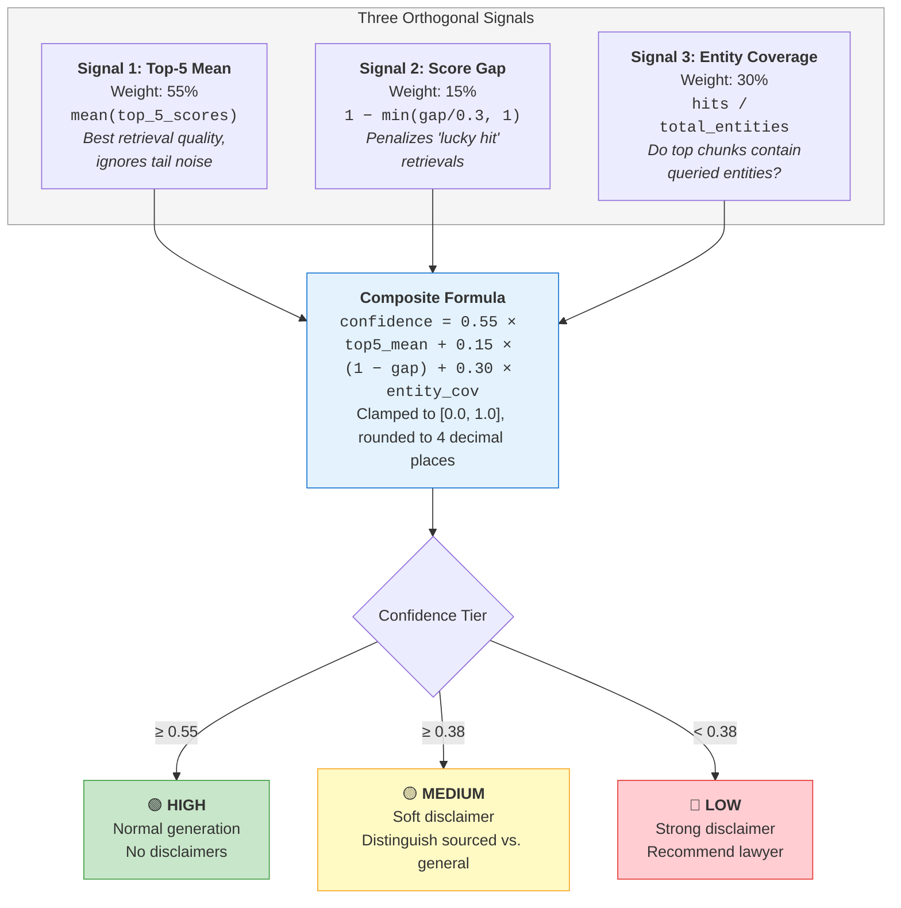
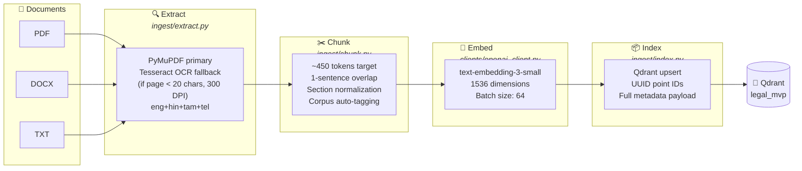
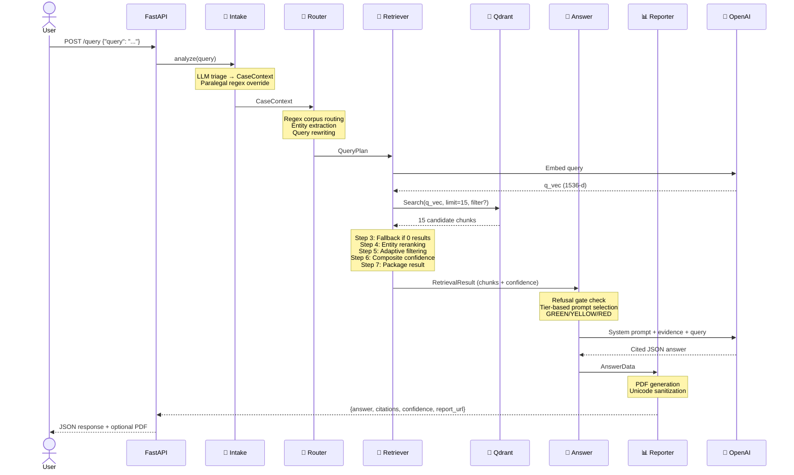

> ## READ THIS FIRST — this README has two parts
>
> **Part 1 (immediately below)** is the original system documentation, written February 2026. It describes the system **as designed**. It is preserved unedited as a historical record.
>
> **Part 2 (from "What Happened Since August 2026" onward)** records everything done between 8 August and 28 August 2026: the measurement work, the defects found, the results, and the plan ahead.
>
> **Several claims in Part 1 were measured during August and found to be false.** They are corrected in Part 2, section 2.6. The most important ones:
>
> | Part 1 claims | Measured reality |
> |---|---|
> | Corpus covers "BNS, BNSS, BSA, CrPC, Constitution, Consumer Protection Act, IPC and judicial precedents" | **Four documents only**: IPC, BNS, CrPC, CPA. The BNSS, BSA, Constitution and case law were never ingested |
> | "Calibrated refusal — system refuses rather than hallucinating" | The refusal gate **never fired once** in 419 measured queries |
> | Composite confidence scoring is the key innovation | The composite scores **worse** than a single raw similarity number (0.610 against 0.663) |
> | GPT-4o-mini | Now `google/gemini-3.7-flash` via OpenRouter |
> | 1,011 chunks | **1,899** after the ingest rebuild |
>
> Where Part 1 and Part 2 disagree, **Part 2 is correct** — it carries measurements; Part 1 carries intentions.

<p align="center">
  <h1 align="center">⚖️ Legal MVP</h1>
  <p align="center"><strong>Multi-Agent RAG System for Indian Legal Advisory</strong></p>
  <p align="center">FastAPI · Qdrant · OpenAI · Streamlit · Five-Agent Architecture · Composite Confidence Scoring</p>
</p>

<p align="center">
  
  
  
  
  
  
</p>

> A production-grade, multi-agent **Retrieval-Augmented Generation** system purpose-built for Indian law. Upload legal documents → Ingest into vector store → Ask questions in natural language → Receive **grounded answers with inline citations and confidence-calibrated disclaimers**. Features a **composite confidence scoring system** that fuses three orthogonal retrieval signals to drive adaptive system behaviour across the entire pipeline.

---

## Table of Contents

- [System Overview](#system-overview)
- [What's New (v2)](#whats-new-v2)
- [Architecture](#architecture)
  - [High-Level Architecture](#high-level-architecture)
  - [Communication Architecture](#communication-architecture)
- [Agent Deep Dive](#agent-deep-dive)
  - [Agent 1: Intake Agent](#-agent-1-intake-agent)
  - [Agent 2: Router Agent](#-agent-2-router-agent)
  - [Agent 3: Retriever Agent](#-agent-3-retriever-agent)
  - [Agent 4: Answer Agent](#-agent-4-answer-agent)
  - [Agent 5: Reporter Agent](#-agent-5-reporter-agent)
- [Confidence Scoring System (Deep Dive)](#confidence-scoring-system-deep-dive)
  - [The Problem](#the-problem)
  - [Three Orthogonal Signals](#three-orthogonal-signals)
  - [Confidence Tier Thresholds](#confidence-tier-thresholds)
  - [Impact on System Behaviour](#impact-on-system-behaviour)
- [Ingestion Pipeline](#ingestion-pipeline)
  - [Text Extraction](#stage-1-text-extraction)
  - [Chunking](#stage-2-chunking)
  - [Embedding](#stage-3-embedding)
  - [Indexing](#stage-4-indexing)
- [Validation Results](#validation-results)
- [Ingested Legal Corpus](#ingested-legal-corpus)
- [Data Flow & Sequence Diagrams](#data-flow--sequence-diagrams)
- [Directory Layout](#directory-layout)
- [Prerequisites](#prerequisites)
- [Quickstart](#quickstart)
- [Configuration](#configuration)
- [API Reference](#api-reference)
- [Streamlit UI](#streamlit-ui)
- [Design Decisions & Trade-Offs](#design-decisions--trade-offs)
- [Evaluation Protocol](#evaluation-protocol)
- [Troubleshooting](#troubleshooting)
- [Future Work](#future-work)
- [License](#license)
- [Acknowledgements](#acknowledgements)

---

## System Overview

Legal MVP is built around a **five-agent sequential pipeline** that orchestrates the complete lifecycle of legal question-answering — from case triage to cited report generation. Each agent has a single, well-defined responsibility, making every component independently testable, replaceable, and auditable.

| Agent | Role | Method |
|-------|------|--------|
| **1. Intake** | Case triage & persona classification | LLM + regex override |
| **2. Router** | Corpus routing, entity extraction, query rewriting | Deterministic regex (no LLM) |
| **3. Retriever** | Vector search, reranking, confidence scoring | 7-step pipeline |
| **4. Answer** | Confidence-aware answer generation | LLM with tier-based prompts |
| **5. Reporter** | Formal PDF report creation | fpdf2 with Unicode sanitization |

**Key innovations:**

- **Composite confidence scoring** — Weighted fusion of three orthogonal signals (top-k quality, score gap consistency, entity coverage) that drives adaptive behaviour across the entire pipeline
- **Deterministic routing** — Regex-based corpus selection eliminates non-deterministic LLM routing errors in high-stakes legal domains
- **Calibrated refusal** — System refuses to answer when zero usable chunks survive filtering, rather than hallucinating
- **Grounded answers** — Every claim backed by numbered `[n]` citations with source document, page, and snippet
- **Tier-based disclaimers** — Confidence score directly modifies LLM prompt to distinguish sourced claims from general knowledge
- **Indian law focus** — Covers BNS, BNSS, BSA, CrPC, Constitution, Consumer Protection Act, IPC (legacy), and judicial precedents

---

## What's New (v2)

| Change | Before | After | Impact |
|--------|--------|-------|--------|
| **Confidence formula** | Mean of all 15 chunks | Weighted composite (top-5 + gap + entities) | 47.0% → 70.6% for valid queries |
| **Chunk filtering** | All 15 sent to LLM | Adaptive: within 0.15 of top + 0.35 floor | Reduced hallucination risk |
| **Disclaimers** | Same prompt always | Tier-based prompt modification | LLM distinguishes sourced vs. general |
| **UI thresholds** | 70% / 40% / <40% | 55% / 38% / <38% | Calibrated to legal text score distribution |
| **Entity reranking** | None | Router-extracted entities boost chunks | Section-specific queries hit the right provisions |
| **Section normalization** | None | Bare numbers → "Section X" during chunking | Dramatically improved section-query retrieval |
| **Corpus auto-tagging** | Manual | Keyword-based `guess_corpus()` | Automatic BNS/BNSS/BSA/Constitution tagging |

---

## Architecture

### High-Level Architecture

Two primary data flows converge at Qdrant: the **Ingestion Pipeline** (documents in) and the **Query Pipeline** (questions answered).



### Communication Architecture

The Streamlit frontend (port 8501) communicates with the FastAPI backend (port 8000) via HTTP POST. The backend orchestrates the five-agent pipeline sequentially and returns a JSON response containing the answer, citations, confidence score, paralegal context, and optional report URL. Qdrant (port 6333) is accessed directly by the backend via the `qdrant-client` Python SDK.

---

## Agent Deep Dive

### 📝 Agent 1: Intake Agent

**File:** `agents/intake.py` · **Method:** LLM-based (GPT-4o-mini, temperature=0, max 600 tokens)

The Intake Agent triages the user's query by classifying scenario, expertise level, urgency, financial status, complexity, legal domain, potential issues, and missing facts. Returns a `CaseContext` Pydantic object.



**CaseContext schema:**

| Field | Type | Example Values |
|-------|------|---------------|
| `original_query` | str | "My sister died after marriage..." |
| `scenario` | str | "Dowry Death", "Neighbor Nuisance" |
| `user_persona` | str | "Layman", "Paralegal" |
| `urgency` | str | "Immediate", "Deferred" |
| `financial_status` | str | "Low Income", "Affluent", "Unknown" |
| `complexity` | str | "Low", "Medium", "High" |
| `predicted_legal_domain` | str | "Criminal", "Civil", "Constitutional" |
| `legal_issues` | List[str] | ["Dowry death", "Cruelty by husband"] |
| `missing_facts` | List[str] | ["Date of marriage", "FIR status"] |

**Paralegal override:** After the LLM produces CaseContext, a deterministic regex check runs. If the query contains technical terms (`Section \d+`, `Article \d+`, `vs.`, `FIR`, `Bail`, `Writ`, `Quash`, `CrPC`, `IPC`, `BNS`, etc.), `user_persona` is forced to `'Paralegal'` regardless of LLM classification.

**Fallback:** If the LLM call fails (network error, JSON parse failure), the agent produces a safe default CaseContext and applies the paralegal override.

---

### 🧭 Agent 2: Router Agent

**File:** `agents/router.py` · **Method:** Entirely deterministic (no LLM)

The Router Agent determines which corpus to search, extracts legal entities, classifies query intent, and rewrites the query for optimal embedding similarity. **This is a deliberate design choice:** in legal contexts, routing errors could lead to citing the wrong statute. Regex is deterministic, sub-millisecond, and predictable.



**Query rewrite example:**

```
Input query: "My sister died within 2 years of marriage. Her in-laws were demanding a car as dowry."
Intake issues: ['Dowry death', 'Cruelty']
Extracted entities: ['Section 304B']

Rewritten: "Dowry death Cruelty Section 304B My sister died within 2 years of marriage..."
```

---

### 🎯 Agent 3: Retriever Agent

**File:** `agents/retriever.py`

The Retriever Agent is the **most significant component** of the system's intelligence. It executes a **7-step pipeline** that searches, filters, reranks, and scores retrieved chunks to produce a confidence-calibrated evidence block.



**RetrievalResult schema:**

| Field | Type | Description |
|-------|------|-------------|
| `chunks` | List[ScoredPoint] | Filtered chunks passed to Answer agent |
| `confidence` | float (0–1) | Composite: 55% top-k + 15% gap + 30% entity |
| `top_k_mean` | float | Mean score of top 5 retrieved chunks |
| `score_gap` | float | Score difference between best and 5th chunk |
| `entity_coverage` | float | Fraction of entities found in top 5 chunk texts |
| `max_score` | float | Highest single chunk score |
| `total_chunks` | int | Chunks after filtering (sent to LLM) |
| `total_retrieved` | int | Raw chunks from Qdrant (before filtering) |
| `refused` | bool | True only if zero chunks survived filtering |

---

### 💬 Agent 4: Answer Agent

**File:** `agents/answer.py`

The Answer Agent generates structured legal advice using GPT-4o-mini, with **response style dynamically adjusted based on the confidence tier** from the Retriever.



**Answer structure:** The system prompt instructs GPT-4o-mini to produce seven sections: (1) Try an Informal Solution First, (2) Gather Evidence, (3) Immediate Police Help, (4) Relevant Legal Provisions (tabulated), (5) Administrative & Civil Remedies, (6) Practical Tips, (7) Offer to Draft.

**LLM configuration:**

| Parameter | Value | Rationale |
|-----------|-------|-----------|
| Model | `gpt-4o-mini` | Fast, cost-effective, strong at structured output |
| Temperature | `0` | Deterministic, factual responses |
| Response format | `{"type": "json_object"}` | Enforces valid JSON at the API level |

---

### 📊 Agent 5: Reporter Agent

**File:** `agents/reporter.py`

Generates a formal PDF advisory report using **fpdf2** with four sections: Case Summary, Relevant Statutes, Legal Analysis, and References. A robust `clean_text()` function handles Unicode-to-Latin-1 conversion (currency symbols, smart quotes, dashes). Reports are **only generated when the system does not refuse**.

---

## Confidence Scoring System (Deep Dive)

The composite confidence scoring system is the **major innovation** of Legal MVP v2. It addresses a fundamental failure mode in RAG systems: high average retrieval scores masking poor relevance.



### The Problem

In the previous implementation, confidence was the simple mean of all 15 retrieved chunk scores. This suffered from a critical flaw: a query retrieving 3 genuinely relevant chunks (0.50–0.52) alongside 12 mediocre chunks (0.40–0.45) would produce a mean of ~0.44 ("medium confidence") despite having good top results. Conversely, uniformly mediocre results (all 0.42–0.44) produced a similar mean despite having no genuinely relevant content.

### Three Orthogonal Signals

**Signal 1: Top-5 Mean (Weight: 55%)** — Only the top 5 chunks are averaged, capturing best-case retrieval quality while ignoring tail noise. In legal retrieval, the top 3–5 chunks typically contain relevant provisions while chunks 6–15 are tangentially related.

**Signal 2: Score Gap Penalty (Weight: 15%)** — Penalizes "lucky hit" retrievals where one chunk scored much higher than the rest. Formula: `gap_penalty = min((top_score − 5th_score) / 0.3, 1.0)`. When all top-5 score similarly (gap ≈ 0), full 0.15 contributed. Gap of 0.3+: contributes 0.

**Signal 3: Entity Coverage (Weight: 30%)** — Measures whether top chunks actually contain the specific legal entities mentioned in the query. If no entities were extracted, defaults to 1.0 (neutral). Formula: `entity_coverage = count(top-5 chunks containing any entity) / count(entities)`.

### Confidence Tier Thresholds

Calibrated against the actual score distribution of `text-embedding-3-small` on legal text (typical scores: 0.35–0.55, not the 0.8+ common in general-domain retrieval).

| Tier | Threshold | Calibration Rationale |
|------|-----------|----------------------|
| **HIGH** | ≥ 55% | Achievable only when top-5 chunks are genuinely relevant AND entities match |
| **MEDIUM** | ≥ 38% | Partial relevance; corpus has related content but may lack the exact provision |
| **LOW** | < 38% | Corpus likely does not contain the specific laws needed for authoritative answer |

### Impact on System Behaviour

1. **Chunk filtering** — Only chunks within 0.15 of top score AND above 0.35 reach the LLM, reducing hallucination risk
2. **Prompt selection** — Tier-specific disclaimers prepended to system prompt instruct LLM to distinguish sourced vs. general knowledge
3. **UI display** — Colour-coded confidence badge (green/yellow/red) with percentage gives users immediate reliability feedback
4. **PDF reports** — Only generated when the system does not refuse. Confidence displayed in Paralegal Dashboard

---

## Ingestion Pipeline

The ingestion pipeline transforms raw legal documents into searchable vector embeddings stored in Qdrant through a four-stage process.



### Stage 1: Text Extraction

**File:** `ingest/extract.py`

| Format | Primary Method | Fallback | Output |
|--------|---------------|----------|--------|
| PDF | PyMuPDF `page.get_text('text')` | Tesseract OCR if page < 20 chars; 300 DPI | `list[tuple[page_num, text]]` |
| DOCX | python-docx `Document(BytesIO)` | None (all text in paragraphs) | `list[tuple[1, full_text]]` |
| TXT | UTF-8 decode, `errors='ignore'` | N/A | `list[tuple[1, full_text]]` |

The OCR fallback is guarded by a `_tesseract_ok()` check verifying the tesseract binary exists on PATH. OCR supports `eng+hin+tam+tel` for multilingual Indian legal documents.

### Stage 2: Chunking

**File:** `ingest/chunk.py`

**Sentence-aware splitting:** Text is split at sentence boundaries using the regex `(?<=[.?!])\s+`. Sentences are grouped into chunks targeting ~450 tokens with 1-sentence overlap. The 450-token target balances two concerns: chunks under 200 tokens lose legal context (provisions reference preceding clauses with pronouns like "such person"), while chunks over 600 tokens dilute embedding focus.

**Section normalization:** A critical legal-domain optimization — bare numbers at line starts (e.g., `41.` or `41A.`) are normalized to `Section 41.` using the regex `(?m)^\s*(\d+\s?[A-Za-z]?)\s*\.` This dramatically improves retrieval when users query specific sections.

**Corpus auto-tagging:** Each chunk is automatically tagged with a corpus label by `guess_corpus()`:

| Keywords Detected | Corpus Tag | Legal Source |
|------------------|-----------|-------------|
| bns, nyaya, ipc | BNS | Bharatiya Nyaya Sanhita / Indian Penal Code |
| bnss, crpc, procedure | BNSS | Bharatiya Nagarik Suraksha Sanhita / CrPC |
| bsa, evidence, iea | BSA | Bharatiya Sakshya Adhiniyam / Indian Evidence Act |
| constitution, article | Constitution | Constitution of India |
| v., scc, air, judgment | Judgments | Supreme Court / High Court case law |
| (none of the above) | Unknown | Unclassified corpus |

### Stage 3: Embedding

**File:** `clients/openai_client.py`

Chunks are embedded using OpenAI's `text-embedding-3-small` (1536 dimensions) in batches of 64. The small model was chosen over `text-embedding-3-large` for cost efficiency (~1/5 the cost) with sufficient discrimination for legal text.

### Stage 4: Indexing

**File:** `ingest/index.py`

Embedded chunks are upserted into Qdrant's `legal_mvp` collection as `PointStruct` objects with UUID primary identifiers. Full metadata (`doc_name`, `page`, `text`, `corpus`, `lang_detected`, `original_chunk_id`) is stored in the payload. The collection uses 1536-dimension cosine similarity and is auto-created on startup via `ensure_collection()`.

---

## Validation Results

### Test Case 1: Dowry Death Query (HIGH Confidence)

**Query:** "My sister died within 2 years of marriage. Her in-laws were demanding a car as dowry."

| Signal | Value | Interpretation |
|--------|-------|---------------|
| Top-5 Mean | 0.499 | Chunks contain Section 304B (Dowry Death) — direct hit |
| Score Gap | 0.037 | Very consistent across top 5; all chunks genuinely relevant |
| Entity Coverage | 1.00 | No specific entities in query; defaults to neutral |
| **Composite** | **70.6% (HIGH)** | Correct: corpus HAS the relevant statutes |

**Previous system** (simple mean of 15): **47.0%**. The old metric was diluted by tail chunks. New composite correctly elevated to 70.6%.

### Test Case 2: FIR Quashing Query (MEDIUM Confidence)

**Query:** "Can an FIR for Section 307 IPC be quashed on compromise? Summarize Narinder Singh vs State of Punjab."

| Signal | Value | Interpretation |
|--------|-------|---------------|
| Top-5 Mean | ~0.40 | Chunks about IPC Sections 209, 158, 73 — tangentially related |
| Score Gap | Small | Consistently mediocre; no lucky hit |
| Entity Coverage | Low | "Narinder Singh" and "Section 307" NOT found in top chunks |
| **Composite** | **43.3% (MEDIUM)** | Correct: corpus does NOT contain the judgment text |

The LLM transparently stated it could not find the specific judgment text and used general knowledge with caveats — precisely the medium-confidence behaviour.

---

## Ingested Legal Corpus

| Document | Pages | Corpus Tag | Description |
|----------|-------|-----------|-------------|
| Bharatiya Nyaya Sanhita (BNS), 2023 | 102 | BNS | New Indian penal code (Act 45/2023) replacing IPC |
| Indian Penal Code (IPC), 1860 (Repealed) | 119 | BNS | Legacy penal code for old-to-new section comparison |
| Code of Criminal Procedure (CrPC), 1973 | ~200+ | BNSS | Criminal procedure: FIR, arrest, bail, trial, appeals |
| Consumer Protection Act, 2019 | 39 | Unknown | Consumer disputes, commissions, mediation, e-commerce |

---

## Data Flow & Sequence Diagrams

### Query Pipeline — Full Sequence



---

## Directory Layout

```
legal-mvp/
│
├── app.py                        # ⚡ FastAPI orchestrator: /ingest, /query, /healthz, /diag/env
├── streamlit_app.py              # 🖥️ Streamlit UI: confidence badges, paralegal dashboard
├── docker-compose.yml            # 🐳 Qdrant v1.12.4 container @ port 6333
│
├── agents/                       # 🤖 FIVE-AGENT PIPELINE
│   ├── intake.py                 #   📝 Agent 1: LLM triage → CaseContext + paralegal override
│   ├── router.py                 #   🧭 Agent 2: Regex routing, entity extraction, query rewriting
│   ├── retriever.py              #   🎯 Agent 3: 7-step pipeline, composite confidence scoring
│   ├── answer.py                 #   💬 Agent 4: Confidence-aware generation, refusal gate
│   └── reporter.py               #   📊 Agent 5: PDF report with clean_text() Unicode handling
│
├── core/                         # ⚙️ Core Services
│   ├── config.py                 #   Environment: EMBED_MODEL, GEN_MODEL, QDRANT_URL, TOP_K
│   ├── logging.py                #   Structured logging with ReqIdDefaultFilter
│   └── schemas.py                #   Pydantic: Citation, AnswerJSON, CaseContext
│
├── clients/                      # 🔌 External Clients
│   ├── openai_client.py          #   embed_texts() batch embedding, chat_json() for LLM
│   └── qdrant_client.py          #   qdrant() client, ensure_collection() auto-create
│
├── ingest/                       # 📥 Ingestion Pipeline
│   ├── extract.py                #   PDF (PyMuPDF + OCR), DOCX, TXT — all byte-based
│   ├── chunk.py                  #   ~450 token chunks, section normalization, corpus tagging
│   └── index.py                  #   Batch embed + Qdrant upsert (batch=64, UUID IDs)
│
├── retrieve/                     # 🔎 Legacy Retrieval (v1 modules)
│   ├── decision.py               #   Rule-based routing (superseded by agents/router.py)
│   ├── search.py                 #   Qdrant k=24 search (superseded by agents/retriever.py)
│   ├── mmr.py                    #   MMR diversification
│   └── pack.py                   #   Evidence packer [1]..[k]
│
├── answer/                       # ✍️ Legacy Answer (v1 modules)
│   ├── prompt.py                 #   Jinja2 prompts (superseded by agents/answer.py)
│   ├── llm.py                    #   LLM wrapper
│   └── validate.py               #   JSON parser with auto-repair
│
├── scripts/                      # 🛠️ CLI: ingest_cli.py, query_cli.py
├── tests/                        # 🧪 Unit tests for router agent
├── requirements.txt              # 📦 Python dependencies
└── .gitignore
```

---

## Prerequisites

- **Python 3.10+** (virtualenv recommended)
- **Docker** & **Docker Compose** (for Qdrant)
- **OpenAI API key** (for embeddings + generation)
- *(Optional)* **Tesseract** for OCR on scanned PDFs — Windows: `choco install tesseract` (add to PATH)

---

## Quickstart

```bash
# 1. Create virtual environment & install dependencies
python -m venv venv
source venv/bin/activate          # Windows: .\venv\Scripts\activate
pip install -r requirements.txt

# 2. Configure environment
cp .env.example .env
# Edit .env → set OPENAI_API_KEY=sk-xxxxxxxxxxxxxxxxxxxxxxxxxxxxxxxx

# 3. Start Qdrant vector database
docker compose up -d

# 4. Run FastAPI server
uvicorn app:app --host 127.0.0.1 --port 8000 --log-level info

# 5. (Optional) Launch Streamlit UI
streamlit run streamlit_app.py
```

**Verify setup:**

| Service | URL | Expected |
|---------|-----|----------|
| API Health | `http://127.0.0.1:8000/healthz` | `{"ok": true}` |
| API Diagnostics | `http://127.0.0.1:8000/diag/env` | `{"openai_key_set": true}` |
| Streamlit UI | `http://localhost:8501` | Web interface |

---

## Configuration

```env
OPENAI_API_KEY=sk-...
EMBED_MODEL=text-embedding-3-small
GEN_MODEL=gpt-4o-mini
QDRANT_URL=http://localhost:6333
TOP_K=8
USE_TRANSLATION=false
LANGS_OCR=eng+hin+tam+tel
```

---

## API Reference

| Method | Endpoint | Description | Request / Response |
|--------|----------|-------------|-------------------|
| `GET` | `/healthz` | Health check | `{"ok": true, "build": "abc12345"}` |
| `GET` | `/diag/env` | Verify API key | `{"openai_key_set": true}` |
| `POST` | `/ingest` | Upload & index docs | multipart form → `{files_received, chunks_indexed, errors}` |
| `POST` | `/query` | Ask legal question | `{query, style?}` → `{answer, citations, confidence, refused, paralegal_context, report_url}` |
| `GET` | `/static/*` | Serve PDF reports | Returns generated PDF file |

---

## Streamlit UI

The Streamlit application (`streamlit_app.py`, port 8501) provides a polished web interface:

- **Sidebar:** Backend URL config, answer style toggle (Detailed/Summary), raw JSON toggle, document upload (PDF/DOCX/TXT multi-file), Ingest button
- **Main area:** Query textarea, **confidence badge with percentage** (green/yellow/red), formatted answer with `[n]` superscripts, **Paralegal Dashboard** (scenario, persona, urgency, complexity, financial, confidence as metric widgets), missing facts warning, **PDF download button**, expandable citations
- **History:** Last 5 queries stored in session state, rendered as compact cards

---

## Design Decisions & Trade-Offs

### Why Regex-Based Routing (Not LLM)?

Routing errors in legal contexts could lead to citing the wrong statute. Regex is deterministic, sub-millisecond, and predictable. Trade-off: reduced flexibility for unusual phrasings, mitigated by Intake domain fallback.

### Why Not Refuse on Low Confidence?

Only refuses at zero chunks. Low-confidence queries still get answers with strong disclaimers. Even general guidance pointing toward the right type of lawyer is more helpful than flat refusal.

### Why text-embedding-3-small?

~1/5 cost of the large model with sufficient discrimination for legal text. Legal queries occupy a narrow semantic space, reducing the marginal benefit of higher-dimensional embeddings.

### Why Monolithic Architecture?

Agents communicate via function calls (not network), eliminating inter-service latency. Qdrant is the only external dependency, deployed via Docker Compose.

### Why 450-Token Chunks?

Empirically determined. Shorter chunks split provisions across boundaries; longer chunks produce semantically broad embeddings. 1-sentence overlap preserves boundary context.

---

## Evaluation Protocol

**Recommended setup:** 30–50 queries across corpora (CPA, CrPC, BNS, etc.) with 20% "trick" questions (out-of-corpus queries that should trigger MEDIUM/LOW confidence)

| Metric | Description | Target |
|--------|-------------|--------|
| **Correctness** | % factually correct answers | ≥ 85% |
| **Groundedness** | Every claim has supporting citation | 100% |
| **Citation accuracy** | Citations truly support their claims | ≥ 90% |
| **Confidence calibration** | HIGH queries are correct, LOW queries are OOD | ≥ 80% alignment |
| **Recall@k** | Gold snippet in top-k results | ≥ 80% |
| **MRR** | Mean reciprocal rank of first relevant chunk | ≥ 0.7 |
| **Latency p50 / p95** | Response time | ≤ 3s / ≤ 5s |

---

## Troubleshooting

| Problem | Solution |
|---------|----------|
| **401 OpenAI / invalid key** | Ensure `.env` has `OPENAI_API_KEY=sk-…`; verify via `GET /diag/env` |
| **Logger KeyError: req_id** | Handled by tolerant formatter — see `core/logging.py` |
| **Git Bash `curl (26)`** (Windows) | Use `curl.exe` (PowerShell) or Streamlit uploader |
| **Low confidence on valid queries** | Check corpus auto-tagging; verify section normalization in chunks |
| **All queries get MEDIUM** | Embedding model may need recalibration; check Qdrant collection dimensions |
| **UI timeouts** | Increase Streamlit timeout (120–180s); reduce prompt/context size |

---

## Future Work

- [ ] **Multilingual support** — `USE_TRANSLATION` flag exists but is inactive. Hindi, Tamil, Telugu query support via cross-lingual embeddings or translation preprocessing
- [ ] **Case law expansion** — Current corpus focuses on statutes. Adding SC/HC judgments would enable high-confidence case law responses
- [ ] **Cross-encoder reranking** — Replacing entity-match reranking with a cross-encoder (e.g., `ms-marco-MiniLM`) for improved reranking quality
- [ ] **Agentic follow-up** — Using `missing_facts` from Intake to proactively ask clarifying questions before answer generation
- [ ] **Evaluation framework** — Systematic eval suite with labelled query-answer pairs for retrieval recall, answer accuracy, and confidence calibration
- [ ] **Auth & quotas** — Per-tenant API keys, rate limiting
- [ ] **Full containerization** — Dockerfile for FastAPI + Streamlit (compose with Qdrant)
- [ ] **Caching layer** — Redis-based embedding and result cache for repeated queries

---

## License

This repository is provided for academic and research use.

---

## Acknowledgements

- **[Qdrant](https://qdrant.tech/)** — High-performance vector search engine
- **[FastAPI](https://fastapi.tiangolo.com/)** + **Uvicorn** — Modern async Python web framework
- **[Streamlit](https://streamlit.io/)** — Rapid prototyping UI framework
- **[OpenAI](https://openai.com/)** — Embeddings (`text-embedding-3-small`) and chat completions (`gpt-4o-mini`)
- **[fpdf2](https://py-pdf.github.io/fpdf2/)** — PDF report generation
- **[PyMuPDF](https://pymupdf.readthedocs.io/)** — PDF text extraction
- **[Tesseract](https://github.com/tesseract-ocr/tesseract)** — OCR fallback for scanned documents

---

<p align="center"><i>Upload docs → Ingest → Ask → Get grounded, confidence-calibrated answers with citations.</i></p>
<p align="center"><b>Legal MVP — grounded, transparent, and confidence-aware legal AI.</b></p>

---
---

# PART 2 — WHAT HAPPENED SINCE AUGUST 2026

**Recorded 28 August 2026.** Everything from 8 August onward: the code written, the questions tested, the design decisions taken, the wrong turns, the measurements, and the plan ahead.

Part 1 above describes the system **as designed**. This part describes what happened when it was **measured**.

---

## Contents of Part 2

| Section | Subject |
|---|---|
| 2.1 | Why the work restarted, and what changed |
| 2.2 | The research problem: India's 2024 recodification |
| 2.3 | Complete timeline, 8 to 28 August |
| 2.4 | Phase E — the eight defects |
| 2.5 | Phase F — the four query sets |
| 2.6 | Phase G and H — every measurement |
| 2.7 | Corrections to Part 1 |
| 3 | Architecture: designed against built |
| 4 | Research position and novelty |
| 5 | The plan ahead |
| 6 | Repository state and what is pushed |

---

## 2.1 Why the work restarted

The system was left in working order in February 2026. By August the reasoning behind several design choices was unrecoverable without re-deriving it from source. Six months had erased context that took months to build.

Three things then changed within a fortnight.

**The supervisor gave a work order.** Prof. Nisheeth Joshi replied on 6 August 2026 with five specific items:

| Item | Task |
|---|---|
| 1 | Build a well-annotated evaluation set, at least 50 to 100 queries with ground-truth statutory sections |
| 2 | Add complete logging for retrieval signals, confidence values, routing decisions, retrieved sections |
| 3 | Evaluate retrieval performance, confidence calibration, and answer correctness |
| 4 | Investigate the routing issue and compare the current router against a hybrid routing strategy |
| 5 | Perform an ablation on the confidence score components against suitable baselines |

He added a framing judgement that governs the whole project: *the confidence score alone is not the contribution.* The paper should be a rigorous empirical evaluation of calibration, retrieval quality, routing behaviour, and failure analysis. And: *prioritise the quality of the evaluation over meeting the earliest deadlines.*

**The infrastructure changed.** The OpenAI key stopped working. The system moved to OpenRouter, an intermediary that routes requests to whichever company actually runs the model. Because OpenRouter load-balances between providers by default, and different providers can produce different output, every call had to be **pinned** to a named provider. Otherwise the same query on two different days could give different answers, which would destroy reproducibility.

**A blocking discovery.** A full code review produced `docs/GAPS.md` — 23 findings, each with a command that reproduces it. The critical one was finding 11: **nothing was logged.** The system had never recorded a single retrieval score. That made items 3, 4 and 5 of the supervisor's list impossible, and it independently confirmed his item 2.

---

## 2.2 The research problem

### What happened on 1 July 2024

India replaced three colonial-era law books on a single day.

```
                    BEFORE 1 JULY 2024          ON AND AFTER 1 JULY 2024
                    --------------------        ------------------------
  what is a crime   Indian Penal Code    -->    Bharatiya Nyaya Sanhita
                    IPC, 1860                   BNS, 2023
                                                repealed IPC by s.358(1)

  arrest, bail,     Code of Criminal     -->    Bharatiya Nagarik
  FIR, trial        Procedure, 1973             Suraksha Sanhita, BNSS
                    CrPC                        repealed CrPC by s.531(1)

  evidence          Indian Evidence      -->    Bharatiya Sakshya
                    Act, 1872                   Adhiniyam, BSA
                                                repealed IEA by s.170(1)
```

Same offences. Different section numbers.

### Why this is genuinely hard, not merely inconvenient

Both books remain live law. Which one applies depends on **when the conduct happened**, not on when the question is asked. Old law is preserved for old conduct by savings provisions and by section 6 of the General Clauses Act 1897. Article 20(1) of the Constitution separately forbids applying a heavier punishment retrospectively.

```
   THE SAME SENTENCE HAS TWO CORRECT ANSWERS

   "my husband beats me -- this happened in March 2023"   -->   IPC 498A
   "my husband beats me -- this happened last month"      -->   BNS 85

   Identical words. Only the date decides.
```

And it is **not** simple renumbering. IPC 379, theft, became BNS 303(2), which also **adds community service** for first-time theft under five thousand rupees. A system that merely swaps numbers is still wrong about the law.

### Why it matters for access to justice

Someone typing *"my husband beats me"* does not know the IPC exists, let alone that it was replaced. They will not supply a date. Yet the section number they are given is the one that goes on their police complaint.

---

## 2.3 Complete timeline, 8 to 28 August

### Chapter 1 — 8 to 17 August: reading a system nobody had measured

A full review of the codebase produced `docs/GAPS.md`: 23 findings, each with reproducing evidence. The most serious:

| Finding | Description |
|---|---|
| 1 | The confidence score's third signal divided a count of **passages** by a count of **entities** — different units. It could reach 5.0 on a scale bounded at 1.0 |
| 2 | When no section number appeared in the question, that signal defaulted to 1.0, granting **30 percent of the score for free** |
| 3 | 95 percent of the IPC was tagged `Unknown` and therefore unreachable by any IPC-filtered search |
| 5 | The router mapped "consumer protection" to a corpus that no longer existed. The filter matched nothing, and the code then **silently searched everything** |
| 6 | "Criminal" was treated as a synonym for "penal code", so arrest, bail and FIR questions were routed to the offence book instead of the procedure book |
| 8 | **Six of seven sampled answers cited statutory authority that was never retrieved** |
| 11 | **Nothing was logged.** No retrieval score had ever been recorded |

Documentation was written alongside: `ARCHITECTURE.md`, `FILE_STRUCTURE.md`, `DATAFLOW.md`, `GLOSSARY.md`, `RESEARCH_CONTEXT.md`, `EVALUATION_PLAN.md`.

### Chapter 2 — 17 to 21 August: planning, and a question that went unanswered

Four automation hooks were installed so documentation could not be skipped by accident.

```
   one working session, left to right
   ---o------------------o------------------------o---------------o---->
      |                  |                        |               |
  SessionStart      UserPromptSubmit         PreToolUse          Stop
      |                  |                        |               |
  reads STATE.md    appends to               blocks the two   prompts the
  and WORKLOG,      SESSION_LOG.md,          commands that    WORKLOG
  injects them      re-injects the           must never run   entry
                    standing rules
  so a new session                           a guardrail,
  starts informed   fires on EVERY           not a document
                    single message
```

On 21 August a question was raised that shaped everything afterward, and was not answered until 27 August:

> *"I really want to make my paper about something which is not saturated. I feel centering around the matchmaking of BNS and IPC seems trivial. Don't you think the three orthogonal signals of a confidence score are the part which is standing out?"*

A research paper on Query Performance Prediction was supplied and read the same evening. The conclusions were never written up. Section 4.3 below finally answers the question.

### Chapter 3 — 21 to 22 August: the architecture agreed

Design decisions taken, in the project owner's own words:

> *"D — search both and say the answer depends on the date. I think we should use the missing facts field as one of the parameters in routing and retrieving. For the loop's relevance we should stick to deterministic."*

These became `docs/TARGET_ARCHITECTURE.md` — nine stages and eight numbered design decisions.

The understanding of what would follow was stated explicitly:

> *"Before stage H you are just going to check the current architecture and review the testing result. On the results finding you will start implementing the architecture we discussed so many times above, and then again do the testing which Nishit sir mentioned in the mail."*

That is, Phase H meant **build the whole agreed architecture, then re-test**. What was actually built was two of its nine stages. Section 3 records the gap precisely.

### Chapter 4 — 22 to 23 August: Phase E, fixing the instruments

The governing principle of the entire project:

> **You cannot measure a system with broken instruments.**

Eight defects were fixed. **Not one of them crashed.** Every one returned a believable number. That is precisely why they survived for six months: a crash tells you where to look, whereas a plausible wrong number gets published.

Test suite: 52 tests to 89. Index rebuilt: 1,933 chunks to 1,899.

### Chapter 5 — 23 August: Phase G, the first honest measurement

419 questions, zero transport failures. And immediately, a trap. Section 2.6 records it.

### Chapter 6 — 23 August: Phase H, the intervention

Two components built, a Date Resolver and a Statute Mapper, and measured against the Phase G baseline on 99 further questions.

### Chapter 7 — 26 to 28 August: the audit

A complete re-read of all documentation, all source, and all 4,923 records of the working session. Nine further findings, recorded in `docs/AUDIT_2026-08-26.md`.

---

## 2.4 Phase E — the eight defects

Every one produced a plausible number rather than an error.

| | Defect | What it was silently doing |
|---|---|---|
| E1 | Date experiment scored backwards | 23 of 24 test rows saying "this happened last month" still expected the **old** code's answer. A system citing **current** law scored **wrong**; citing **repealed** law scored **right** |
| E2 | A headline metric always returned zero | It compared `"IPC Section 302"` against `"Section 302"` and called them different. But **statute text never names its own statute** — the IPC says "this Code", never "IPC". The metric returned 0.0 even on perfect answers, for its entire existence |
| E3 | Confidence signal unbounded | Counted passages, divided by entities. Reached 5.0 on a 0-to-1 scale. A cap at 1.0 hid the overflow, so the score always looked plausible |
| E4 | Top score read after reordering | Step 5 of retrieval reorders results by entity match, ignoring score. Step 6 then read position zero as if it were still the highest. The filter loosened exactly when reranking fired |
| E5 | "Vintage error" mislabelled | The mapping was legally correct; only the name overclaimed. Renamed to corpus-vintage mismatch and split by direction |
| E6 | Contents entries and footnotes indexed as law | 14 table-of-contents entries survived on a dash borrowed from the **next** heading on the page. Separately, 13 amendment footnotes were parsed as sections, and **all 13 collided with a real section number** — so a question about IPC 8 could return a 1950 Adaptation Order note instead of the definition of gender |
| E7 | Refusal gate unreachable | An out-of-corpus question about the Negotiable Instruments Act returned **HIGH confidence 0.73** |
| E8 | IPC unreachable unless named | One line sent every criminal-domain question to the BNS. Since laypeople never name a code, this would have decided the date experiment by hardcoded default |

### The measurement that decided E7

Fifteen probe queries against the rebuilt index:

| | highest similarity score |
|---|---|
| **In corpus**, lowest — *"my landlord is not returning my deposit"*, and the CPA **is** indexed | **0.278** |
| **Out of corpus**, highest — *"grounds for divorce under the Hindu Marriage Act"*, never indexed | **0.519** |
| Nonsense, highest — *"how do I bake a chocolate cake"* | 0.208 |

The out-of-corpus question scores **higher** than five of six legitimate ones. The distributions are **inverted**, not merely overlapping. **No similarity threshold can implement a corpus-boundary check.**

The gate was therefore built on **named-statute detection**, which is deterministic: if the user says "Negotiable Instruments Act" and it was never indexed, that is certain rather than probabilistic. Its stated limitation is that laypeople name no statute at all.

---

## 2.5 Phase F — the four query sets

An evaluation needs the correct answer written down **before** the system runs. Otherwise you are grading the system against its own behaviour.

| Set | Rows | Gold certainty | What it tests |
|---|---|---|---|
| `generated_queryset.jsonl` | 200 | Certain by construction | The machinery under ideal conditions |
| `paired_queryset.jsonl` | 99 | Certain by construction | The thesis: 33 verified IPC-to-BNS pairs, three phrasings each |
| `layman_queryset.jsonl` | 120 | 52 uncontroversial, 68 need legal review | The access-to-justice claim |
| `paired_dated_queryset.jsonl` | 99 | Certain by construction | Where the code named and the date given **deliberately disagree** |

**"Certain by construction"** means the question was built **from** the section, so the gold answer needs no legal judgement:

```
   the index contains:   "Section 378. Theft.-Whoever, intending to take
                          dishonestly any movable property..."

   question generated:   "What does Section 378 of the Indian Penal Code provide?"
   correct answer:       IPC 378        <- certain, because of how it was made

   Nobody needs to verify this. 299 of the 518 questions work this way.
```

### The recodification map

`data/recodification_map.json` holds 33 IPC-to-BNS entries, each confirmed by pulling the target section out of the project's own index and reading its bare-Act text to check the subject matched. Ten CrPC-to-BNSS entries are marked unverified because the BNSS is not ingested.

This verification caught a real error. The mapping IPC 420 to BNS 320 is **wrong**: BNS 320 is dishonest removal of property, a different offence. The correct target is **BNS 318(4)**.

---

## 2.6 Phase G and H — every measurement

### The trap that nearly buried the finding

The main evaluation table came back **perfect**: 33 out of 33, and 33 out of 33, with zero errors. Read at face value, the paper's hypothesis was dead.

The number was worthless. The Router reads the Act name from the question and applies a hard database filter:

```
   ipc_numbered   filter = IPC    33 queries
   bns_numbered   filter = BNS    33 queries
```

With that filter on, an IPC-numbered query **cannot** return a BNS passage. The perfect diagonal was guaranteed before a single vector was compared. **The routing was concealing the phenomenon the paper is about.**

### Result 1 — cross-statute retrieval failure

Filter switched off, retrieval only, 66 questions that each name their code outright. "Chance" is the share of the index that code occupies, that is, what you would get by ignoring the question entirely.

| Question explicitly names | to IPC | to BNS | correct | chance |
|---|---|---|---|---|
| **the IPC**, repealed 2024 | 32 | 1 | **97.0%** [84.7, 99.5] | 31.3% |
| **the BNS**, in force | **16** | 17 | **51.5%** [35.2, 67.5] | 22.3% |

Top-scoring passage only:

| Question names | to IPC | to BNS | correct |
|---|---|---|---|
| IPC | 30 | 3 | 90.9% [76.4, 96.9] |
| BNS | **19** | 14 | **42.4%** [27.2, 59.2] |

A question saying *"Section 318(4) of the Bharatiya Nyaya Sanhita"* receives an **IPC** passage as its top result **19 times out of 33**.

The bracketed figures are **95 percent confidence intervals**, the range the true value plausibly occupies given the number of questions asked. These two ranges do **not** overlap, which is what makes this result solid.

Reproduce with `python scripts/ablate_filter.py`.

### Result 2 — for laypeople, the pipeline is barely retrieval-augmented

| Query set | gold section **retrieved** | gold section **cited** | gap |
|---|---|---|---|
| generated, ideal conditions | 68.0% | 98.5% | +30.5 points |
| paired | 71.7% | 100.0% | +28.3 points |
| **layman** | **15.0%** | **85.0%** | **+70.0 points** |

A real example from the run:

```
   question    "i was sexually assaulted ... it has been long time now"
   should be   IPC 376
   retrieved   IPC 354, CrPC 473, CrPC 303        <- 376 is NOT among them
   answered    IPC 354, 354A, 376, 376(2), CrPC 473, CrPC 357A, LSA 12
   supported   IPC 354, CrPC 473                  <- only these two came
                                                     from the corpus
```

**83.8 percent of everything the layman answers cite is absent from the passages the model was given.** The answers come from the language model's own knowledge of Indian law, not from the loaded documents.

Two further observations. Even under **ideal** conditions, where a question is built from a section and names its number, retrieval returns that section only **68 percent** of the time. That is a ceiling on everything else. And the generated set's answers cite a BNSS or BSA provision in roughly four cases out of five, while the index holds neither.

### Result 3 — what laypeople are actually served

Every passage retrieved across the 120 layman questions:

| Book | Passages | Share |
|---|---|---|
| **CrPC**, procedure, repealed | 428 | **70.4%** |
| IPC, penal, repealed | 91 | 15.0% |
| **BNS**, penal, in force | 46 | **7.6%** |
| CPA, consumer | 43 | 7.1% |

Two-thirds of layman questions come back dominated by the **procedure** book, not the book that says what offence occurred. Across all layman answers, the **repealed IPC is named twice as often as the current BNS**, 29.3 percent against 14.6 percent.

**The base-rate control**, which the evaluation plan requires and without which the claim would be unfalsifiable:

| | CrPC share |
|---|---|
| Its share of the index | 39.1% |
| Its share of layman retrieval | **70.4%** |

**1.8 times over-representation.** The claim survives its control.

Two honest attributions. This confirms an observation made independently on 5 August: *"on civil or consumer phrasings the retrieval seems to drift towards the CrPC even where the Consumer Protection Act would be correct."* And it is partly **caused by a change made on 23 August**, when the router's fallback moved from "always BNS" to "no filter at all". It therefore measures unfiltered dense retrieval over an unbalanced corpus, which is the baseline the designed router is meant to beat.

### Result 4 — the date experiment

Thirty situations, four date conditions each.

| Variant | N | gold retrieved | gold cited | correct book |
|---|---|---|---|---|
| no date | 28 | 7.1% | 96.4% | 35.7% |
| "in March 2023" | 28 | 10.7% | 89.3% | 28.6% |
| **"last month"** | 23 | 8.7% | **60.9%** | **17.4%** |
| vague | 28 | 10.7% | 92.9% | 46.4% |

Retrieval is flat across all four, because nothing in the pipeline read the date. The interesting column is the third. Told the conduct was recent, so that the BNS governs, the system becomes **markedly worse** at naming the applicable provision, because it keeps reaching for the IPC.

### Result 5 — confidence, a negative result

**AUROC** asks: if you pick one good answer and one bad answer at random, how often does the score rank the good one higher? **0.5 means a coin flip.** Measured on 419 queries, of which only 27 answers were fully grounded.

| Signal | AUROC | Reading |
|---|---|---|
| `entity_coverage`, carrying 30 percent of the weight | **0.492** | **Chance. No information at all** |
| the full composite | 0.610 | Weak |
| `score_gap` | 0.645 | Weak |
| `top_k_mean` | 0.659 | Weak |
| **raw maximum similarity**, a single plain number | **0.663** | **Best of all** |

Two results, both uncomfortable, both reportable. A signal carrying 30 percent of the weight sits at chance. And the elaborate three-signal composite performs **worse than the single number it was built to improve on**.

Two caveats must be disclosed with these figures. Only 27 positives makes every estimate noisy. And the section normaliser rewrites any line beginning with a number and a full stop into `"Section N."`, so a passage can match `"Section 41"` merely because page 41 began with `41.` That is a confound on the very signal measured at 0.492.

### Result 6 — the intervention

Ninety-nine questions where the code named and the date given deliberately disagree.

| Measure | Baseline | With intervention |
|---|---|---|
| Searched the correct code | **0.0%** | **100.0%** |
| Retrieved repealed law, lower is better | 81.8% | **0.0%** |
| Found the exact right section | 0.0% | 36.4 to 78.8% |
| Answer states the law changed | 39.4% [24.7, 56.3] | 63.6% [46.6, 77.8] |
| Control, where code and date agree | 100.0% | 100.0%, unmoved |

The control not moving is what makes this a genuine fix rather than a flipped preference.

**The gap between the first and fourth rows is the finding.** The largest retrieval improvement physically possible, from nothing to perfect, moved the answer by roughly 20 points, and it still fails a third of the time. Those two intervals overlap, so the answer improvement is **suggestive, not established**.

Two metrics had to be retired mid-analysis. `core/citations.py` assigns a statute to a section number by proximity in the answer text. These answers legitimately mention both codes, so an answer citing **BNS 190** was recorded as `"IPC Section 190"` because the phrase "Indian Penal Code" appeared earlier. The metric therefore reads 100 percent both before and after the intervention, and cannot separate *wrongly relied on repealed law* from *correctly explained the law changed*.

### Result 7 — the machine-generated map is 28 percent wrong

`data/ipc_bns_map_candidates.csv` maps all 511 IPC sections to BNS sections by nearest-neighbour search over the existing embeddings. Thirty-two of those overlap with the hand-verified map.

**Twenty-two agree. Nine disagree, a 28 percent error rate.**

| IPC | Hand-verified against the Act | Nearest-neighbour proposed |
|---|---|---|
| **420** cheating | **BNS 318(4)** | BNS **320**, a different offence |
| 307 attempt to murder | BNS 109 | BNS 110 |
| 379 theft | BNS 303(2) | BNS 134 |
| 406 criminal breach of trust | BNS 316(2) | BNS 306 |
| 500 defamation | BNS 356(2) | BNS 352 |

This is independent evidence for the central thesis, obtained from a second direction at no cost: **embeddings cannot reliably align the two codes.**

### Result 8 — refusal never fires

**Zero refusals across 419 questions**, including the five whose correct answer is unreachable because the BNSS was never ingested. This is the named-statute gate behaving exactly as its documented design predicts: laypeople name no statute, so the gate never engages.

### Cost of all measurement

| | |
|---|---|
| Queries recorded in logs | 859 |
| Language-model input tokens | 2,401,487 |
| Language-model output tokens | 1,435,725 |
| Spent on the key, all time | approximately 1,728 rupees |
| Of which Phases G and H | approximately 148 rupees |
| Per query | approximately 0.46 rupees |

A **token** is a chunk of text slightly smaller than a word; roughly 100 tokens make 75 English words. Both input and output are billed, and **output costs five times input**.

The single most important cost fact for planning: **experiments that do not generate a written answer are effectively free.** The headline finding above cost under one rupee, because `scripts/ablate_filter.py` only searches; it never asks the model to write.

---

## 2.7 Corrections to Part 1

| Part 1 states | Measured reality | Evidence |
|---|---|---|
| Corpus covers BNS, BNSS, BSA, CrPC, Constitution, CPA, IPC and judicial precedents | **Four documents only**: IPC, BNS, CrPC, CPA. The BNSS, BSA, Constitution and case law were **never ingested**. Tags for them existed only as artefacts of substring matching | `GAPS.md` finding 10 |
| "Calibrated refusal, system refuses rather than hallucinating" | The refusal gate **never fired once** in 419 measured queries | Result 8 |
| Composite confidence scoring is the key innovation | The composite, 0.610, scores **worse** than a single raw similarity number, 0.663. One of its three signals sits at chance, 0.492 | Result 5 |
| "Grounded answers, every claim backed by citations" | **83.8 percent** of what layman answers cite is absent from the passages supplied | Result 2 |
| Deterministic routing eliminates routing errors | Routing was the largest single source of error. The domain fallback sent every criminal query to the penal code, making the IPC unreachable | `GAPS.md` finding 6, defect E8 |
| 1,011 chunks | **1,899** after the ingest rebuild | Phase E |
| GPT-4o-mini | `google/gemini-3.7-flash` via OpenRouter, provider pinned | Chapter 2 |
| Validation results in the architecture PDF, section 8 | Section 8.2 **cannot be produced by the stated formula**. Do not carry it into any paper | `GAPS.md` finding 21 |

---

# 3. ARCHITECTURE: DESIGNED AGAINST BUILT

## 3.1 The pipeline as it runs today

```
   a person types:  "my husband beats me"
           |
   +-------v---------+
   | 1  INTAKE       |   language-model call
   |                 |   story -> structured facts about the situation
   +-------+---------+
   +-------v---------+
   | 2  ROUTER       |   fixed rules, no model
   |                 |   which book to search, and which rule decided
   +-------+---------+
   +-------v---------+
   | 2.5 DATE        |   fixed rules              ADDED IN PHASE H
   |     RESOLVER    |   when did it happen -> which code governs
   +-------+---------+
   +-------v---------+
   | 2.6 STATUTE     |   fixed rules              ADDED IN PHASE H
   |     MAPPER      |   translate the citation to the code in force
   +-------+---------+
   +-------v---------+
   | 3  RETRIEVAL    |   database search
   |                 |   1,899 passages -> the 15 closest, plus confidence
   +-------+---------+
   +-------v---------+
   | 4  ANSWER       |   language-model call
   |                 |   write the reply using those passages
   +-------+---------+
   +-------v---------+
   | 4.5 VERIFIER    |   fixed rules              ADDED IN PHASE E
   |                 |   does the answer cite what was retrieved?
   +-------+---------+
   +-------v---------+
   | 5  REPORTER     |   the PDF
   +-----------------+

   Two model calls only, at stages 1 and 4. Everything else is fixed
   rules, because a measuring instrument that gives different answers
   on different runs is not a measuring instrument.
```

## 3.2 The agreed design, and what exists

`docs/TARGET_ARCHITECTURE.md` specifies nine stages. **Twenty of its twenty-six specified items were never built.**

| Stage | Built | Missing |
|---|---|---|
| 0 Language handler | none | entire stage, deferred by agreement |
| 1 Intake | `date_expression` | `date_mentioned`, `missing_facts_prompt` |
| 1.5 Date Resolver | era values | `event_date`, `date_confidence`, `date_range`, model fallback. **And it sits at 2.5, not 1.5** |
| 2 Router | `target_corpora` as a list | `corpus_reason`, structured `Entity` objects, date-based routing, both-codes-when-date-unknown, **penal against procedural split** |
| 2.5 Statute Mapper | basic translation | `MappedProvision`, one-to-many relations, `mapping_note`, **always-runs behaviour** |
| 3 Retriever | none of the new work | **`statute_consistency`, the fourth confidence signal**, the corrective retry loop, `assess()` |
| 4 Answer | none | **`DUAL_REGIME` prompt variant**, `date_caveat`, `cost_usd` |
| 4.5 Verifier | complete | none |
| 5 Reporter | citation audit section | Unicode font support |
| Ingest | `in_force_from` | `section_heading` |

## 3.3 The position error, and what it costs

```
   AS DESIGNED (TARGET_ARCHITECTURE.md, stage 1.5)
   -------------------------------------------------------------------
   +---------+    +------------------+    +----------+    +-----------+
   | 1 Intake|--->| 1.5 Date Resolver|--->| 2 Router |--->|3 Retrieval|
   +---------+    |     -> era       |    | CAN USE  |    +-----------+
                  +------------------+    | the era  |
                                          +----------+
   Works for EVERY question. The Router knows the era even when the
   question names no statute at all.


   AS BUILT
   -------------------------------------------------------------------
   +---------+    +----------+    +------------------+   +--------------+
   | 1 Intake|--->| 2 Router |--->| 2.5 Date Resolver|-->| 2.6 Statute  |
   +---------+    | decides  |    +------------------+   |     Mapper   |
                  |  BLIND   |<---- overrides afterwards |  fires ONLY  |
                  +----------+                           |  if a code   |
                                                         |  is NAMED    |
                                                         +--------------+
   Works ONLY when the question names a statute. Layman questions name
   none, so the date is computed and then discarded.
```

**Verified:** *"husband beats me since 2019"* resolves correctly to both eras, and the Statute Mapper then returns **no filter**, because there is no citation to translate.

**Tested for effect on 27 August, at a cost of one paisa.** Moving the Date Resolver to its designed position changes the outcome of **3 questions out of 120**. It should therefore be built for legal correctness and because it was agreed, **not** because it improves accuracy.

## 3.4 The most consequential omission

`statute_consistency`, the fourth confidence signal. `TARGET_ARCHITECTURE.md` line 352 says of it:

> *"This is the signal that would have caught every routing failure in the recorded runs. It is also the thing the paper argues generic confidence signals lack."*

In plain terms, it measures: **did the passages we found come from the book this question implies?** The three existing signals only examine similarity numbers. This one examines whether the answer is in the right book at all.

It was never built. The paper currently reports that three confidence signals fail, while the one designed to succeed remains untested.

---

# 4. RESEARCH POSITION

All claims below come from arXiv searches run on 26 and 27 August, with paper identifiers for checking.

## 4.1 Where the work is genuinely novel

| Element | Evidence |
|---|---|
| The IPC-to-BNS recodification as a retrieval problem | A search for `"Bharatiya Nyaya Sanhita" OR "recodification"` returned **three papers, none of which study the transition** |
| Corpus-composition default to repealed law | No published work reports this mechanism |
| Asymmetric naming failure, 97.0 percent against 51.5 percent | Unreported |
| The routing filter **concealing** the failure it exists to prevent | Methodological; reviewers value this kind of self-scrutiny |
| Phase H as a controlled context-compliance experiment | Chen et al. 2605.14473 name this problem and describe it as open |
| The verified IPC-to-BNS mapping table | A citable data artifact |
| Nearest-neighbour mapping 28 percent wrong | New, 27 August |

## 4.2 Where the work is not novel

| Element | Prior work |
|---|---|
| Legal RAG hallucination | **Das et al.** 2608.14210, August 2026 — eight legal RAG systems, hallucination from under 10 percent to nearly half |
| Laypeople asking Indian legal questions | **ILSIC**, Findings of EACL 2026, IIT Kharagpur — 836 test queries, over 500 statutes |
| Confidence signals failing to generalise | **Soudani et al.** 2505.07459, **Chifu et al.** 2504.01101 |
| Threshold-based abstention failing | **GRAB-RAG** 2608.22228, August 2026 |

**ILSIC is the closest competitor.** The opening it leaves: **its corpus is the IPC and CrPC, the repealed books. It never mentions the BNS.** A 2026 benchmark for laypeople, built on law repealed in 2024.

## 4.3 The open question, finally answered

The question from 21 August: are the three orthogonal confidence signals the part that stands out?

**Query Performance Prediction**, or QPP, is a field of information retrieval that estimates how well a search performed **without** being told the correct answer. It dates from the early 2000s. Its standard predictors are **all functions of the score distribution**:

| Standard QPP predictor | What it examines |
|---|---|
| WIG | how far the top scores sit above the collection average |
| NQC | the spread of the top scores |
| SMV | magnitude and variance together |
| Clarity | how focused results are against the whole collection |

Compared with the signals in this system:

| Signal | Is it a QPP re-derivation? | AUROC |
|---|---|---|
| `top_k_mean` | **Yes**, essentially WIG without normalisation | 0.659 |
| `score_gap` | **Yes**, a crude NQC | 0.645 |
| `entity_coverage` | **No**, it examines content rather than scores | 0.492 |
| **`statute_consistency`** | **No**, domain-specific | **never built** |

**Two of four are re-derivations. Two are not.** But the two QPP-derived signals **outperformed** the novel one, and the novel one carried a defect for most of its life plus an undisclosed confound.

**The question remains open, and one experiment settles it.** Building `statute_consistency` produces one of two outcomes, and both are publishable:

| If it works | If it does not |
|---|---|
| "Generic score-based signals fail; a domain-specific consistency signal succeeds." A contribution to the QPP literature **and** to legal RAG | "Even a domain-specific signal fails, so the problem is deeper than signal design." A stronger negative result than currently exists |

## 4.4 Recommended framing

Not recodification alone. Not confidence alone. **Both, joined.**

```
   THE SPINE OF THE PAPER

   A person asks an undated question in ordinary words
          |
          v
   The system returns the LARGEST book by base rate, 70.4 percent
   CrPC, and names repealed law twice as often as law in force
          |
          v
   Even when TOLD which book, meaning-based search finds the current
   code 51.5 percent of the time, and the repealed one 97.0 percent
          |
          v
   Its own confidence signals detect none of this: three generic
   signals between 0.49 and 0.66, all worse than one raw number
          |
          v
   A domain-specific signal is the thing that could      <-- statute_consistency
          |
          v
   And when retrieval is fixed from 0 to 100 percent, the ANSWER
   barely follows. Retrieval-side fixes do not propagate.
```

The recodification is the **setting** that makes the failure visible and measurable. Confidence is the **mechanism** that fails to catch it. Neither carries a paper alone; together they do, and together they satisfy all five of the supervisor's items.

## 4.5 Papers that must be cited

| Paper | Why |
|---|---|
| Reuter et al. 2510.06999, NLLP 2025 | Names **DRM**, document-level retrieval mismatch. This work is a **temporal** instance of it |
| Ovcharov 2605.17639 | Ukrainian statute retrieval, temporal decay. Nearest neighbour |
| bBSARD 2412.07462 | *"BM25 remains a competitive baseline"* for statutory retrieval. Direct support for hybrid search |
| Magesh et al. 2405.20362 | Commercial legal RAG hallucinates 17 to 33 percent. The motivation |
| Gao et al., ALCE 2305.14627 | The established citation-precision protocol. Adopt rather than invent |
| Soudani et al. 2505.07459, Chifu et al. 2504.01101 | Confidence estimation in RAG is an open problem. Frame the negative result against these |

---

# 5. THE PLAN AHEAD

## 5.1 Budget position

| | |
|---|---|
| Account balance | approximately 2,700 rupees |
| **This key's own spending cap, remaining** | **approximately 32 rupees** |
| Spent on this key, all time | approximately 1,728 rupees |

The key carries a spending cap separate from the account balance. Raising it is a settings change on openrouter.ai, not a payment.

## 5.2 The phases

### Phase A — Fix the two measurement bugs. Zero cost, half a day.

**The counting bug.** The analysis identified a retrieved passage by reading the first 160 characters of its text and looking for `"Section 190."`. Passages beginning mid-provision, such as *"Explanation.—A threat to injure..."*, carry no number there and were counted as failures. The authoritative `section_number` field was in the payload throughout and was never read. This already halved one published figure: layman retrieval reported as 7.5 percent is actually **15.0 percent**.

**The tier bug.** `agents/answer.py` sets `prompt_variant` to `"HIGH"` and never updates it, even when applying a LOW-confidence disclaimer.

| Actual tier from the score | Logged as | Count |
|---|---|---|
| HIGH | HIGH | 490, correct |
| **MEDIUM** | **HIGH** | **354, wrong** |
| **LOW** | **HIGH** | **15, wrong** |

**43 percent of all records state the wrong tier.** The disclaimer was applied correctly; only the log is wrong. But the evaluation plan calls tier separation *"the honest headline"* for calibration, and it cannot be computed from these logs.

**Nothing else can be trusted until this is done.**

### Phase B — Compute the metrics never computed. Zero cost, one day.

All of these are required by `docs/EVALUATION_PLAN.md`, none exist, and all are computable from logs already paid for.

| Metric | What it answers |
|---|---|
| **Recall at k**, for k of 1, 3, 5, 10 and 15 | How deep in the results does the right passage appear? |
| **Precision at k** | What fraction of returned passages are relevant? |
| **MRR**, mean reciprocal rank | On average, how far down is the first correct passage? |
| **ECE**, expected calibration error | When the system says 66 percent, is it right 66 percent of the time? **The standard calibration metric, and the supervisor's item 3 implies it** |
| **Reliability diagram** | The figure that shows calibration at a glance |
| **Tier separation** | Do HIGH, MEDIUM and LOW queries actually differ in accuracy? |
| **Citation recall** | Of the relevant provisions retrieved, how many did the answer actually cite? |

### Phase C — Build `statute_consistency`. Zero cost, half a day.

**The highest-value item in the plan.** It answers the 21 August question with data, and it converts a negative result into a negative result with a proposed fix, which is the shape the supervisor asked for.

### Phase D — Hybrid search comparison. Approximately 2 rupees, one day.

**BM25** is exact-word search, the opposite of meaning-based search. It is precise about *"318"* and useless at paraphrase. **Hybrid** runs both and merges the two ranked lists using reciprocal rank fusion.

```
   query: "punishment under Section 318(4) BNS"

   +---------------------------+   +---------------------------+
   | DENSE, what exists today  |   | BM25, not yet built       |
   | matches by MEANING        |   | matches EXACT WORDS       |
   |                           |   |                           |
   | finds paraphrases         |   | "318" matches only 318    |
   | but "318" and "420" look  |   | but misses "cheating"     |
   | nearly identical to it    |   | when text says "deceiving"|
   +-------------+-------------+   +-------------+-------------+
                 |                               |
                 +---------------+---------------+
                                 v
                  +--------------------------------+
                  | HYBRID: merge both ranked lists|
                  | rank 1 in EITHER scores high   |
                  +---------------+----------------+
                                  v
                        one merged list -> the answer
```

This is the supervisor's outstanding item 4, and the sharpest reviewer objection: *exact-match search would separate IPC 420 from BNS 318 trivially, so is the failure real or an artefact of choosing the wrong retriever?*

**Either result is publishable.** If hybrid fixes it, a lexical component is **necessary** rather than optional. If it does not, the failure is **architectural**, a stronger claim than currently exists.

This was previously estimated at 100 rupees. That estimate was wrong: comparing which passages come back requires no written answers, so the true cost is about **2 rupees**.

### Phase E — Second embedding model. Zero cost, half a day.

`bge-m3` runs locally at no cost. It answers the objection *is this a fact about Indian law, or about one embedding model?*

### Phase F — Build the missing architecture. Zero cost, one to two days.

In value order: `missing_facts` into routing and retrieval; the `DUAL_REGIME` answer variant that states the answer depends on the date; the Date Resolver moved to stage 1.5; the penal against procedural split; the corrective retry loop.

### Phase G — The no-retrieval baseline. Approximately 50 rupees. Requires the cap raised.

Run the questions with **no retrieval at all** and compare. The evaluation plan calls this *"Important. If the LLM alone scores comparably, retrieval is adding little."*

The existing data already hints at the answer: the right section is cited 85 percent of the time while retrieval supplies it 15 percent of the time. **This turns a hint into a demonstration**, and it may become the most quotable number in the paper.

### Phase H — Full re-run. Approximately 150 rupees. Requires the cap raised.

Everything enabled, answers generated, end-to-end effect measured.

### Phase I — Write. Zero cost, one week.

## 5.3 Summary

| Phase | Cost | Time | Affordable now |
|---|---|---|---|
| A, fix measurement bugs | **0** | half day | yes |
| B, compute missing metrics | **0** | 1 day | yes |
| **C, build `statute_consistency`** | **0** | half day | yes |
| D, hybrid and BM25 | **approx 2** | 1 day | yes |
| E, second embedding model | **0** | half day | yes |
| F, missing architecture | **0** | 1 to 2 days | yes |
| G, no-retrieval baseline | approx 50 | 2 hours | needs cap raised |
| H, full re-run | approx 150 | 1 day | needs cap raised |
| I, write | **0** | 1 week | yes |
| **Total** | **approx 202** | **approx 6 days plus writing** | |

**Phases A through F, everything that changes the paper, cost approximately 2 rupees and fit inside the current balance.**

## 5.4 Multilingual work

Deferred, and recommended for deferral beyond this paper. The corpus is English-only, so a Hindi question must be translated before it can match anything; the measurement would capture a translation step rather than a legal-retrieval finding. It also doubles every table at a point where confidence intervals are already too wide.

The layman set already contains code-mixed Hinglish, for example *"ek aadmi ne mujhse paise liye saying double karke dega"*. Reporting how those performed costs nothing and captures the point honestly. Future Work receives one paragraph.

---

# 6. REPOSITORY STATE

## 6.1 What is pushed to GitHub

Remote: `https://github.com/uditauniyal/legal-mvp.git`

| | |
|---|---|
| Commits ahead of origin/main | **0** |
| All source code, tests, query sets and results documents | **pushed** |

## 6.2 What is not yet committed

| File | Status |
|---|---|
| `docs/THE_WHOLE_PICTURE.md` | New, uncommitted |
| `docs/AUDIT_2026-08-26.md` | New, uncommitted |
| `docs/RESEARCH_POSITION_AND_PLAN.md` | New, uncommitted |
| `docs/ANSWERS.md` | New, uncommitted |
| `core/verifier.py` | **Modified and left half-finished.** Two functions were added for the citation-binding fix, then work was stopped mid-edit. It is missing an `import re` that the new code requires |
| `docs/SESSION_LOG.md` | Appended automatically by a hook on every command |

**`core/verifier.py` must be either finished or reverted before the next commit**, so the repository never contains a half-applied change.

## 6.3 Test suite

```
python -m pytest tests/ -q        ->  142 passing
```

| File | Tests |
|---|---|
| `tests/test_dates.py` | 35 |
| `tests/test_statute_mapper.py` | 18 |
| `tests/test_chunk_filters.py` | 17 |
| `tests/test_confidence.py` | 14 |
| `tests/test_router.py` | 13 |
| `tests/test_citations.py` | 12 |
| `tests/test_corpus_tagging.py` | 12 |
| `tests/test_verifier.py` | 11 |
| `tests/test_run_logger.py` | 10 |

Every expected value in the metric tests is worked out by hand in its docstring. A test whose expectation was produced by running the code proves only that the code is deterministic.

## 6.4 Documentation map

| Document | Purpose |
|---|---|
| `docs/STATE.md` | Read first. Where the project stands today |
| `docs/THE_WHOLE_PICTURE.md` | The complete narrative, A to Z |
| `docs/AUDIT_2026-08-26.md` | Nine findings from the full re-read |
| `docs/results/PHASE_G.md` | The baseline, every table with confidence intervals |
| `docs/results/PHASE_H.md` | The intervention, measured against that baseline |
| `docs/TARGET_ARCHITECTURE.md` | The agreed design, nine stages |
| `docs/EVALUATION_PLAN.md` | The supervisor's five items as runnable experiments |
| `docs/RESEARCH_CONTEXT.md` | The correspondence, verbatim, and the literature |
| `docs/GAPS.md` | The original 23 findings. **Partly historical** |
| `docs/WORKLOG.md` | What happened, in order. Append-only |
| `docs/DECISIONS.md` | Why things are as they are. Append-only |
| `docs/OPEN_QUESTIONS.md` | Unresolved questions, with how to settle each |
| `docs/SESSION_LOG.md` | Automatic record of every prompt and command |

`GAPS.md`, `ARCHITECTURE.md`, `FILE_STRUCTURE.md` and `DATAFLOW.md` predate Phase E and still describe defects that are now fixed. Where they disagree with `WORKLOG.md` or `docs/results/`, the latter are correct.

## 6.5 Reproducing the headline finding

```bash
python scripts/ablate_filter.py
```

Retrieval only. No answers generated. Costs under one rupee.

---

**End of Part 2.**
