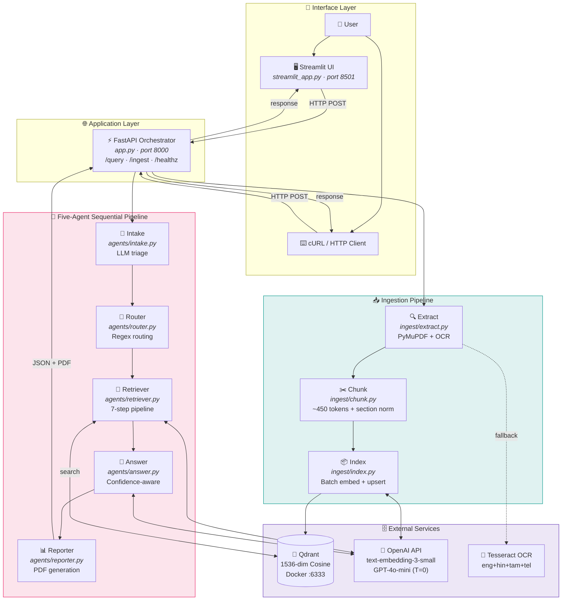
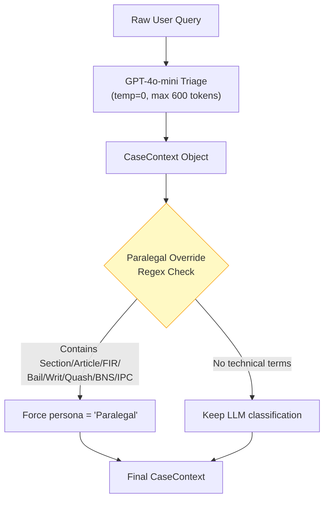
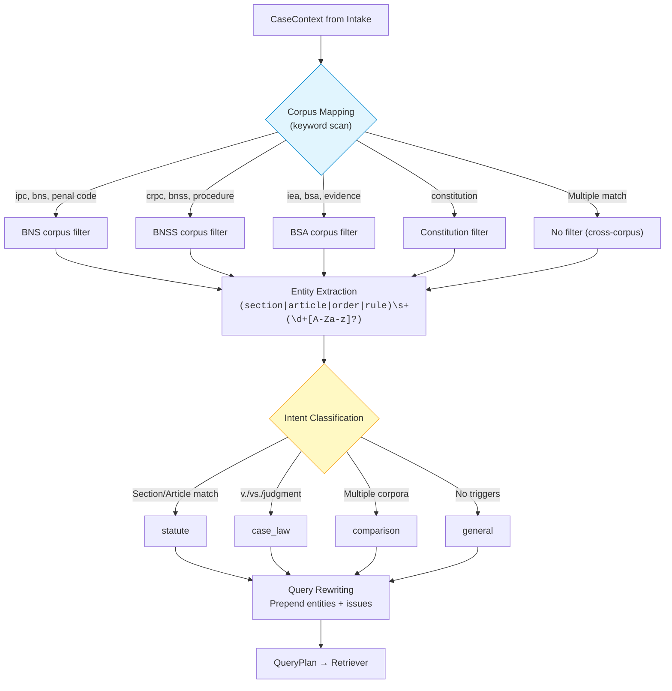
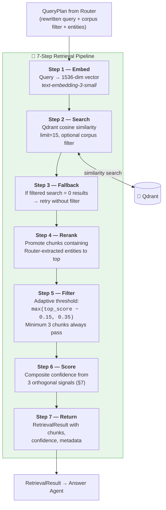
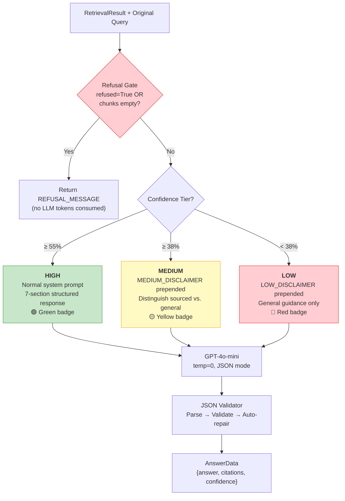
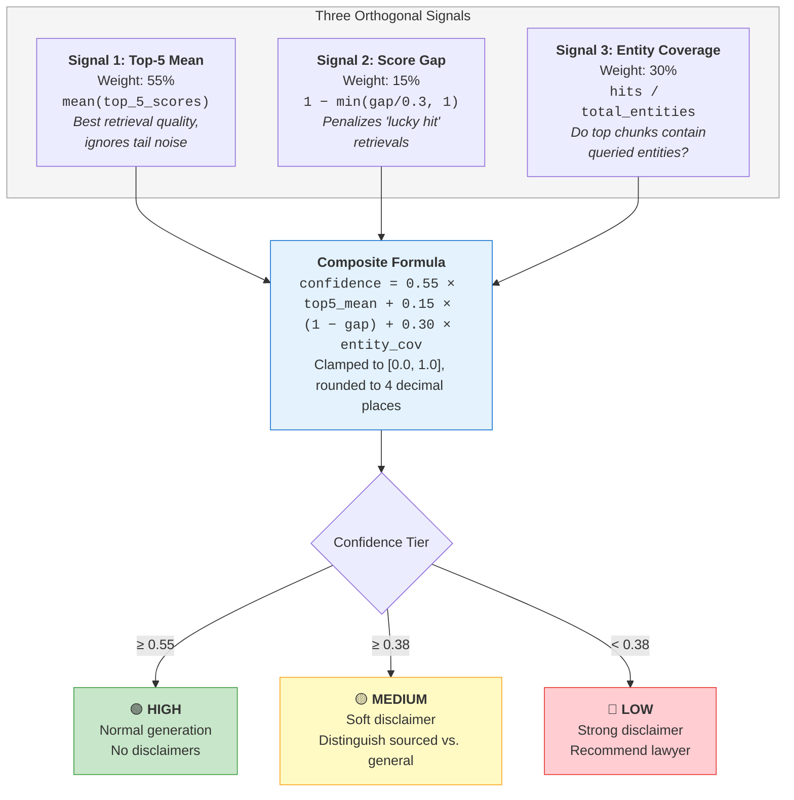
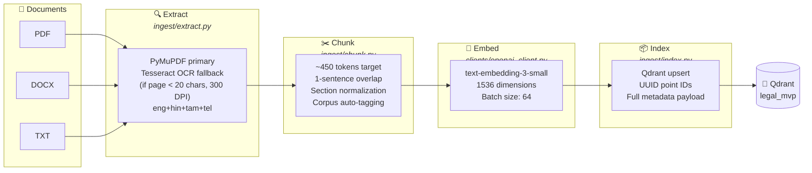
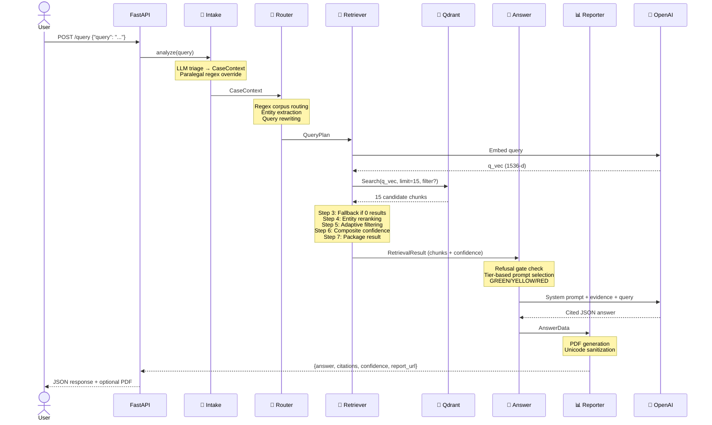

<p align="center">
  <h1 align="center">⚖️ Legal MVP</h1>
  <p align="center"><strong>Multi-Agent RAG System for Indian Legal Advisory</strong></p>
  <p align="center">FastAPI · Qdrant · OpenAI · Streamlit · Five-Agent Architecture · Composite Confidence Scoring</p>
</p>

<p align="center">
  
  
  
  
  
  
</p>

> A production-grade, multi-agent **Retrieval-Augmented Generation** system purpose-built for Indian law. Upload legal documents → Ingest into vector store → Ask questions in natural language → Receive **grounded answers with inline citations and confidence-calibrated disclaimers**. Features a **composite confidence scoring system** that fuses three orthogonal retrieval signals to drive adaptive system behaviour across the entire pipeline.

---

## Table of Contents

- [System Overview](#system-overview)
- [What's New (v2)](#whats-new-v2)
- [Architecture](#architecture)
  - [High-Level Architecture](#high-level-architecture)
  - [Communication Architecture](#communication-architecture)
- [Agent Deep Dive](#agent-deep-dive)
  - [Agent 1: Intake Agent](#-agent-1-intake-agent)
  - [Agent 2: Router Agent](#-agent-2-router-agent)
  - [Agent 3: Retriever Agent](#-agent-3-retriever-agent)
  - [Agent 4: Answer Agent](#-agent-4-answer-agent)
  - [Agent 5: Reporter Agent](#-agent-5-reporter-agent)
- [Confidence Scoring System (Deep Dive)](#confidence-scoring-system-deep-dive)
  - [The Problem](#the-problem)
  - [Three Orthogonal Signals](#three-orthogonal-signals)
  - [Confidence Tier Thresholds](#confidence-tier-thresholds)
  - [Impact on System Behaviour](#impact-on-system-behaviour)
- [Ingestion Pipeline](#ingestion-pipeline)
  - [Text Extraction](#stage-1-text-extraction)
  - [Chunking](#stage-2-chunking)
  - [Embedding](#stage-3-embedding)
  - [Indexing](#stage-4-indexing)
- [Validation Results](#validation-results)
- [Ingested Legal Corpus](#ingested-legal-corpus)
- [Data Flow & Sequence Diagrams](#data-flow--sequence-diagrams)
- [Directory Layout](#directory-layout)
- [Prerequisites](#prerequisites)
- [Quickstart](#quickstart)
- [Configuration](#configuration)
- [API Reference](#api-reference)
- [Streamlit UI](#streamlit-ui)
- [Design Decisions & Trade-Offs](#design-decisions--trade-offs)
- [Evaluation Protocol](#evaluation-protocol)
- [Troubleshooting](#troubleshooting)
- [Future Work](#future-work)
- [License](#license)
- [Acknowledgements](#acknowledgements)

---

## System Overview

Legal MVP is built around a **five-agent sequential pipeline** that orchestrates the complete lifecycle of legal question-answering — from case triage to cited report generation. Each agent has a single, well-defined responsibility, making every component independently testable, replaceable, and auditable.

| Agent | Role | Method |
|-------|------|--------|
| **1. Intake** | Case triage & persona classification | LLM + regex override |
| **2. Router** | Corpus routing, entity extraction, query rewriting | Deterministic regex (no LLM) |
| **3. Retriever** | Vector search, reranking, confidence scoring | 7-step pipeline |
| **4. Answer** | Confidence-aware answer generation | LLM with tier-based prompts |
| **5. Reporter** | Formal PDF report creation | fpdf2 with Unicode sanitization |

**Key innovations:**

- **Composite confidence scoring** — Weighted fusion of three orthogonal signals (top-k quality, score gap consistency, entity coverage) that drives adaptive behaviour across the entire pipeline
- **Deterministic routing** — Regex-based corpus selection eliminates non-deterministic LLM routing errors in high-stakes legal domains
- **Calibrated refusal** — System refuses to answer when zero usable chunks survive filtering, rather than hallucinating
- **Grounded answers** — Every claim backed by numbered `[n]` citations with source document, page, and snippet
- **Tier-based disclaimers** — Confidence score directly modifies LLM prompt to distinguish sourced claims from general knowledge
- **Indian law focus** — Covers BNS, BNSS, BSA, CrPC, Constitution, Consumer Protection Act, IPC (legacy), and judicial precedents

---

## What's New (v2)

| Change | Before | After | Impact |
|--------|--------|-------|--------|
| **Confidence formula** | Mean of all 15 chunks | Weighted composite (top-5 + gap + entities) | 47.0% → 70.6% for valid queries |
| **Chunk filtering** | All 15 sent to LLM | Adaptive: within 0.15 of top + 0.35 floor | Reduced hallucination risk |
| **Disclaimers** | Same prompt always | Tier-based prompt modification | LLM distinguishes sourced vs. general |
| **UI thresholds** | 70% / 40% / <40% | 55% / 38% / <38% | Calibrated to legal text score distribution |
| **Entity reranking** | None | Router-extracted entities boost chunks | Section-specific queries hit the right provisions |
| **Section normalization** | None | Bare numbers → "Section X" during chunking | Dramatically improved section-query retrieval |
| **Corpus auto-tagging** | Manual | Keyword-based `guess_corpus()` | Automatic BNS/BNSS/BSA/Constitution tagging |

---

## Architecture

### High-Level Architecture

Two primary data flows converge at Qdrant: the **Ingestion Pipeline** (documents in) and the **Query Pipeline** (questions answered).



### Communication Architecture

The Streamlit frontend (port 8501) communicates with the FastAPI backend (port 8000) via HTTP POST. The backend orchestrates the five-agent pipeline sequentially and returns a JSON response containing the answer, citations, confidence score, paralegal context, and optional report URL. Qdrant (port 6333) is accessed directly by the backend via the `qdrant-client` Python SDK.

---

## Agent Deep Dive

### 📝 Agent 1: Intake Agent

**File:** `agents/intake.py` · **Method:** LLM-based (GPT-4o-mini, temperature=0, max 600 tokens)

The Intake Agent triages the user's query by classifying scenario, expertise level, urgency, financial status, complexity, legal domain, potential issues, and missing facts. Returns a `CaseContext` Pydantic object.



**CaseContext schema:**

| Field | Type | Example Values |
|-------|------|---------------|
| `original_query` | str | "My sister died after marriage..." |
| `scenario` | str | "Dowry Death", "Neighbor Nuisance" |
| `user_persona` | str | "Layman", "Paralegal" |
| `urgency` | str | "Immediate", "Deferred" |
| `financial_status` | str | "Low Income", "Affluent", "Unknown" |
| `complexity` | str | "Low", "Medium", "High" |
| `predicted_legal_domain` | str | "Criminal", "Civil", "Constitutional" |
| `legal_issues` | List[str] | ["Dowry death", "Cruelty by husband"] |
| `missing_facts` | List[str] | ["Date of marriage", "FIR status"] |

**Paralegal override:** After the LLM produces CaseContext, a deterministic regex check runs. If the query contains technical terms (`Section \d+`, `Article \d+`, `vs.`, `FIR`, `Bail`, `Writ`, `Quash`, `CrPC`, `IPC`, `BNS`, etc.), `user_persona` is forced to `'Paralegal'` regardless of LLM classification.

**Fallback:** If the LLM call fails (network error, JSON parse failure), the agent produces a safe default CaseContext and applies the paralegal override.

---

### 🧭 Agent 2: Router Agent

**File:** `agents/router.py` · **Method:** Entirely deterministic (no LLM)

The Router Agent determines which corpus to search, extracts legal entities, classifies query intent, and rewrites the query for optimal embedding similarity. **This is a deliberate design choice:** in legal contexts, routing errors could lead to citing the wrong statute. Regex is deterministic, sub-millisecond, and predictable.



**Query rewrite example:**

```
Input query: "My sister died within 2 years of marriage. Her in-laws were demanding a car as dowry."
Intake issues: ['Dowry death', 'Cruelty']
Extracted entities: ['Section 304B']

Rewritten: "Dowry death Cruelty Section 304B My sister died within 2 years of marriage..."
```

---

### 🎯 Agent 3: Retriever Agent

**File:** `agents/retriever.py`

The Retriever Agent is the **most significant component** of the system's intelligence. It executes a **7-step pipeline** that searches, filters, reranks, and scores retrieved chunks to produce a confidence-calibrated evidence block.



**RetrievalResult schema:**

| Field | Type | Description |
|-------|------|-------------|
| `chunks` | List[ScoredPoint] | Filtered chunks passed to Answer agent |
| `confidence` | float (0–1) | Composite: 55% top-k + 15% gap + 30% entity |
| `top_k_mean` | float | Mean score of top 5 retrieved chunks |
| `score_gap` | float | Score difference between best and 5th chunk |
| `entity_coverage` | float | Fraction of entities found in top 5 chunk texts |
| `max_score` | float | Highest single chunk score |
| `total_chunks` | int | Chunks after filtering (sent to LLM) |
| `total_retrieved` | int | Raw chunks from Qdrant (before filtering) |
| `refused` | bool | True only if zero chunks survived filtering |

---

### 💬 Agent 4: Answer Agent

**File:** `agents/answer.py`

The Answer Agent generates structured legal advice using GPT-4o-mini, with **response style dynamically adjusted based on the confidence tier** from the Retriever.



**Answer structure:** The system prompt instructs GPT-4o-mini to produce seven sections: (1) Try an Informal Solution First, (2) Gather Evidence, (3) Immediate Police Help, (4) Relevant Legal Provisions (tabulated), (5) Administrative & Civil Remedies, (6) Practical Tips, (7) Offer to Draft.

**LLM configuration:**

| Parameter | Value | Rationale |
|-----------|-------|-----------|
| Model | `gpt-4o-mini` | Fast, cost-effective, strong at structured output |
| Temperature | `0` | Deterministic, factual responses |
| Response format | `{"type": "json_object"}` | Enforces valid JSON at the API level |

---

### 📊 Agent 5: Reporter Agent

**File:** `agents/reporter.py`

Generates a formal PDF advisory report using **fpdf2** with four sections: Case Summary, Relevant Statutes, Legal Analysis, and References. A robust `clean_text()` function handles Unicode-to-Latin-1 conversion (currency symbols, smart quotes, dashes). Reports are **only generated when the system does not refuse**.

---

## Confidence Scoring System (Deep Dive)

The composite confidence scoring system is the **major innovation** of Legal MVP v2. It addresses a fundamental failure mode in RAG systems: high average retrieval scores masking poor relevance.



### The Problem

In the previous implementation, confidence was the simple mean of all 15 retrieved chunk scores. This suffered from a critical flaw: a query retrieving 3 genuinely relevant chunks (0.50–0.52) alongside 12 mediocre chunks (0.40–0.45) would produce a mean of ~0.44 ("medium confidence") despite having good top results. Conversely, uniformly mediocre results (all 0.42–0.44) produced a similar mean despite having no genuinely relevant content.

### Three Orthogonal Signals

**Signal 1: Top-5 Mean (Weight: 55%)** — Only the top 5 chunks are averaged, capturing best-case retrieval quality while ignoring tail noise. In legal retrieval, the top 3–5 chunks typically contain relevant provisions while chunks 6–15 are tangentially related.

**Signal 2: Score Gap Penalty (Weight: 15%)** — Penalizes "lucky hit" retrievals where one chunk scored much higher than the rest. Formula: `gap_penalty = min((top_score − 5th_score) / 0.3, 1.0)`. When all top-5 score similarly (gap ≈ 0), full 0.15 contributed. Gap of 0.3+: contributes 0.

**Signal 3: Entity Coverage (Weight: 30%)** — Measures whether top chunks actually contain the specific legal entities mentioned in the query. If no entities were extracted, defaults to 1.0 (neutral). Formula: `entity_coverage = count(top-5 chunks containing any entity) / count(entities)`.

### Confidence Tier Thresholds

Calibrated against the actual score distribution of `text-embedding-3-small` on legal text (typical scores: 0.35–0.55, not the 0.8+ common in general-domain retrieval).

| Tier | Threshold | Calibration Rationale |
|------|-----------|----------------------|
| **HIGH** | ≥ 55% | Achievable only when top-5 chunks are genuinely relevant AND entities match |
| **MEDIUM** | ≥ 38% | Partial relevance; corpus has related content but may lack the exact provision |
| **LOW** | < 38% | Corpus likely does not contain the specific laws needed for authoritative answer |

### Impact on System Behaviour

1. **Chunk filtering** — Only chunks within 0.15 of top score AND above 0.35 reach the LLM, reducing hallucination risk
2. **Prompt selection** — Tier-specific disclaimers prepended to system prompt instruct LLM to distinguish sourced vs. general knowledge
3. **UI display** — Colour-coded confidence badge (green/yellow/red) with percentage gives users immediate reliability feedback
4. **PDF reports** — Only generated when the system does not refuse. Confidence displayed in Paralegal Dashboard

---

## Ingestion Pipeline

The ingestion pipeline transforms raw legal documents into searchable vector embeddings stored in Qdrant through a four-stage process.



### Stage 1: Text Extraction

**File:** `ingest/extract.py`

| Format | Primary Method | Fallback | Output |
|--------|---------------|----------|--------|
| PDF | PyMuPDF `page.get_text('text')` | Tesseract OCR if page < 20 chars; 300 DPI | `list[tuple[page_num, text]]` |
| DOCX | python-docx `Document(BytesIO)` | None (all text in paragraphs) | `list[tuple[1, full_text]]` |
| TXT | UTF-8 decode, `errors='ignore'` | N/A | `list[tuple[1, full_text]]` |

The OCR fallback is guarded by a `_tesseract_ok()` check verifying the tesseract binary exists on PATH. OCR supports `eng+hin+tam+tel` for multilingual Indian legal documents.

### Stage 2: Chunking

**File:** `ingest/chunk.py`

**Sentence-aware splitting:** Text is split at sentence boundaries using the regex `(?<=[.?!])\s+`. Sentences are grouped into chunks targeting ~450 tokens with 1-sentence overlap. The 450-token target balances two concerns: chunks under 200 tokens lose legal context (provisions reference preceding clauses with pronouns like "such person"), while chunks over 600 tokens dilute embedding focus.

**Section normalization:** A critical legal-domain optimization — bare numbers at line starts (e.g., `41.` or `41A.`) are normalized to `Section 41.` using the regex `(?m)^\s*(\d+\s?[A-Za-z]?)\s*\.` This dramatically improves retrieval when users query specific sections.

**Corpus auto-tagging:** Each chunk is automatically tagged with a corpus label by `guess_corpus()`:

| Keywords Detected | Corpus Tag | Legal Source |
|------------------|-----------|-------------|
| bns, nyaya, ipc | BNS | Bharatiya Nyaya Sanhita / Indian Penal Code |
| bnss, crpc, procedure | BNSS | Bharatiya Nagarik Suraksha Sanhita / CrPC |
| bsa, evidence, iea | BSA | Bharatiya Sakshya Adhiniyam / Indian Evidence Act |
| constitution, article | Constitution | Constitution of India |
| v., scc, air, judgment | Judgments | Supreme Court / High Court case law |
| (none of the above) | Unknown | Unclassified corpus |

### Stage 3: Embedding

**File:** `clients/openai_client.py`

Chunks are embedded using OpenAI's `text-embedding-3-small` (1536 dimensions) in batches of 64. The small model was chosen over `text-embedding-3-large` for cost efficiency (~1/5 the cost) with sufficient discrimination for legal text.

### Stage 4: Indexing

**File:** `ingest/index.py`

Embedded chunks are upserted into Qdrant's `legal_mvp` collection as `PointStruct` objects with UUID primary identifiers. Full metadata (`doc_name`, `page`, `text`, `corpus`, `lang_detected`, `original_chunk_id`) is stored in the payload. The collection uses 1536-dimension cosine similarity and is auto-created on startup via `ensure_collection()`.

---

## Validation Results

### Test Case 1: Dowry Death Query (HIGH Confidence)

**Query:** "My sister died within 2 years of marriage. Her in-laws were demanding a car as dowry."

| Signal | Value | Interpretation |
|--------|-------|---------------|
| Top-5 Mean | 0.499 | Chunks contain Section 304B (Dowry Death) — direct hit |
| Score Gap | 0.037 | Very consistent across top 5; all chunks genuinely relevant |
| Entity Coverage | 1.00 | No specific entities in query; defaults to neutral |
| **Composite** | **70.6% (HIGH)** | Correct: corpus HAS the relevant statutes |

**Previous system** (simple mean of 15): **47.0%**. The old metric was diluted by tail chunks. New composite correctly elevated to 70.6%.

### Test Case 2: FIR Quashing Query (MEDIUM Confidence)

**Query:** "Can an FIR for Section 307 IPC be quashed on compromise? Summarize Narinder Singh vs State of Punjab."

| Signal | Value | Interpretation |
|--------|-------|---------------|
| Top-5 Mean | ~0.40 | Chunks about IPC Sections 209, 158, 73 — tangentially related |
| Score Gap | Small | Consistently mediocre; no lucky hit |
| Entity Coverage | Low | "Narinder Singh" and "Section 307" NOT found in top chunks |
| **Composite** | **43.3% (MEDIUM)** | Correct: corpus does NOT contain the judgment text |

The LLM transparently stated it could not find the specific judgment text and used general knowledge with caveats — precisely the medium-confidence behaviour.

---

## Ingested Legal Corpus

| Document | Pages | Corpus Tag | Description |
|----------|-------|-----------|-------------|
| Bharatiya Nyaya Sanhita (BNS), 2023 | 102 | BNS | New Indian penal code (Act 45/2023) replacing IPC |
| Indian Penal Code (IPC), 1860 (Repealed) | 119 | BNS | Legacy penal code for old-to-new section comparison |
| Code of Criminal Procedure (CrPC), 1973 | ~200+ | BNSS | Criminal procedure: FIR, arrest, bail, trial, appeals |
| Consumer Protection Act, 2019 | 39 | Unknown | Consumer disputes, commissions, mediation, e-commerce |

---

## Data Flow & Sequence Diagrams

### Query Pipeline — Full Sequence



---

## Directory Layout

```
legal-mvp/
│
├── app.py                        # ⚡ FastAPI orchestrator: /ingest, /query, /healthz, /diag/env
├── streamlit_app.py              # 🖥️ Streamlit UI: confidence badges, paralegal dashboard
├── docker-compose.yml            # 🐳 Qdrant v1.12.4 container @ port 6333
│
├── agents/                       # 🤖 FIVE-AGENT PIPELINE
│   ├── intake.py                 #   📝 Agent 1: LLM triage → CaseContext + paralegal override
│   ├── router.py                 #   🧭 Agent 2: Regex routing, entity extraction, query rewriting
│   ├── retriever.py              #   🎯 Agent 3: 7-step pipeline, composite confidence scoring
│   ├── answer.py                 #   💬 Agent 4: Confidence-aware generation, refusal gate
│   └── reporter.py               #   📊 Agent 5: PDF report with clean_text() Unicode handling
│
├── core/                         # ⚙️ Core Services
│   ├── config.py                 #   Environment: EMBED_MODEL, GEN_MODEL, QDRANT_URL, TOP_K
│   ├── logging.py                #   Structured logging with ReqIdDefaultFilter
│   └── schemas.py                #   Pydantic: Citation, AnswerJSON, CaseContext
│
├── clients/                      # 🔌 External Clients
│   ├── openai_client.py          #   embed_texts() batch embedding, chat_json() for LLM
│   └── qdrant_client.py          #   qdrant() client, ensure_collection() auto-create
│
├── ingest/                       # 📥 Ingestion Pipeline
│   ├── extract.py                #   PDF (PyMuPDF + OCR), DOCX, TXT — all byte-based
│   ├── chunk.py                  #   ~450 token chunks, section normalization, corpus tagging
│   └── index.py                  #   Batch embed + Qdrant upsert (batch=64, UUID IDs)
│
├── retrieve/                     # 🔎 Legacy Retrieval (v1 modules)
│   ├── decision.py               #   Rule-based routing (superseded by agents/router.py)
│   ├── search.py                 #   Qdrant k=24 search (superseded by agents/retriever.py)
│   ├── mmr.py                    #   MMR diversification
│   └── pack.py                   #   Evidence packer [1]..[k]
│
├── answer/                       # ✍️ Legacy Answer (v1 modules)
│   ├── prompt.py                 #   Jinja2 prompts (superseded by agents/answer.py)
│   ├── llm.py                    #   LLM wrapper
│   └── validate.py               #   JSON parser with auto-repair
│
├── scripts/                      # 🛠️ CLI: ingest_cli.py, query_cli.py
├── tests/                        # 🧪 Unit tests for router agent
├── requirements.txt              # 📦 Python dependencies
└── .gitignore
```

---

## Prerequisites

- **Python 3.10+** (virtualenv recommended)
- **Docker** & **Docker Compose** (for Qdrant)
- **OpenAI API key** (for embeddings + generation)
- *(Optional)* **Tesseract** for OCR on scanned PDFs — Windows: `choco install tesseract` (add to PATH)

---

## Quickstart

```bash
# 1. Create virtual environment & install dependencies
python -m venv venv
source venv/bin/activate          # Windows: .\venv\Scripts\activate
pip install -r requirements.txt

# 2. Configure environment
cp .env.example .env
# Edit .env → set OPENAI_API_KEY=sk-xxxxxxxxxxxxxxxxxxxxxxxxxxxxxxxx

# 3. Start Qdrant vector database
docker compose up -d

# 4. Run FastAPI server
uvicorn app:app --host 127.0.0.1 --port 8000 --log-level info

# 5. (Optional) Launch Streamlit UI
streamlit run streamlit_app.py
```

**Verify setup:**

| Service | URL | Expected |
|---------|-----|----------|
| API Health | `http://127.0.0.1:8000/healthz` | `{"ok": true}` |
| API Diagnostics | `http://127.0.0.1:8000/diag/env` | `{"openai_key_set": true}` |
| Streamlit UI | `http://localhost:8501` | Web interface |

---

## Configuration

```env
OPENAI_API_KEY=sk-...
EMBED_MODEL=text-embedding-3-small
GEN_MODEL=gpt-4o-mini
QDRANT_URL=http://localhost:6333
TOP_K=8
USE_TRANSLATION=false
LANGS_OCR=eng+hin+tam+tel
```

---

## API Reference

| Method | Endpoint | Description | Request / Response |
|--------|----------|-------------|-------------------|
| `GET` | `/healthz` | Health check | `{"ok": true, "build": "abc12345"}` |
| `GET` | `/diag/env` | Verify API key | `{"openai_key_set": true}` |
| `POST` | `/ingest` | Upload & index docs | multipart form → `{files_received, chunks_indexed, errors}` |
| `POST` | `/query` | Ask legal question | `{query, style?}` → `{answer, citations, confidence, refused, paralegal_context, report_url}` |
| `GET` | `/static/*` | Serve PDF reports | Returns generated PDF file |

---

## Streamlit UI

The Streamlit application (`streamlit_app.py`, port 8501) provides a polished web interface:

- **Sidebar:** Backend URL config, answer style toggle (Detailed/Summary), raw JSON toggle, document upload (PDF/DOCX/TXT multi-file), Ingest button
- **Main area:** Query textarea, **confidence badge with percentage** (green/yellow/red), formatted answer with `[n]` superscripts, **Paralegal Dashboard** (scenario, persona, urgency, complexity, financial, confidence as metric widgets), missing facts warning, **PDF download button**, expandable citations
- **History:** Last 5 queries stored in session state, rendered as compact cards

---

## Design Decisions & Trade-Offs

### Why Regex-Based Routing (Not LLM)?

Routing errors in legal contexts could lead to citing the wrong statute. Regex is deterministic, sub-millisecond, and predictable. Trade-off: reduced flexibility for unusual phrasings, mitigated by Intake domain fallback.

### Why Not Refuse on Low Confidence?

Only refuses at zero chunks. Low-confidence queries still get answers with strong disclaimers. Even general guidance pointing toward the right type of lawyer is more helpful than flat refusal.

### Why text-embedding-3-small?

~1/5 cost of the large model with sufficient discrimination for legal text. Legal queries occupy a narrow semantic space, reducing the marginal benefit of higher-dimensional embeddings.

### Why Monolithic Architecture?

Agents communicate via function calls (not network), eliminating inter-service latency. Qdrant is the only external dependency, deployed via Docker Compose.

### Why 450-Token Chunks?

Empirically determined. Shorter chunks split provisions across boundaries; longer chunks produce semantically broad embeddings. 1-sentence overlap preserves boundary context.

---

## Evaluation Protocol

**Recommended setup:** 30–50 queries across corpora (CPA, CrPC, BNS, etc.) with 20% "trick" questions (out-of-corpus queries that should trigger MEDIUM/LOW confidence)

| Metric | Description | Target |
|--------|-------------|--------|
| **Correctness** | % factually correct answers | ≥ 85% |
| **Groundedness** | Every claim has supporting citation | 100% |
| **Citation accuracy** | Citations truly support their claims | ≥ 90% |
| **Confidence calibration** | HIGH queries are correct, LOW queries are OOD | ≥ 80% alignment |
| **Recall@k** | Gold snippet in top-k results | ≥ 80% |
| **MRR** | Mean reciprocal rank of first relevant chunk | ≥ 0.7 |
| **Latency p50 / p95** | Response time | ≤ 3s / ≤ 5s |

---

## Troubleshooting

| Problem | Solution |
|---------|----------|
| **401 OpenAI / invalid key** | Ensure `.env` has `OPENAI_API_KEY=sk-…`; verify via `GET /diag/env` |
| **Logger KeyError: req_id** | Handled by tolerant formatter — see `core/logging.py` |
| **Git Bash `curl (26)`** (Windows) | Use `curl.exe` (PowerShell) or Streamlit uploader |
| **Low confidence on valid queries** | Check corpus auto-tagging; verify section normalization in chunks |
| **All queries get MEDIUM** | Embedding model may need recalibration; check Qdrant collection dimensions |
| **UI timeouts** | Increase Streamlit timeout (120–180s); reduce prompt/context size |

---

## Future Work

- [ ] **Multilingual support** — `USE_TRANSLATION` flag exists but is inactive. Hindi, Tamil, Telugu query support via cross-lingual embeddings or translation preprocessing
- [ ] **Case law expansion** — Current corpus focuses on statutes. Adding SC/HC judgments would enable high-confidence case law responses
- [ ] **Cross-encoder reranking** — Replacing entity-match reranking with a cross-encoder (e.g., `ms-marco-MiniLM`) for improved reranking quality
- [ ] **Agentic follow-up** — Using `missing_facts` from Intake to proactively ask clarifying questions before answer generation
- [ ] **Evaluation framework** — Systematic eval suite with labelled query-answer pairs for retrieval recall, answer accuracy, and confidence calibration
- [ ] **Auth & quotas** — Per-tenant API keys, rate limiting
- [ ] **Full containerization** — Dockerfile for FastAPI + Streamlit (compose with Qdrant)
- [ ] **Caching layer** — Redis-based embedding and result cache for repeated queries

---

## License

This repository is provided for academic and research use.

---

## Acknowledgements

- **[Qdrant](https://qdrant.tech/)** — High-performance vector search engine
- **[FastAPI](https://fastapi.tiangolo.com/)** + **Uvicorn** — Modern async Python web framework
- **[Streamlit](https://streamlit.io/)** — Rapid prototyping UI framework
- **[OpenAI](https://openai.com/)** — Embeddings (`text-embedding-3-small`) and chat completions (`gpt-4o-mini`)
- **[fpdf2](https://py-pdf.github.io/fpdf2/)** — PDF report generation
- **[PyMuPDF](https://pymupdf.readthedocs.io/)** — PDF text extraction
- **[Tesseract](https://github.com/tesseract-ocr/tesseract)** — OCR fallback for scanned documents

---

<p align="center"><i>Upload docs → Ingest → Ask → Get grounded, confidence-calibrated answers with citations.</i></p>
<p align="center"><b>Legal MVP — grounded, transparent, and confidence-aware legal AI.</b></p>
