<p align="center">
  <h1 align="center">⚖️ Legal MVP</h1>
  <p align="center"><strong>Agentic RAG System for Indian Legal Q&A</strong></p>
  <p align="center">FastAPI · Qdrant · OpenAI · Streamlit · Multi-Agent Architecture</p>
</p>

<p align="center">
  
  
  
  
  
</p>

> A production-minded, multi-agent **Retrieval-Augmented Generation** system for Indian law. Upload legal documents → Ingest into vector store → Ask questions in natural language → Receive **grounded answers with inline citations**. Includes a full **Paralegal Mode** with case intake, intelligent routing, and automated report generation.

---

## Table of Contents

- [System Overview](#system-overview)
- [Architecture](#architecture)
  - [High-Level Architecture](#high-level-architecture)
  - [Dual Operating Modes](#dual-operating-modes)
- [Agent Deep Dive](#agent-deep-dive)
  - [Router Agent](#-router-agent)
  - [Retriever Agent](#-retriever-agent)
  - [Answer Agent](#-answer-agent)
  - [Intake Agent](#-intake-agent--paralegal-mode)
  - [Reporter Agent](#-reporter-agent--paralegal-mode)
- [Supporting Modules](#supporting-modules)
  - [Decision Engine](#decision-engine)
  - [MMR Diversifier](#mmr-diversifier)
  - [Evidence Packer](#evidence-packer)
  - [JSON Validator](#json-validator)
- [Ingestion Pipeline](#ingestion-pipeline)
- [Data Flow & Sequence Diagrams](#data-flow--sequence-diagrams)
- [Directory Layout](#directory-layout)
- [Prerequisites](#prerequisites)
- [Quickstart](#quickstart)
- [Configuration](#configuration)
- [API Reference](#api-reference)
- [Streamlit UI](#streamlit-ui)
- [Evaluation Protocol](#evaluation-protocol)
- [Troubleshooting](#troubleshooting)
- [Roadmap](#roadmap)
- [License](#license)
- [Acknowledgements](#acknowledgements)

---

## System Overview

Legal MVP is built around a **five-agent architecture** that orchestrates the entire lifecycle of legal question-answering — from case intake to cited report generation. The system operates in two modes:

| Mode | Agents Involved | Use Case |
|------|----------------|----------|
| **Standard Q&A** | Router → Retriever → Answer | Direct legal questions with cited responses |
| **Paralegal Mode** | Intake → Router → Retriever → Answer → Reporter | Full case workflow: intake, research, analysis, and report |

**Key capabilities:**

- **Grounded answers** — Every claim backed by numbered `[n]` citations with source document, page, and snippet
- **Agentic routing** — Intelligent classification of queries to the right legal corpus and retrieval strategy
- **Paralegal automation** — Structured case intake, intelligent evidence gathering, and professional report generation
- **Indian law focus** — Covers BNS, BNSS, BSA, CPA, CrPC, Constitution, and judicial precedents
- **Production-ready** — FastAPI backend, Docker-based vector DB, Windows-compatible, robust error handling

---

## Architecture

### High-Level Architecture

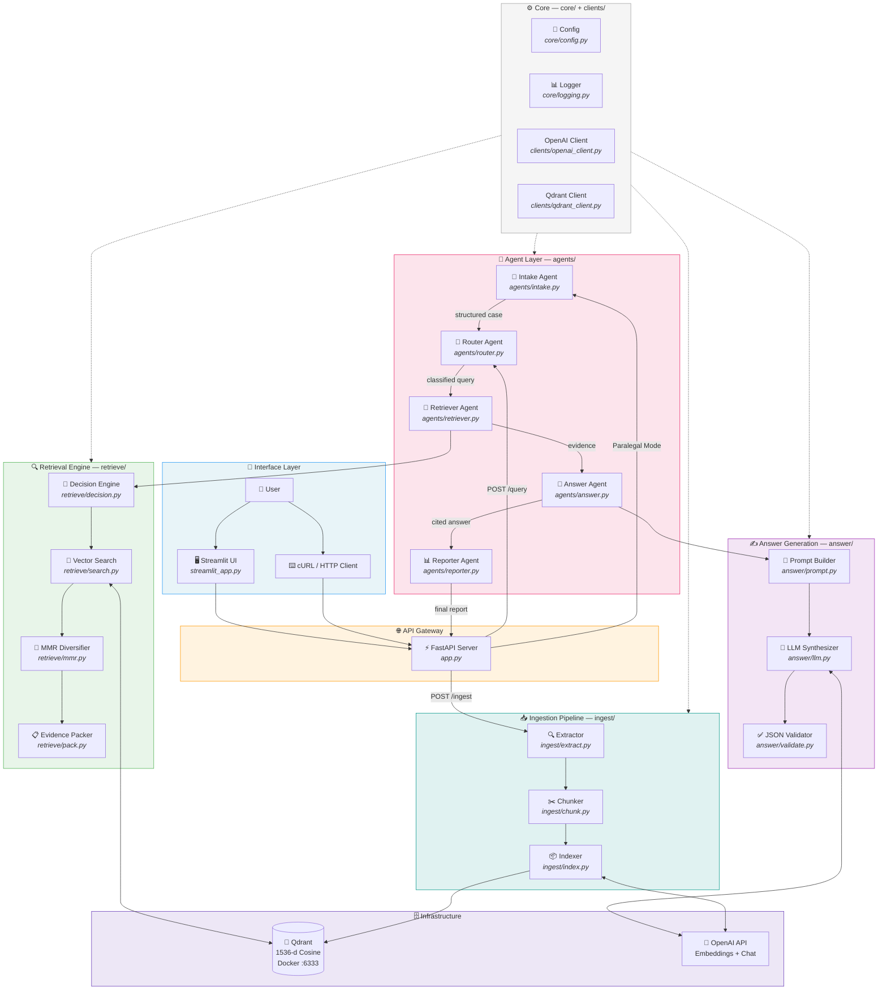

---

### Dual Operating Modes

The system operates in two distinct modes, each using a different subset of agents:

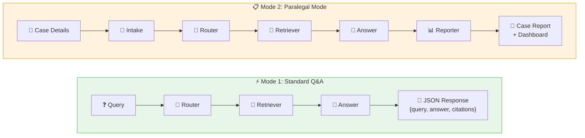

| Feature | Standard Q&A | Paralegal Mode |
|---------|-------------|----------------|
| **Entry point** | Direct question | Structured case intake |
| **Agents used** | 3 (Router → Retriever → Answer) | 5 (all agents) |
| **Output** | JSON with answer + citations | Full case report + dashboard |
| **Best for** | Quick legal queries | Comprehensive case analysis |
| **Interaction** | Single-turn | Multi-turn with structured input |

---

## Agent Deep Dive

The five agents in `agents/` form the backbone of the system. Each agent is a specialized module with a distinct role in the legal Q&A pipeline.

### 🧭 Router Agent

**File:** `agents/router.py`

The Router Agent is the **orchestrator** and entry point for all queries. It classifies the incoming query, determines which legal corpus to target, applies section-specific boosting rules, and routes the request to the Retriever Agent with the appropriate configuration.

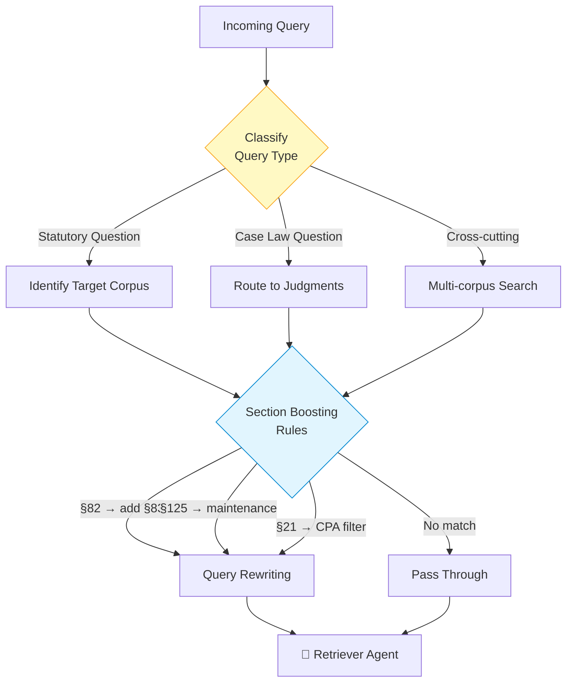

**Responsibilities:**

- **Query classification** — Determines if the query is statutory, case-law, procedural, or cross-cutting
- **Corpus routing** — Maps query keywords to specific legal corpora (BNS/BNSS/BSA, CPA, CrPC, Constitution, Judgments)
- **Section boosting** — Injects related sections for companion provisions (e.g., §82 proclamation → also boost §83 attachment)
- **Query rewriting** — Prepends boosted terms to improve semantic retrieval

**Boosting rules:**

| Detected Pattern | Injected Boost | Reason |
|-----------------|----------------|--------|
| §82 (proclamation) | §83 (attachment of property) | Companion provisions always read together |
| §125 | "maintenance" context | Enriches semantic search for family law |
| §21 (misleading ads) | CPA corpus filter | Routes to Consumer Protection Act |
| Forms/Annexures | De-prioritize FORM pages | Prefer substantive statute body text |

**Query rewrite example:**

```
Input:  "What is the procedure under Section 83 CrPC?"
Output: "Section 83 CrPC attachment property || What is the procedure under Section 83 CrPC?"
```

---

### 🎯 Retriever Agent

**File:** `agents/retriever.py`

The Retriever Agent manages the entire evidence-gathering pipeline. It coordinates four sub-modules — Decision Engine, Vector Search, MMR Diversification, and Evidence Packing — to produce a curated, diverse, and numbered evidence block.

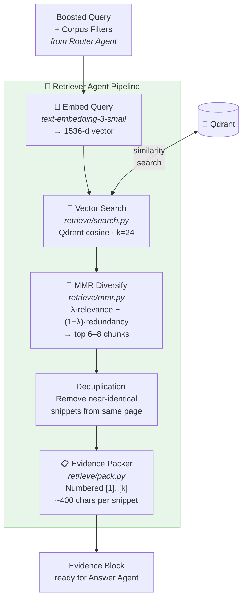

**Stage-by-stage breakdown:**

| Stage | Module | Input | Output | Details |
|-------|--------|-------|--------|---------|
| **1. Embed** | `clients/openai_client.py` | Boosted query string | 1536-d vector | `text-embedding-3-small` model |
| **2. Search** | `retrieve/search.py` | Query vector + corpus filter | 24 candidate chunks | Qdrant cosine similarity |
| **3. MMR** | `retrieve/mmr.py` | 24 candidates | 6–8 diverse chunks | Maximal Marginal Relevance |
| **4. Dedupe** | `retrieve/mmr.py` | 6–8 chunks | Deduplicated set | Removes near-identical snippets |
| **5. Pack** | `retrieve/pack.py` | Diverse chunks | Numbered evidence block | `[1]` source, page, snippet format |

---

### 💬 Answer Agent

**File:** `agents/answer.py`

The Answer Agent synthesizes grounded legal answers from the evidence block. It constructs a strict prompt, calls the LLM with JSON-mode enforcement, and validates the output through a repair-capable JSON validator.

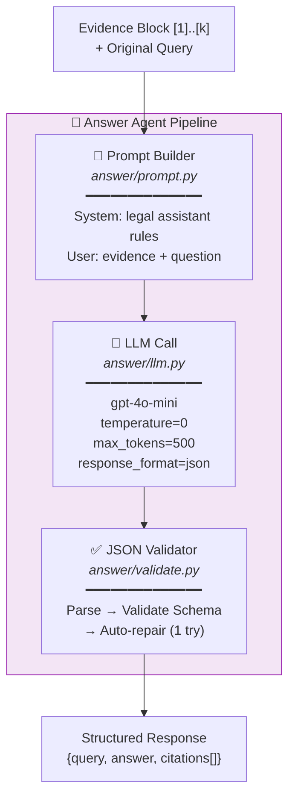

**Prompt design:**

```
┌─────────────────────────────────────────┐
│  SYSTEM PROMPT                          │
│  • You are a legal research assistant   │
│  • Answer ONLY from provided evidence   │
│  • Use [n] inline citations             │
│  • Admit when evidence is insufficient  │
│  • Output strict JSON format:           │
│    {query, answer, citations[]}         │
└─────────────────────────────────────────┘
                    +
┌─────────────────────────────────────────┐
│  USER PROMPT                            │
│  Evidence:                              │
│  [1] Source: file.pdf | Page: 20        │
│  "The District Commission may order..." │
│  [2] Source: file.pdf | Page: 7         │
│  "Consumer rights include..."           │
│                                         │
│  Question: {user_query}                 │
└─────────────────────────────────────────┘
```

**Output schema:**

```json
{
  "query": "What actions can the District Commission take?",
  "answer": "The District Commission may direct the seller to remove the defect [1], replace the goods [1], or return the price paid [2].",
  "citations": [
    {"source": "a2019-35.pdf", "page": 20, "snippet": "...relevant excerpt..."},
    {"source": "a2019-35.pdf", "page": 7,  "snippet": "...relevant excerpt..."}
  ]
}
```

**LLM Configuration:**

| Parameter | Value | Rationale |
|-----------|-------|-----------|
| Model | `gpt-4o-mini` | Fast, cost-effective, strong at structured output |
| Temperature | `0` | Deterministic, factual responses |
| Max tokens | `500` | Prevents verbose outputs; keeps answers concise |
| Response format | `{"type": "json_object"}` | Enforces valid JSON at the API level |

---

### 📝 Intake Agent — Paralegal Mode

**File:** `agents/intake.py`

The Intake Agent is the entry point for **Paralegal Mode**. It conducts a structured case intake — gathering key details about the legal matter, parties involved, relevant facts, and desired outcomes — then formats this information into a structured case object that the Router Agent can process.

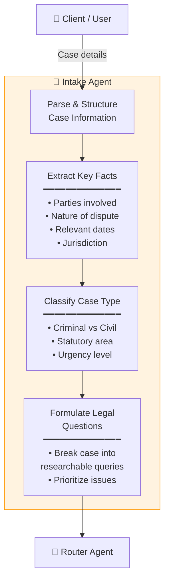

**Responsibilities:**

- **Case information parsing** — Extracts structured data from free-form case descriptions
- **Fact extraction** — Identifies parties, dispute nature, dates, and jurisdictional details
- **Case classification** — Determines the legal domain (criminal, civil, consumer, constitutional) and urgency
- **Query formulation** — Breaks the case down into discrete, researchable legal questions for the Retriever Agent

---

### 📊 Reporter Agent — Paralegal Mode

**File:** `agents/reporter.py`

The Reporter Agent is the **final stage** in Paralegal Mode. It takes the cited answers produced by the Answer Agent and compiles them into a comprehensive, professional legal report or dashboard view.

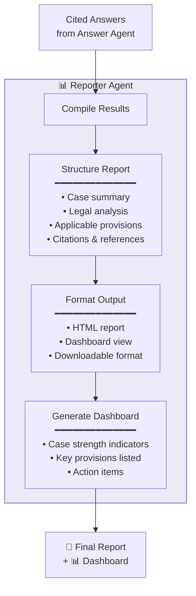

**Responsibilities:**

- **Result compilation** — Aggregates answers and citations from multiple legal queries into a unified view
- **Report structuring** — Organizes findings into case summary, legal analysis, applicable provisions, and references
- **Output formatting** — Generates HTML reports (via Jinja2 templates in `report/`) and dashboard views
- **Action items** — Highlights key legal provisions, potential arguments, and recommended next steps

---

## Supporting Modules

These modules in `retrieve/` and `answer/` provide the low-level functionality that the agents orchestrate.

### Decision Engine

**File:** `retrieve/decision.py`

Rule-based corpus filter and section booster — no LLM calls required.

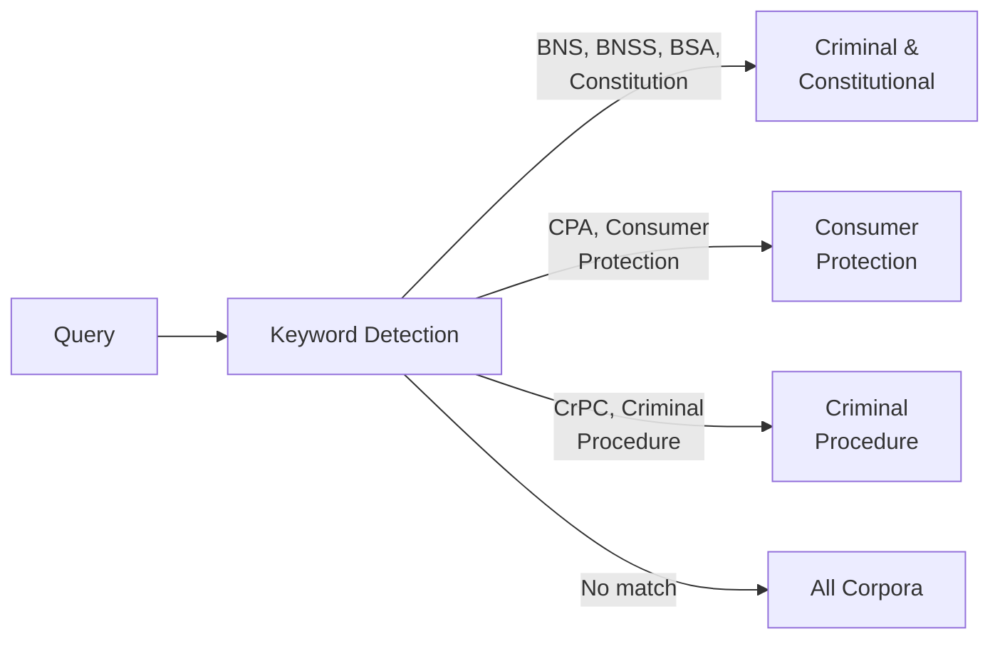

### MMR Diversifier

**File:** `retrieve/mmr.py`

Applies **Maximal Marginal Relevance** to balance relevance with diversity:

```
Score(d) = λ × Sim(d, query) − (1 − λ) × max[Sim(d, already_selected)]
```

Takes 24 candidates → outputs 6–8 diverse, non-redundant chunks.

### Evidence Packer

**File:** `retrieve/pack.py`

Formats chunks into numbered evidence blocks: `[1] Source: file.pdf | Page: 20 | "snippet..."` — each capped at ~400 characters.

### JSON Validator

**File:** `answer/validate.py`

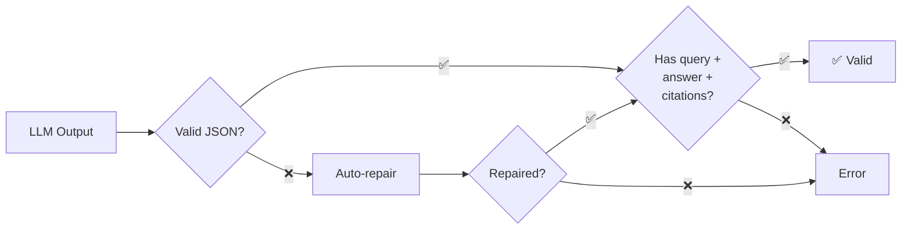

---

## Ingestion Pipeline

The ingestion pipeline (`ingest/`) transforms raw legal documents into searchable vectors:

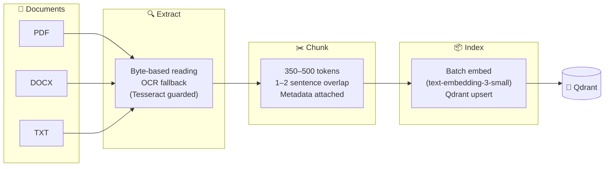

**Chunk metadata payload:**

| Field | Type | Description |
|-------|------|-------------|
| `doc_name` | string | Source filename |
| `page` | int | Page number in source |
| `chunk_id` | UUID | Unique chunk identifier |
| `chunk_index` | int | Sequential index within document |
| `corpus` | string | Legal corpus (BNS, CPA, CrPC, etc.) |
| `lang_detected` | string | Detected language |
| `text` | string | Chunk content |

---

## Data Flow & Sequence Diagrams

### Standard Q&A Mode — Full Sequence

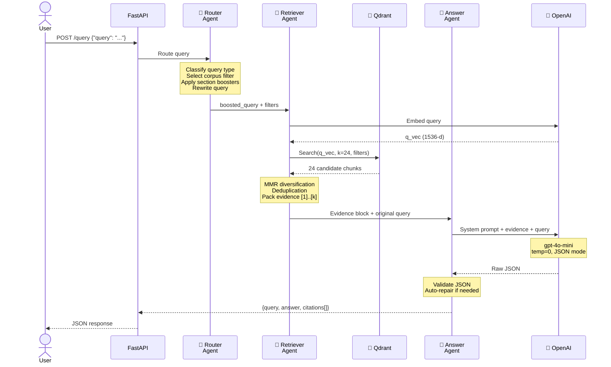

### Paralegal Mode — Full Sequence

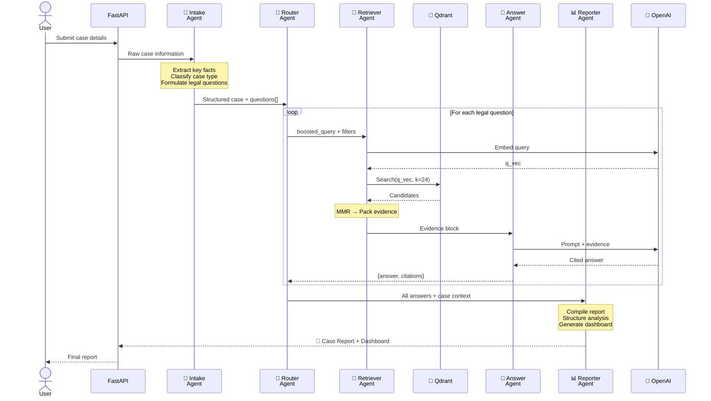

---

## Directory Layout

```
legal-mvp/
│
├── app.py                        # ⚡ FastAPI application (routes: /ingest, /query, /healthz, /diag)
├── streamlit_app.py              # 🖥️ Streamlit demo UI (upload + query + history)
├── app_backup.py                 # Backup of main application
│
├── agents/                       # 🤖 AGENT LAYER — Core agentic architecture
│   ├── __init__.py               #   Agent registry & exports
│   ├── router.py                 #   🧭 Router Agent: query classification, corpus routing, boosting
│   ├── retriever.py              #   🎯 Retriever Agent: search orchestration, MMR, evidence packing
│   ├── answer.py                 #   💬 Answer Agent: LLM synthesis, JSON validation
│   ├── intake.py                 #   📝 Intake Agent: Paralegal mode case intake & structuring
│   └── reporter.py               #   📊 Reporter Agent: Paralegal mode report & dashboard generation
│
├── core/                         # ⚙️ Core Services
│   ├── config.py                 #   Environment variables, model names, feature flags
│   └── logging.py                #   Tolerant logging with req_id safety
│
├── clients/                      # 🔌 External Service Clients
│   ├── openai_client.py          #   Embeddings (text-embedding-3-small) + Chat (gpt-4o-mini)
│   └── qdrant_client.py          #   Collection CRUD, upsert, similarity search
│
├── ingest/                       # 📥 Ingestion Pipeline
│   ├── extract.py                #   PDF/DOCX/TXT byte-based extraction + OCR guard
│   ├── chunk.py                  #   Token-based chunking (350–500) with overlap & metadata
│   └── index.py                  #   Batch embedding + Qdrant upsert
│
├── retrieve/                     # 🔎 Retrieval Sub-modules
│   ├── decision.py               #   Decision Engine: corpus filter + section boosting rules
│   ├── search.py                 #   Qdrant cosine similarity search (k=24)
│   ├── mmr.py                    #   Maximal Marginal Relevance diversification + deduplication
│   └── pack.py                   #   Evidence Packer: numbered snippet formatting [1]..[k]
│
├── answer/                       # ✍️ Answer Generation Sub-modules
│   ├── prompt.py                 #   System + user prompt templates (strict JSON enforcement)
│   ├── llm.py                    #   LLM call wrapper (gpt-4o-mini, temp=0, JSON mode)
│   └── validate.py               #   JSON parser with auto-repair capability
│
├── report/                       # 📊 Report Generation
│   ├── render.py                 #   Jinja2-based HTML report renderer
│   └── templates/
│       └── answer.html.j2        #   HTML answer report template
│
├── scripts/                      # 🛠️ Utility Scripts (smoke tests, CLI tools)
├── tests/                        # 🧪 Test Suite
│
├── docker-compose.yml            # 🐳 Qdrant container @ port 6333
├── requirements.txt              # 📦 Python dependencies
├── check_pdfs.py                 # PDF diagnostic utility
├── debug_qdrant.py               # Qdrant debug/inspection tool
├── full_codebase.py              # Codebase consolidation script
├── smoke_ingest.sh               # Ingestion smoke test
├── test_ingest.py                # Ingestion test script
└── .gitignore
```

---

## Prerequisites

- **Python 3.10+** (virtualenv recommended)
- **Docker** & **Docker Compose** (for Qdrant)
- **OpenAI API key** (for embeddings + generation)
- *(Optional)* **Tesseract** for OCR on scanned PDFs — Windows: `choco install tesseract` (add to PATH)

---

## Quickstart

```bash
# 1. Create virtual environment & install dependencies
python -m venv venv
source venv/bin/activate          # Windows: .\venv\Scripts\activate
pip install -r requirements.txt

# 2. Configure environment
cp .env.example .env
# Edit .env → set OPENAI_API_KEY=sk-xxxxxxxxxxxxxxxxxxxxxxxxxxxxxxxx

# 3. Start Qdrant vector database
docker compose up -d

# 4. Run FastAPI server
uvicorn app:app --host 127.0.0.1 --port 8000 --log-level info

# 5. (Optional) Launch Streamlit UI
streamlit run streamlit_app.py
```

**Verify setup:**

| Service | URL | Expected |
|---------|-----|----------|
| API Health | http://127.0.0.1:8000/healthz | `{"ok": true}` |
| API Diagnostics | http://127.0.0.1:8000/diag/env | `{"openai_key_set": true}` |
| Streamlit UI | http://localhost:8501 | Web interface |

---

## Configuration

Create a `.env` file in the project root:

```env
OPENAI_API_KEY=sk-...
EMBED_MODEL=text-embedding-3-small
GEN_MODEL=gpt-4o-mini
QDRANT_URL=http://localhost:6333
TOP_K=8
USE_TRANSLATION=false
LANGS_OCR=eng+hin+tam+tel
```

> The app loads `.env` at startup (top of `app.py`) so all keys are available before clients initialize.

---

## API Reference

### `POST /ingest` — Document Ingestion

Upload one or more legal documents for processing and indexing.

**Request:** `multipart/form-data` with `files` field (PDF, DOCX, TXT)

```json
// Response
{
  "files_received": 3,
  "chunks_indexed": 128,
  "errors": []
}
```

### `POST /query` — Legal Q&A

Ask a question; receive a grounded JSON answer with inline citations.

```json
// Request
{"query": "What actions can the District Commission take for a defective product?"}

// Response
{
  "query": "What actions can the District Commission take for a defective product?",
  "answer": "The District Commission may direct the seller to remove the defect [1], replace the goods [1], or return the price paid [2].",
  "citations": [
    {"source": "a2019-35.pdf", "page": 20, "snippet": "..."},
    {"source": "a2019-35.pdf", "page": 7,  "snippet": "..."}
  ]
}
```

> Append `?format=html` for a pre-rendered HTML report.

### `GET /healthz` → `{"ok": true}`

### `GET /diag/env` → `{"openai_key_set": true}`

---

## Streamlit UI

The Streamlit interface (`streamlit_app.py`) provides a modern, mobile-friendly demo experience:

- **Sidebar:** Backend URL, answer style (Detailed/Summary), raw JSON toggle, document upload & ingest, clear history
- **Main area:** Query text area, answer cards with inline `[n]` superscripts, collapsible citation expander, HTML report download, conversation history

---

## Evaluation Protocol

**Recommended setup:** 30–50 queries across corpora (CPA, CrPC, BNS, etc.) with 20% "trick" questions

| Metric | Description | Target |
|--------|-------------|--------|
| **Correctness** | % factually correct answers | ≥ 85% |
| **Groundedness** | Every claim has supporting citation | 100% |
| **Citation accuracy** | Citations truly support their claims | ≥ 90% |
| **Recall@k** | Gold snippet in top-k results | ≥ 80% |
| **MRR** | Mean reciprocal rank of first relevant chunk | ≥ 0.7 |
| **Latency p50** | Median response time | ≤ 3s |
| **Latency p95** | 95th percentile response time | ≤ 5s |

---

## Troubleshooting

| Problem | Solution |
|---------|----------|
| **401 OpenAI / invalid key** | Ensure `.env` has `OPENAI_API_KEY=sk-…`; verify via `GET /diag/env` |
| **Logger KeyError: req_id** | Handled by tolerant formatter — see `core/logging.py` |
| **Git Bash `curl (26)`** (Windows) | Use `curl.exe` (PowerShell) or Streamlit uploader |
| **Mis-grounded forms/annexures** | Add section boosters in Decision Engine; de-rank "FORM No." pages |
| **UI timeouts** | Increase Streamlit timeout (120–180s); reduce prompt/context size |

---

## Roadmap

- [ ] **Corpus expansion** — BNS/BNSS/BSA (new criminal codes), IPC §§141/415/503/320, HMA, Limitation Act
- [ ] **Judgment metadata** — Extract parties, bench, year, citation fields into vector payload
- [ ] **RAG eval harness** — Automated correctness & groundedness scoring pipeline
- [ ] **Auth & quotas** — Per-tenant API keys, rate limiting
- [ ] **Full containerization** — Dockerfile for FastAPI + Streamlit (compose with Qdrant)
- [ ] **Caching layer** — Redis-based embedding and result cache for repeated queries
- [ ] **Multi-language support** — Hindi, Tamil, Telugu legal documents with translation layer
- [ ] **Paralegal Mode enhancements** — Multi-turn conversation, case timeline builder, precedent comparison

---

## License

This repository is provided for educational and research use.

---

## Acknowledgements

- **[Qdrant](https://qdrant.tech/)** — High-performance vector search engine
- **[FastAPI](https://fastapi.tiangolo.com/)** + **Uvicorn** — Modern async Python web framework
- **[Streamlit](https://streamlit.io/)** — Rapid prototyping UI framework
- **[OpenAI](https://openai.com/)** — Embeddings (`text-embedding-3-small`) and chat completions (`gpt-4o-mini`)

---

<p align="center"><i>Upload docs → Ingest → Ask → Get grounded answers with citations.</i></p>
<p align="center"><b>Legal MVP — simple, explainable, and fast legal AI.</b></p>
