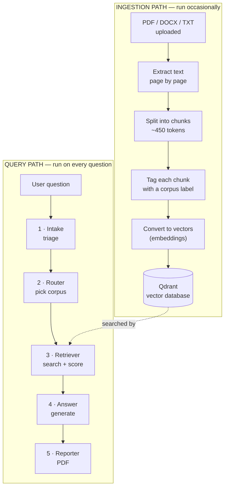
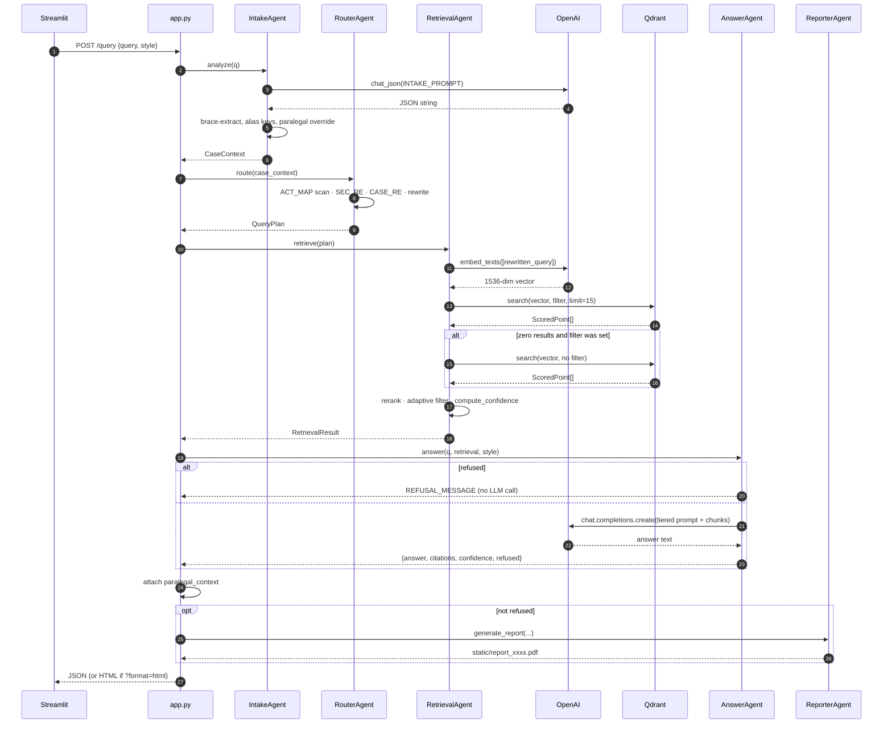
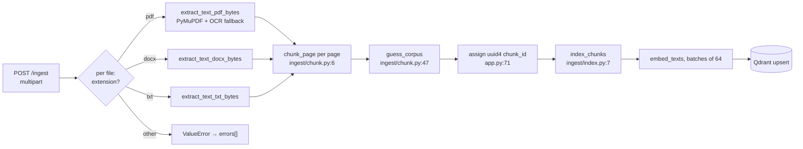
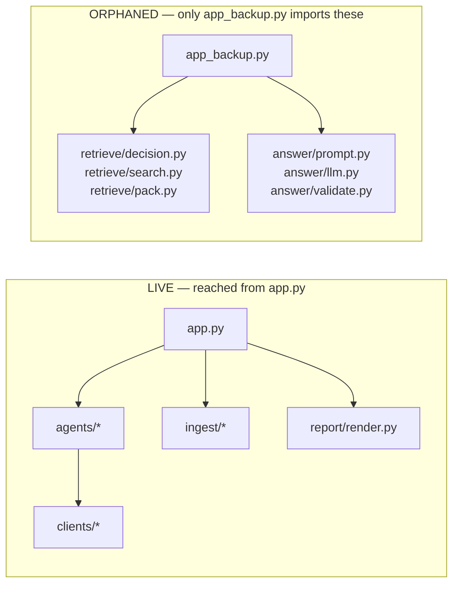

# Legal MVP — Architecture

**What this document is:** a description of the system as the code actually behaves today, built up in five passes from plain language to line-level detail.

**What this document is not:** a judgement. It describes the machine faithfully, including places where the machine does something you may not have intended. All criticism, all "this is broken because…", lives in [`GAPS.md`](GAPS.md) — read that *after* this, so you form your own picture first.

**How to read it.** The five passes are cumulative but self-contained. You can stop after any one of them and still hold a coherent (if coarser) understanding.

| Pass | Question it answers | Read it when |
|---|---|---|
| [0](#pass-0--in-plain-language) | What is this thing, in one page? | Always start here |
| [1](#pass-1--the-pipeline-at-a-glance) | What are the moving parts? | You want the shape |
| [2](#pass-2--the-machinery) | *Why* does any of this work? | You want to understand embeddings, similarity, chunking |
| [3](#pass-3--component-deep-dives) | What does each file actually do? | You're about to change something |
| [4](#pass-4--control-flow) | What calls what, in what order? | You're debugging |
| [5](#pass-5--design-decisions) | Why is it built this way? | You're defending or revisiting a choice |

Companion documents: [`FILE_STRUCTURE.md`](FILE_STRUCTURE.md) (what every file is), [`DATAFLOW.md`](DATAFLOW.md) (one real query traced with real numbers), [`GLOSSARY.md`](GLOSSARY.md) (terms).

---

## Pass 0 — In plain language

### The problem

Someone in India has a legal problem. Their landlord kept their deposit. Police are at the door. A fridge broke and the seller won't help. They don't know which law applies, what it's called, or what to do next. Hiring a lawyer to answer *"is this even a legal issue?"* is expensive and slow.

The laws that answer these questions do exist, in public PDFs — the Bharatiya Nyaya Sanhita, the Code of Criminal Procedure, the Consumer Protection Act. They are thousands of pages of dense statutory language. Nobody reads them for fun.

### The idea

Put those PDFs somewhere a computer can search *by meaning* rather than by exact words, then have a language model write an answer **using only what it found**, and show the user which page each claim came from.

That last part — "using only what it found," with receipts — is the whole point. A language model asked a legal question with no documents will answer anyway, fluently and sometimes wrongly. Wrong legal advice, delivered confidently, causes real harm. So the system is built to retrieve first and answer second.

### The analogy

Think of a diligent junior researcher in a law library.

1. **They read your question and size it up.** Is this urgent? Criminal or civil? Are you a lawyer using technical terms, or a worried person describing what happened? *(This is the Intake Agent.)*
2. **They decide which shelf to walk to.** You said "IPC" — that's the penal code shelf. You said "Section 41" — they note that number down to look for specifically. *(Router Agent.)*
3. **They pull the passages that look most relevant**, discard the ones that clearly aren't, and form a private opinion about whether they actually found good material or just something vaguely on-topic. *(Retriever Agent.)*
4. **They write you a note based on those passages** — and how confidently they write depends on step 3. Good material → a direct answer. Thin material → hedged, with "you should really ask a lawyer." Nothing usable → they decline rather than guess. *(Answer Agent.)*
5. **They hand you a printed copy for your file.** *(Reporter Agent.)*

Five agents, in a line, each doing one job and handing its output to the next.

### What it is not

It does not think, reason about your case, or know law. It matches text to text and asks a language model to write prose around the matches. Every "intelligent" behaviour in the system is either a regular expression, an arithmetic formula, or a prompt. Knowing that precisely is most of understanding this codebase.

---

## Pass 1 — The pipeline at a glance

Two paths exist. **Ingestion** happens rarely (when you add documents). **Query** happens on every question.



The five query agents in one line each:

| # | Agent | File | Uses an LLM? | Turns … into … |
|---|---|---|---|---|
| 1 | **Intake** | `agents/intake.py` | Yes | raw question → `CaseContext` (urgency, persona, domain, issues) |
| 2 | **Router** | `agents/router.py` | **No** — pure regex | `CaseContext` → `QueryPlan` (which corpus, which sections, rewritten query) |
| 3 | **Retriever** | `agents/retriever.py` | No (embeds only) | `QueryPlan` → `RetrievalResult` (chunks + confidence) |
| 4 | **Answer** | `agents/answer.py` | Yes | `RetrievalResult` → answer text + citations |
| 5 | **Reporter** | `agents/reporter.py` | No | answer → PDF file |

That the **Router uses no LLM** is deliberate and important — see [Pass 5](#51--why-the-router-uses-regex-not-an-llm).

The whole sequence is orchestrated in ~50 lines of `app.py`:

```python
case_context = intake_agent.analyze(q)          # 1
plan         = router_agent.route(case_context) # 2
retrieval    = retrieval_agent.retrieve(plan)   # 3
data         = answer_agent.answer(q, retrieval, style=style)  # 4
reporter_agent.generate_report(q, plan, data, filename=...)    # 5
```

Everything else in this document explains what happens inside those five calls.

---

## Pass 2 — The machinery

This pass explains the concepts the system rests on. If you already know what an embedding is, skim to [Pass 3](#pass-3--component-deep-dives).

### 2.1 · Why not just search for keywords?

Suppose someone asks: *"my husband's family is demanding money for a car and threatening me."*

A keyword search looks for those literal words. The relevant law says **"dowry death"** and **"cruelty by husband or relatives."** The words *dowry* and *cruelty* never appear in the question; the words *car* and *threatening* never appear in the statute. Keyword search finds nothing.

The user described a **situation**. The law describes a **category**. Matching them requires matching *meaning*, not spelling. That is what embeddings buy you.

### 2.2 · What an embedding actually is

An embedding is a list of numbers that represents a piece of text's meaning as a **position in space**.

Concretely: OpenAI's `text-embedding-3-small` takes any text and returns **1536 numbers**. That list is a coordinate in 1536-dimensional space. Texts that mean similar things land near each other; unrelated texts land far apart.

```
"dowry death"                    → [ 0.021, -0.118,  0.077, ... ]  (1536 numbers)
"in-laws demanding money for car"→ [ 0.019, -0.109,  0.081, ... ]  ← nearby
"procedure for filing an appeal" → [-0.140,  0.302, -0.055, ... ]  ← far away
```

Nobody chose what the 1536 dimensions mean. They were learned by a neural network trained on enormous amounts of text, by being repeatedly asked to predict which texts belong together. The dimensions are not interpretable individually. What matters is only that **distance in that space tracks difference in meaning**.

You cannot read an embedding. You can only compare it to another one.

> In this codebase: `clients/openai_client.py:6`, `embed_texts()`. It is called in exactly two places — once per chunk at ingest time (`ingest/index.py:17`) and once per query at search time (`agents/retriever.py:73`). Both must use the **same model**, or the coordinates aren't in the same space and every comparison is garbage.

### 2.3 · Cosine similarity, worked by hand

To ask "how similar are these two texts?", you compare their vectors. This system uses **cosine similarity**: the cosine of the angle between the two vectors.

Vectors pointing the same direction → angle 0° → cosine **1.0**. Perpendicular → 90° → **0.0**. Opposite → 180° → **−1.0**.

The formula, for vectors **A** and **B**:

```
                A · B
cos(A, B) = ─────────────
             ‖A‖ × ‖B‖
```

Where `A · B` is the dot product (multiply matching components, sum them) and `‖A‖` is the length of A (square each component, sum, square-root).

**Worked example in 2 dimensions** (the real thing is identical, just with 1536 components):

Let `A = [3, 4]` and `B = [4, 3]`.

```
Dot product:  A · B = (3×4) + (4×3) = 12 + 12 = 24
Length of A:  ‖A‖  = √(3² + 4²) = √25 = 5
Length of B:  ‖B‖  = √(4² + 3²) = √25 = 5

cos(A, B) = 24 / (5 × 5) = 24 / 25 = 0.96
```

0.96 — nearly the same direction, so these two texts would be judged very similar.

Two more to build intuition:

```
A = [1, 0], B = [0, 1]   → dot = 0  → cos = 0.0    (unrelated)
A = [1, 0], B = [-1, 0]  → dot = -1 → cos = -1.0   (opposite)
```

Notice that **length is divided out**. A long document and a short phrase about the same topic still score high, because only *direction* matters. That is exactly what you want when comparing a 40-word question against a 450-word statutory chunk.

> In this codebase you never compute this yourself. Qdrant does it, configured at `clients/qdrant_client.py:15` with `Distance.COSINE`. The number that comes back on each search result — `hit.score` — is this cosine value.

### 2.4 · Why legal scores sit at 0.35–0.55, not 0.8+

If you have seen RAG demos elsewhere, scores of 0.85 and 0.92 are common. Here you will see 0.42, 0.48, 0.51. That is not a bug, and understanding why matters for every threshold in this system.

Two reasons:

1. **Register mismatch.** The user writes *"police are arresting my brother."* The statute writes *"any officer in charge of a police station may, without an order from a Magistrate and without a warrant, arrest any person who…"* Same subject, utterly different vocabulary, sentence length, and formality. The embedding captures both as "arrest-related," but they are not near-identical texts, so the cosine lands mid-range.

2. **Domain compression.** Every document in the corpus is Indian statutory law. They all share vocabulary — *shall*, *provided that*, *notwithstanding*, *Magistrate*, *Court*, *punishable*. In embedding space, the entire corpus occupies a small, dense neighbourhood. Everything is somewhat similar to everything, so the spread between "right chunk" and "wrong chunk" is compressed.

**The consequence:** absolute score values are close to meaningless here; only *relative* differences carry information. A 0.51 is a strong hit in this corpus. This is why the thresholds in the code — `MIN_SCORE_FLOOR = 0.35`, tiers at 0.55 and 0.38 — look low compared to general-purpose RAG systems. They were tuned to this distribution.

### 2.5 · Chunking, and why 450 tokens

You cannot embed a 250-page PDF as one vector. Meaning would average out into mush, and you could not cite a page.

So documents are cut into **chunks** — here, roughly 450 tokens each (a token ≈ ¾ of an English word, so ~340 words), split at sentence boundaries, with **one sentence of overlap** between consecutive chunks.

The trade-off runs in both directions:

| Chunk size | Failure mode |
|---|---|
| Too small | A statutory provision gets split across two chunks. You retrieve the half that says "shall be punished with" without the half saying what the offence was. |
| Too large | The embedding averages several unrelated provisions into one vague vector that matches everything weakly and nothing strongly. |

The **overlap** exists because a provision that straddles a boundary would otherwise be truncated in both chunks. Repeating the last sentence at the start of the next chunk gives the boundary content a chance to appear intact somewhere.

> In this codebase: `ingest/chunk.py:6`, `chunk_page(doc_name, page, text, target_tokens=450, overlap_sentences=1)`. Token counting is approximated by whitespace word count (`tokens(x) = len(x.split())`, line 13) — cheap, and adequate because the target is a soft budget.

### 2.6 · What the vector database adds

Once every chunk is a vector, answering a query means: *find the chunks whose vectors point most nearly in the same direction as the query's vector.*

Naively, that's 1,011 cosine computations per query. Manageable here. At a million chunks it isn't, so vector databases build specialised indexes to find near neighbours without checking everything.

This system uses **Qdrant**, running in Docker (`docker-compose.yml`), storing data in `qdrant_storage/`. It holds one collection, `legal_mvp`, of 1536-dimensional cosine-distance vectors.

The second thing Qdrant provides is **payload** — arbitrary metadata stored alongside each vector:

```python
{
  "doc_name": "the_code_of_criminal_procedure,_1973.pdf",
  "page": 41,
  "text": "Section 41. When police may arrest without warrant.—...",
  "corpus": "BNSS",
  "chunk_index": 3,
  "lang_detected": "en"
}
```

Payload does two jobs. It carries the citation data (`doc_name`, `page`, `text`) shown to the user. And it enables **payload filtering** — restricting the search to a subset before similarity is computed:

```python
Filter(must=[{"key": "corpus", "match": {"value": "BNSS"}}])
```

With that filter, Qdrant only considers chunks tagged `BNSS`. This is the mechanism the Router controls, and it is the single most consequential lever in the system: **a filter that excludes the right document guarantees a wrong answer, no matter how good the embeddings are.**

### 2.7 · What RAG is, and why grounding matters here

**Retrieval-Augmented Generation** is the pattern: instead of asking a language model a question directly, first *retrieve* relevant documents, then ask the model to answer *using those documents*, supplied in the prompt.

The motivation is that language models generate plausible text, and plausibility is not accuracy. Asked about "Section 41 of the CrPC," a model will produce something section-shaped and confident whether or not it recalls the actual provision. In law, that failure is not cosmetic — wrong section numbers sent to someone whose relative is being arrested is a real harm.

RAG's promise is that the answer is *grounded*: every claim traceable to retrieved text the user can inspect.

The promise is only as good as two things:

1. **Retrieval actually surfacing the right passages** (Passes 3–4 explain how this system tries).
2. **The model actually confining itself to them** — which is requested via prompt instructions, not enforced by any mechanism.

That second point is worth sitting with. Nothing in this codebase *prevents* the model from writing an answer that ignores the retrieved chunks entirely. The system asks it not to. Whether the request is honoured is an empirical question, which is precisely what your evaluation work is for.

### 2.8 · Why a confidence score exists at all

Retrieval always returns *something*. Ask about maritime insurance against a corpus of criminal law, and you still get the fifteen least-unrelated criminal-law chunks back, with scores. Emptiness is not how failure presents itself; **mediocrity** is.

So the system computes a **confidence score** summarising "how good was this retrieval, really?" — and uses it to change its own behaviour: high confidence answers normally, medium adds a hedge, low adds a strong warning, and zero usable chunks refuses outright.

The score combines three signals, each meant to catch a different failure mode:

| Signal | Weight | Intended to catch |
|---|---|---|
| Top-5 mean score | 55% | Overall retrieval quality |
| Score gap (best vs 5th) | 15% | One lucky hit surrounded by noise |
| Entity coverage | 30% | The specific section asked about isn't in what came back |

The exact formula and its arithmetic are in [3.4](#34--retriever-agent). Trace it with real numbers in [`DATAFLOW.md`](DATAFLOW.md).

---

## Pass 3 — Component deep dives

Each section: what the component is responsible for, what goes in and out, and the mechanism.

### 3.1 · `app.py` — the orchestrator

**Responsible for:** HTTP surface and sequencing the five agents. It contains no legal or retrieval logic itself.

**Endpoints:**

| Method | Path | Purpose |
|---|---|---|
| `GET` | `/healthz` | Liveness + a build hash (SHA-1 of `app.py`, so you can tell whether a reload took) |
| `GET` | `/diag/env` | Reports whether `OPENAI_API_KEY` is set — without revealing it |
| `POST` | `/ingest` | Multipart upload → extract → chunk → index |
| `POST` | `/query` | The five-agent pipeline; `?format=html` switches the response type |
| `GET` | `/static/*` | Serves generated PDF reports |

**Startup order matters.** Line 6 loads `.env` with `override=True` *before* any other project import. This is deliberate: `clients/openai_client.py` constructs `OpenAI()` at module import time (line 4), which reads `OPENAI_API_KEY` from the environment right then. If `.env` were loaded after that import, the client would be built without a key.

The five agents are instantiated once at module level (lines 93–97) and reused across requests — they are stateless apart from `RetrievalAgent`, which holds a Qdrant client.

**The `/query` body** (lines 100–151):

```python
q = body.get("query", "").strip()          # required; 400 if empty
style = body.get("style", "Detailed")      # optional
```

After the answer is produced, `paralegal_context` is attached unconditionally (line 120) so the Streamlit dashboard renders even when PDF generation fails. The PDF is generated only when the system did not refuse (line 131), written to `static/report_<8 hex>.pdf`, and its URL returned as `report_url`.

### 3.2 · Intake Agent — `agents/intake.py`

**Responsible for:** turning an unstructured question into a structured `CaseContext`.

**In:** `str` — the raw query. **Out:** `CaseContext` (Pydantic model, lines 6–15):

| Field | Example |
|---|---|
| `scenario` | `"Dowry Death"` |
| `user_persona` | `"Layman"` / `"Paralegal"` |
| `urgency` | `"Immediate"` / `"Deferred"` |
| `financial_status` | `"Low Income"` / `"Affluent"` / `"Unknown"` |
| `complexity` | `"Low"` / `"Medium"` / `"High"` |
| `predicted_legal_domain` | `"Criminal"`, `"Civil"`, … |
| `legal_issues` | `["Dowry death", "Cruelty by husband"]` |
| `missing_facts` | `["Date of marriage", "FIR status"]` |

**Mechanism.** An LLM call with a long instruction prompt (lines 17–55) asking for JSON, then three layers of defence against the LLM misbehaving:

1. **Brace extraction** (lines 69–76) — take everything between the first `{` and last `}`, so markdown code fences don't break parsing.
2. **Key aliasing** (lines 80–90) — accepts either `"Persona"` or `"user_persona"`, `"Missing Facts"` or `"missing_facts"`, because the prompt's field names and the schema's differ in case and spacing.
3. **Total fallback** (lines 92–105) — if anything raises, build a safe default `CaseContext` and carry on. The failure prints `[Intake] LLM CRASH` and is not otherwise surfaced.

**The paralegal override** (lines 111–141) runs on *both* the success and failure paths. It scans the raw query for 16 regex triggers — `Section \d+`, `Article \d+`, `vs\.`, `Quash`, `FIR`, `Bail`, `Writ`, `CrPC`, `IPC`, `BNS`, and so on. Any match forces `user_persona = "Paralegal"`, overriding the LLM. The reasoning: someone typing "can 307 IPC be quashed" is demonstrably not a layman, regardless of what the classifier decided.

Note what `CaseContext` is actually *used* for downstream: the Router reads `predicted_legal_domain` and `legal_issues`; everything else flows through to the dashboard and PDF for display. `urgency`, `financial_status`, and `complexity` do not currently change system behaviour.

### 3.3 · Router Agent — `agents/router.py`

**Responsible for:** deciding *where* to search and *what specifically* to look for. No LLM — regex and dictionary lookups only.

**In:** `CaseContext`. **Out:** `QueryPlan` (lines 7–15): `rewritten_query`, `intent`, `target_corpus`, `entities`, `boost_terms`.

Four steps:

**Step 1 — Corpus mapping** (lines 38–49). Scan the lowercased query against `ACT_MAP`:

```python
ACT_MAP = {
    "ipc": "BNS", "bns": "BNS", "penal code": "BNS", "nyaya sanhita": "BNS",
    "crpc": "BNSS", "bnss": "BNSS", "criminal procedure": "BNSS",
    "iea": "BSA", "bsa": "BSA", "evidence act": "BSA",
    "constitution": "Constitution",
    "consumer protection": "Unknown",
}
```

Collect *all* matches into a set, then:
- exactly one match → use it as a filter;
- more than one (e.g. "compare IPC and CrPC") → **no filter**, search everything, because filtering to one would guarantee half the answer is missing;
- none → fall through to step 4.

**Step 2 — Entity extraction** (lines 52–58). The pattern

```python
SEC_RE = re.compile(r'(?i)\b(section|sec|article|art|order|rule)\s+(\d+[A-Za-z]?)')
```

pulls things like `Section 41`, `Article 226`, `Order 39`. Each match is normalised to `"Section 41"` and appended to both `entities` (used later for reranking and scoring) and `boost_terms` (used for query rewriting). Any match sets `intent = "statute"`.

**Step 3 — Case-law detection** (lines 61–64). `CASE_RE` looks for ` v. `, ` vs. `, `judgment`, `appeal`, `scc`, `air \d+`. A match sets `intent = "case_law"` but deliberately **does not** set `target_corpus = "Judgments"` — the comment explains the reasoning: the corpus may contain no judgments, so filtering to them would return nothing useful.

**Step 4 — Domain fallback** (lines 67–71). Only if no keyword matched at all: `"Criminal"` in the domain → `target_corpus = "BNS"`; `"Civil"` → `None` (search everything).

**Step 5 — Rewriting** (lines 76–79). If any boosts exist, the query sent for embedding becomes:

```
"{legal_issues} {entities} {original query}"
```

e.g. `"Dowry death Cruelty Section 304B My sister died within 2 years of marriage…"`

The purpose is to drag the query's embedding toward statutory vocabulary. The user says "my sister died"; the statute says "dowry death." Prepending the Intake-derived issue terms moves the query vector closer to the statutory neighbourhood before the search happens. Note this rewrite affects **only** the embedding — the original text is what the Answer Agent shows the LLM.

### 3.4 · Retriever Agent — `agents/retriever.py`

**Responsible for:** the actual search, filtering, reranking, and confidence scoring. The most consequential component.

**In:** `QueryPlan`. **Out:** `RetrievalResult` (lines 14–25) — chunks plus quality metadata.

Seven steps:

**1 · Embed** (line 73). `embed_texts([plan.rewritten_query])[0]` → 1536 floats.

**2 · Build filter** (lines 76–80). If `target_corpus` is set, a `must` payload filter on `corpus`; otherwise `None`.

**3 · Search** (lines 84–90). `client.search(..., limit=15, with_payload=True)` — returns up to 15 `ScoredPoint`s, each with `.score` (the cosine) and `.payload`.

**4 · Fallback** (lines 93–100). If the filtered search returned **zero** results, retry without the filter. Note the condition is strict emptiness — one result is enough to prevent the fallback.

**5 · Rerank** (lines 105–114). If entities were extracted, partition results into those whose text contains an entity string and those that don't, then concatenate: `res = prioritized + others`. This is a **reordering by entity presence, independent of score** — a chunk containing "Section 41" moves ahead of a higher-scoring chunk that doesn't.

**6 · Filter by score** (lines 117–127):

```python
top_score = res[0].score
adaptive_threshold = max(top_score - ADAPTIVE_DROP, MIN_SCORE_FLOOR)   # 0.15, 0.35
filtered = [hit for hit in res if hit.score >= adaptive_threshold]
if len(filtered) < 3 and len(res) >= 3:
    filtered = res[:3]
```

Two ideas combined. **Adaptive**: keep only chunks within 0.15 of the best one — because absolute scores are corpus-dependent (see [2.4](#24--why-legal-scores-sit-at-035055-not-08)) but *relative* drop-off is meaningful. **Floor**: never keep anything below 0.35 regardless. Then a guard forcing at least 3 chunks through if at least 3 exist.

**7 · Score confidence** (lines 28–64, called at line 133). The formula:

```python
top_k = sorted(scores, reverse=True)[:5]

top_k_mean = sum(top_k) / len(top_k)                    # Signal 1
score_gap  = top_k[0] - top_k[-1]                       # Signal 2

if entities:
    entity_hits = sum(
        1 for c in chunks[:5]
        if any(e.lower() in c.payload.get("text", "").lower() for e in entities)
    )
    entity_coverage = entity_hits / len(entities)        # Signal 3
else:
    entity_coverage = 1.0                                # neutral default

gap_penalty = min(score_gap / 0.3, 1.0)

confidence = (0.55 * top_k_mean
            + 0.15 * (1.0 - gap_penalty)
            + 0.30 * entity_coverage)

return round(min(confidence, 1.0), 4)
```

Read signal 3 carefully and note precisely what it counts. `entity_hits` iterates over `chunks[:5]` — so it is **a count of chunks**, from 0 to 5. It is then divided by `len(entities)` — **a count of entities**. When no entities were extracted, the signal defaults to `1.0`, contributing its full 0.30 weight.

`refused` is set at line 136 and is `True` only when `filtered` is empty — i.e. confidence never triggers refusal on its own.

### 3.5 · Answer Agent — `agents/answer.py`

**Responsible for:** turning retrieved chunks into prose, with the tone governed by confidence.

**In:** query string + `RetrievalResult`. **Out:** `dict` with `answer`, `citations`, `confidence`, `refused`.

**Refusal gate** (lines 83–90). If `retrieval.refused` or no chunks, return a fixed `REFUSAL_MESSAGE` telling the user to rephrase, upload documents, or narrow scope. No LLM call is made — no tokens spent.

**Tier selection** (lines 96–103):

| Confidence | Prompt used |
|---|---|
| ≥ 0.55 | `ANSWER_SYSTEM_PROMPT` alone |
| 0.38 – 0.55 | `MEDIUM_CONFIDENCE_DISCLAIMER` + base prompt |
| < 0.38 | `LOW_CONFIDENCE_DISCLAIMER` + base prompt |

The disclaimers are *prepended instructions to the model*, not text shown to the user. The medium one tells it to distinguish source-supported claims from general knowledge; the low one tells it to give only general direction, avoid citing sections not present in the retrieved text, and push the user toward a lawyer or Legal Aid Centre.

**Context assembly** (lines 106–109). Each chunk becomes:

```
Doc: {doc_name} (Page {page})
Text: {chunk text}
```

joined by blank lines, and sent as the user message alongside the original query.

**The base prompt** (lines 5–35) prescribes a fixed seven-section answer format: informal solution → gather evidence → police help → **tabulated legal provisions** → administrative/civil remedies → practical tips → offer to draft. It also instructs English-only output.

**Citations** (lines 129–136) are built mechanically from the chunks that were sent — `source`, `page`, and the first 200 characters of text. They are a record of *what was retrieved*, produced independently of what the model wrote.

### 3.6 · Reporter Agent — `agents/reporter.py`

**Responsible for:** a formal PDF, via `fpdf2`.

Four sections: Case Summary (query, scenario, persona, complexity, urgency, missing facts) → Relevant Statutes (from `plan.entities`) → Legal Analysis (the answer text) → References (the citations).

The interesting part is `clean_text()` (lines 26–55). `fpdf2`'s built-in fonts are **Latin-1 only**, and legal answers routinely contain `₹`, em-dashes, and smart quotes — any of which would raise on output. So the function maps common offenders to ASCII equivalents, strips markdown (`**`, `###`), and finally forces `.encode('latin-1', 'replace')`, turning anything still unmappable into `?`.

This is why Devanagari or Tamil in an answer cannot survive into the PDF — a constraint to remember if multilingual support is ever pursued.

### 3.7 · Clients — `clients/`

**`openai_client.py`** — 18 lines, two functions.

```python
client = OpenAI()                      # module-level; reads env at import
def embed_texts(texts) -> list[list[float]]
def chat_json(messages, max_tokens=2048, model=None) -> str
```

`embed_texts` batches — one API call for a list of texts, which is why ingestion embeds 64 chunks at a time rather than one per call. `chat_json` is the shared chat wrapper used by Intake; note the Answer Agent does **not** use it, calling `client.chat.completions.create` directly instead.

**`qdrant_client.py`** — connection and collection setup. `qdrant()` returns a **new** `QdrantClient` on every call. `ensure_collection()` creates the `legal_mvp` collection at 1536 dimensions with cosine distance if it doesn't exist. The dimension is a hard-coded default parameter (`dim=1536`), matching `text-embedding-3-small`.

### 3.8 · Ingestion — `ingest/`

**`extract.py`** — `extract_text_pdf_bytes()` (line 17) opens the PDF from bytes with PyMuPDF and pulls text per page. If a page yields fewer than 20 characters, it is presumed scanned: the page is rasterised at 300 dpi and run through Tesseract OCR — but only if `shutil.which("tesseract")` finds the binary (line 10), so the system degrades to empty text rather than crashing when OCR isn't installed. Returns `[(page_number, text), ...]`, 1-indexed.

The file also contains path-based variants (`extract_text_pdf`, etc., lines 39–61) which the API does not use — it works in memory to avoid Windows temp-file locking.

**`chunk.py`** — two functions.

`chunk_page()` first normalises section headers (line 8):

```python
text = re.sub(r'(?m)^\s*(\d+\s?[A-Za-z]?)\s*\.', r'Section \1.', text)
```

Statutory PDFs often print provisions as bare `41.` at line start. Rewriting these to `Section 41.` makes the literal word "Section" present in the chunk text, which matters because both the entity reranking (3.4 step 5) and entity coverage (3.4 step 7) work by substring matching against chunk text.

Then it splits on sentence boundaries, accumulates until the ~450-token budget is hit, emits a chunk, and carries the last sentence forward as overlap.

`guess_corpus()` (line 47) assigns the corpus label, by checking `doc_name + text[:200]` lowercased against ordered keyword lists:

```python
if any(k in n for k in ["bns", "nyaya", "ipc"]):            return "BNS"
if any(k in n for k in ["bnss", "crpc", "procedure"]):      return "BNSS"
if any(k in n for k in ["bsa", "evidence", "iea"]):         return "BSA"
if any(k in n for k in ["constitution", "article "]):       return "Constitution"
if any(k in n for k in [" v. ", "scc", "air ", "judgment", "appeal"]): return "Judgments"
return "Unknown"
```

Order matters — the first match wins. The label produced here is what the Router's filter later matches against, so these two functions must agree on vocabulary for filtering to work.

**`index.py`** — batches of 64: embed the batch, wrap each into a `PointStruct` with a fresh UUID as the ID and the whole chunk dict as payload, upsert. UUIDs are used because Qdrant requires IDs to be UUIDs or unsigned integers, and the human-readable `chunk_id` (`"doc.pdf:41:003"`) is neither — it is preserved in the payload as `original_chunk_id`.

### 3.9 · Presentation — `report/` and `streamlit_app.py`

**`report/render.py`** renders `templates/answer.html.j2` via Jinja2 for the `?format=html` response. The template expects `query`, `answer`, and `citations`.

**`streamlit_app.py`** is a separate process (port 8501) that talks to FastAPI (port 8000) over HTTP — it imports nothing from the backend. It provides upload/ingest, the question form, a confidence badge (thresholds 0.55/0.38 restated client-side at lines 249–254), the Paralegal Dashboard, citations, raw JSON, and the PDF link.

One behaviour worth knowing: the answer-style toggle does not send a `style` field. `build_query()` (line 75) *appends English instructions to the question text itself* — `"…(Respond concisely.)"` — which means the style hint becomes part of the string that gets embedded and searched.

---

## Pass 4 — Control flow

### 4.1 · Query path, call by call



Line references for the same sequence:

| Step | Location |
|---|---|
| Endpoint entry | `app.py:99` |
| Empty-query guard | `app.py:101` |
| Intake | `app.py:106` → `agents/intake.py:58` |
| LLM call | `agents/intake.py:60` → `clients/openai_client.py:10` |
| Paralegal override | `agents/intake.py:111` |
| Route | `app.py:109` → `agents/router.py:29` |
| Retrieve | `app.py:112` → `agents/retriever.py:71` |
| Embed | `agents/retriever.py:73` → `clients/openai_client.py:6` |
| Qdrant search | `agents/retriever.py:84` |
| Unfiltered fallback | `agents/retriever.py:93` |
| Rerank | `agents/retriever.py:105` |
| Adaptive filter | `agents/retriever.py:117` |
| Confidence | `agents/retriever.py:133` → `agents/retriever.py:28` |
| Answer | `app.py:116` → `agents/answer.py:81` |
| Refusal gate | `agents/answer.py:83` |
| Tier selection | `agents/answer.py:96` |
| Generation | `agents/answer.py:117` |
| Attach context | `app.py:120` |
| PDF | `app.py:137` → `agents/reporter.py:20` |
| HTML branch | `app.py:144` → `report/render.py:11` |

### 4.2 · Ingest path



Error handling is per-file (`app.py:74`) — one bad PDF doesn't abort the batch; its traceback is collected into `errors[]` and the rest proceed. A second try/except wraps the Qdrant upsert (`app.py:80`).

### 4.3 · Code that is never reached

Two package trees are **not** on any live path. They are imported only by `app_backup.py`, which nothing runs:



These are the previous generation of the system, superseded when the `agents/` architecture was introduced. `retrieve/decision.py` is an earlier Router, `retrieve/pack.py` an evidence formatter, `answer/validate.py` a JSON parser with LLM-based repair. They still import cleanly, which is why nothing has flagged them.

Also unused despite being imported in `app.py`: `AnswerJSON` (line 19), `new_req_id` (line 16), `embed_texts` (line 18). And `core/logging.py` configures a `req_id` log formatter that nothing calls — every agent uses bare `print()`.

See [`FILE_STRUCTURE.md`](FILE_STRUCTURE.md) for the complete classification.

---

## Pass 5 — Design decisions

Each of these was a real choice with a real trade-off. They are recorded here descriptively; new decisions from here on belong in [`DECISIONS.md`](DECISIONS.md).

### 5.1 · Why the Router uses regex, not an LLM

**Choice:** corpus selection and entity extraction are pure pattern matching.

**Reasoning:** a routing error is worse than most errors, because it happens *before* retrieval — filter to the wrong corpus and the right passage cannot be found no matter how good everything downstream is. Regex is deterministic, sub-millisecond, free, and inspectable: given the same query you get the same route, every time, and you can point at the line that caused it.

**Cost:** phrasings that don't contain a keyword get no filter at all. "My in-laws are demanding money" never says IPC or BNS, so the corpus decision falls to the Intake domain fallback — a much blunter instrument. This is the trade-off your professor's item #4 (hybrid routing) is aimed at.

### 5.2 · Why `text-embedding-3-small`

**Choice:** 1536-dimensional `small` rather than 3072-dimensional `large`.

**Reasoning:** roughly one-fifth the cost, and legal statutory text occupies a narrow semantic band (see [2.4](#24--why-legal-scores-sit-at-035055-not-08)) where the marginal discrimination from more dimensions was judged small.

**Cost:** untested as an assumption — no comparison was run. It is also a **hard coupling**: the dimension is baked into `ensure_collection(dim=1536)`, so changing embedding model means recreating the collection and re-embedding everything.

### 5.3 · Why ~450-token chunks with one-sentence overlap

**Choice:** the chunk budget in `chunk_page`.

**Reasoning:** empirically settled. Smaller chunks split provisions across boundaries; larger ones produce diffuse embeddings that match everything weakly.

**Cost:** a single number applied uniformly to statutes whose provisions vary from one line to several pages. Long provisions still fragment.

### 5.4 · Why refusal only at zero chunks

**Choice:** `refused = len(filtered) == 0`. Low confidence produces a hedged answer, never a refusal.

**Reasoning:** stated in the architecture document — even general guidance pointing someone toward the right *kind* of lawyer or forum beats a flat refusal, especially for a user with no other access to legal help.

**Cost:** the refusal gate can only fire when retrieval returns literally nothing. Given `limit=15` over a non-empty collection plus the "at least 3 chunks pass" guard, that is close to unreachable in practice.

### 5.5 · Why single-valued corpus filtering

**Choice:** `target_corpus` is one string or `None`; multi-corpus queries drop the filter entirely.

**Reasoning:** simple and safe — better to search everything than to search the wrong single thing.

**Cost:** no middle ground. Qdrant supports `should` clauses that would allow "BNS **or** BNSS," which would be the natural fit for comparison queries. The current design has only "one corpus" or "all corpora."

### 5.6 · Why a monolith

**Choice:** agents are Python classes calling each other in-process, not services.

**Reasoning:** no network hops between stages; one process to run; Qdrant is the only external dependency.

**Cost:** no independent scaling or deployment, and the whole pipeline shares one failure domain.

### 5.7 · Why Streamlit is a separate process

**Choice:** the UI talks to FastAPI over HTTP rather than importing the agents.

**Reasoning:** it forces the API to be genuinely usable by any client, and keeps UI concerns out of the backend.

**Cost:** two processes to start, and the confidence thresholds are duplicated — `0.55`/`0.38` appear in both `agents/answer.py` and `streamlit_app.py`, and can drift apart.

---

## Where to go next

1. [`FILE_STRUCTURE.md`](FILE_STRUCTURE.md) — which of the 84 files are real, which are dead, which are debris.
2. [`DATAFLOW.md`](DATAFLOW.md) — one query traced with actual values and the confidence arithmetic worked by hand.
3. [`GLOSSARY.md`](GLOSSARY.md) — any term above you want pinned down.
4. **Then** [`GAPS.md`](GAPS.md) — where this system's behaviour diverges from its intent, with evidence you can reproduce.
