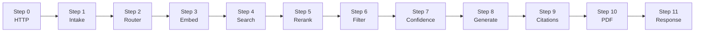
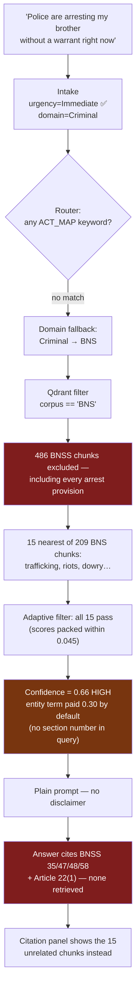
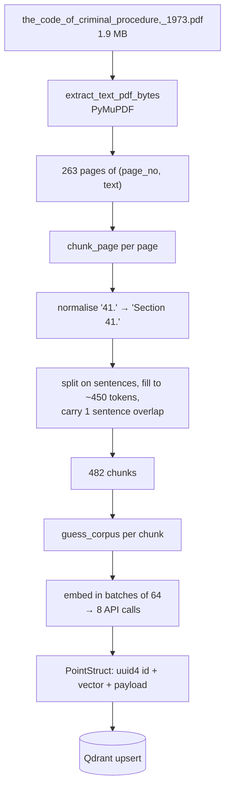

# Legal MVP — Data Flow

**What this document is:** one real query followed end to end, showing the actual data at every hop.

**Why:** [`ARCHITECTURE.md`](ARCHITECTURE.md) tells you what each component does. This tells you what the data *looks like* as it moves. If you only read one document before touching the code, read this one — it is where the abstractions become concrete.

---

## A note on which numbers are real

| Mark | Meaning |
|---|---|
| ✅ | **Recorded.** Taken from `testing_results/Straightforward_Queries.docx`, an actual run of this system. |
| 🔶 | **Derived.** Not recorded, but determined by reading the code — given the recorded inputs, this is what the code must produce. |
| 🔷 | **Illustrative.** Representative values, not measured. Cosine scores were never logged. |

That last category is itself a finding: **the system has never recorded its own retrieval scores.** Fixing that is Prof. Joshi's item #2 and the reason this document has any 🔷 in it at all. Once logging lands, every 🔷 here should be replaced with a measured value.

---

## The query

```
"Police are arresting my brother without a warrant right now."
```

Chosen deliberately. It is urgent, it is the kind of question this system exists for, and — as you will see — it is instructive about how the machine behaves under pressure.

Recorded end-to-end latency: **35,016 ms** ✅ (~35 seconds).



---

## Step 0 · HTTP request arrives

`streamlit_app.py:84` POSTs to `app.py:99`.

```json
{ "query": "Police are arresting my brother without a warrant right now. (Provide a detailed, step-by-step explanation.)" }
```

Note the trailing parenthetical. Streamlit's "Detailed" toggle does not travel as a separate field — `build_query()` (`streamlit_app.py:75`) **appends it to the question text**. That appended English becomes part of the string that gets embedded in Step 3.

`app.py:101` strips it and checks it is non-empty. It is, so the pipeline proceeds.

---

## Step 1 · Intake Agent — triage

`app.py:106` → `agents/intake.py:58`

**In:** the raw string. **Process:** one LLM call with `INTAKE_SYSTEM_PROMPT`, response brace-extracted and parsed, then the paralegal override runs.

**Out — `CaseContext`:**

```python
CaseContext(
    original_query        = "Police are arresting my brother without a warrant right now.",
    scenario              = "General Query",   # ✅ recorded
    user_persona          = "Layman",          # ✅ recorded
    urgency               = "Immediate",       # ✅ recorded
    financial_status      = "Unknown",         # ✅ recorded
    complexity            = "Low",             # ✅ recorded
    predicted_legal_domain= "Criminal",        # 🔶 derived — see Step 2
    legal_issues          = [...],             # 🔶 not captured
    missing_facts         = [...],             # 🔶 not captured
)
```

Two things to notice.

**The urgency triage worked.** `"Immediate"` is correct — someone is being arrested as they type. This is the system's best moment in the whole trace.

**The paralegal override did not fire, correctly.** `_apply_paralegal_override` (`agents/intake.py:111`) scans for 16 patterns — `Section \d+`, `FIR`, `Bail`, `CrPC`, `IPC`, `Quash`, … The query contains none of them. "Arresting" and "warrant" are not triggers. So `user_persona` stays `"Layman"`, which is right: this is a frightened family member, not a practitioner.

**But note what `CaseContext` does *not* do.** `urgency = "Immediate"` changes nothing downstream. It is displayed on the dashboard and printed in the PDF. It does not widen the search, skip a step, or alter the prompt. The only field the Router reads is `predicted_legal_domain` — and, as the next step shows, that one field decides the entire outcome.

---

## Step 2 · Router Agent — where to look

`app.py:109` → `agents/router.py:29`

This is the step that determines everything that follows. Walk it exactly.

**Step 2a — corpus keyword scan** (`router.py:38-49`). Lowercase the query and check each `ACT_MAP` key:

| Key | Present in `"police are arresting my brother without a warrant right now"`? |
|---|---|
| `ipc`, `bns`, `penal code`, `nyaya sanhita` | ❌ |
| `crpc`, `bnss`, `criminal procedure` | ❌ |
| `iea`, `bsa`, `evidence act` | ❌ |
| `constitution` | ❌ |
| `consumer protection` | ❌ |

`matched_corpora = set()` — **empty**. A person in distress describes what is happening; they do not cite the statute book.

**Step 2b — entity extraction** (`router.py:52-58`). `SEC_RE` needs one of `section|sec|article|art|order|rule` followed by a number. There is none.

```python
entities = []        # 🔶
boost_terms = []     # (until step 2d)
intent = "general"   # unchanged
```

**Step 2c — case-law detection** (`router.py:61`). No ` v. `, no `judgment`, no `scc`. Skipped.

**Step 2d — the domain fallback** (`router.py:67-71`). This is where the outcome is decided:

```python
if not target_corpus and not matched_corpora:
    if "Criminal" in context.predicted_legal_domain:
        target_corpus = "BNS"
    elif "Civil" in context.predicted_legal_domain:
        target_corpus = None
```

Intake said `"Criminal"`. So:

```python
target_corpus = "BNS"    # 🔶 derived — and confirmed by the recorded citations
```

**Read that carefully, because it is the hinge of this entire trace.** The question is about *arrest procedure* — police powers, warrants, what must happen after detention. In Indian law that is the **Code of Criminal Procedure** (tagged `BNSS` in this index). The BNS is the **penal code**: it defines offences and punishments. It says almost nothing about how an arrest may be conducted.

The fallback treats "Criminal" as a synonym for "the penal code." Those are different things, and the query needed the other one.

**Step 2e — rewriting** (`router.py:76-79`). `boost_terms` gets `context.legal_issues` appended, so the rewritten query is the issue terms plus the original text.

**Out — `QueryPlan`:**

```python
QueryPlan(
    original_query  = "Police are arresting my brother without a warrant right now.",
    rewritten_query = "<legal_issues> Police are arresting my brother without a warrant right now. (Provide a detailed…)",
    intent          = "general",
    target_corpus   = "BNS",      # 🔶 ← the decision that determines the answer
    entities        = [],         # 🔶 ← empty; matters enormously in Step 7
    boost_terms     = [...],
)
```

---

## Step 3 · Embedding

`agents/retriever.py:73` → `clients/openai_client.py:6`

```python
q_vec = embed_texts([plan.rewritten_query])[0]
```

One API call to `text-embedding-3-small`. Out: **1536 floats** 🔷.

```
[0.0134, -0.0271, 0.0442, 0.0089, -0.0356, ... ]   # 1536 numbers
```

This is now a point in 1536-dimensional space. Everything after this is geometry — see [`ARCHITECTURE.md` §2.2–2.3](ARCHITECTURE.md#22--what-an-embedding-actually-is).

---

## Step 4 · Qdrant search

`agents/retriever.py:76-90`

The filter is built from `target_corpus`:

```python
Filter(must=[{"key": "corpus", "match": {"value": "BNS"}}])
```

**This is the moment the outcome is locked in.** Of the 1,011 chunks in the index, this filter admits only the 209 tagged `BNS` — every chunk from `Bharatiya_Nyaya_Sanhita_2023.pdf`. The 486 `BNSS` chunks, which include every provision about arrest without warrant, are **excluded before a single similarity is computed**.

Qdrant returns the 15 nearest of the 209 admitted chunks. The fallback at `retriever.py:93` fires only when the result set is *empty* — 15 results is not empty, so no retry happens. From here on, the system is confidently searching a book that does not contain the answer.

**Recorded results** ✅ — all 15 chunks, in order, with what each is actually about:

| # | Page | Subject of the chunk |
|---|---|---|
| 1 | 47 | Child trafficking |
| 2 | 56 | Unlawful assembly / riot — liability of landowner |
| 3 | 40 | Hurt on grave and sudden provocation |
| 4 | 47 | Trafficking — inducement by payment |
| 5 | 58 | Public servant unlawfully purchasing property |
| 6 | 58 | Illustration — officer taking property in execution |
| 7 | 55 | Unlawful assembly — common object |
| 8 | 29 | Presumption of death after seven years |
| 9 | 36 | Organised crime syndicate — charge-sheets |
| 10 | 52 | Election expenses without candidate's authority |
| 11 | 38 | Terrorist training camps |
| 12 | 28 | Dowry — definition cross-reference |
| 13 | 30 | Abandonment of a child under twelve |
| 14 | 41 | Fine payable to victim |
| 15 | 45 | Assault on grave and sudden provocation |

**Not one of these is about arrest, warrants, or police powers.** They are the fifteen least-unrelated chunks in a book about offences, returned because *something* always ranks highest. This is the failure mode described in [`ARCHITECTURE.md` §2.8](ARCHITECTURE.md#28--why-a-confidence-score-exists-at-all): retrieval does not fail by returning nothing; it fails by returning mediocrity.

---

## Step 5 · Reranking

`agents/retriever.py:105-114`

```python
if plan.entities and res:
    ...
```

`plan.entities` is `[]`. **The whole block is skipped.** Order is unchanged.

---

## Step 6 · Adaptive filtering

`agents/retriever.py:117-127`

```python
all_scores = [hit.score for hit in res]
top_score = res[0].score
adaptive_threshold = max(top_score - 0.15, 0.35)
filtered = [hit for hit in res if hit.score >= adaptive_threshold]
if len(filtered) < 3 and len(res) >= 3:
    filtered = res[:3]
```

Illustrative scores 🔷 consistent with the corpus's known distribution ([`ARCHITECTURE.md` §2.4](ARCHITECTURE.md#24--why-legal-scores-sit-at-035055-not-08)):

```
[0.412, 0.404, 0.399, 0.396, 0.391, 0.388, 0.385, 0.383,
 0.381, 0.378, 0.376, 0.374, 0.371, 0.369, 0.367]
```

```
top_score          = 0.412
adaptive_threshold = max(0.412 - 0.15, 0.35) = max(0.262, 0.35) = 0.35
```

Every score is above 0.35, so **all 15 survive**. The floor did the work, not the adaptive rule — the scores are packed within 0.045 of each other, far inside the 0.15 window.

We can confirm this against the record: **the run reports exactly 15 citations** ✅. That is consistent with nothing being filtered.

> Tightly-packed scores are the normal case in this corpus, not the exception. A filter designed to catch "one good hit surrounded by noise" rarely triggers when everything is uniformly mediocre.

---

## Step 7 · Confidence

`agents/retriever.py:133` → `compute_confidence()` at line 28. Worked by hand.

**Signal 1 — top-5 mean** (weight 0.55):

```
top_5 = [0.412, 0.404, 0.399, 0.396, 0.391]
top_k_mean = (0.412+0.404+0.399+0.396+0.391) / 5 = 2.002 / 5 = 0.4004
```

**Signal 2 — score gap** (weight 0.15):

```
score_gap   = 0.412 - 0.391 = 0.021
gap_penalty = min(0.021 / 0.3, 1.0) = min(0.07, 1.0) = 0.07
contribution = 0.15 × (1.0 - 0.07) = 0.15 × 0.93 = 0.1395
```

Very consistent scores → almost the full 0.15. The signal is doing exactly what it was designed to do: it detects that no single chunk stands out. What it cannot detect is that they are consistently *irrelevant*.

**Signal 3 — entity coverage** (weight 0.30):

```python
if entities:      # entities == []  →  False
    ...
else:
    entity_coverage = 1.0    # neutral default
```

```
entity_coverage = 1.0
contribution    = 0.30 × 1.0 = 0.30
```

**Composite:**

```
confidence = 0.55 × 0.4004  +  0.15 × 0.93  +  0.30 × 1.0
           = 0.2202         +  0.1395       +  0.30
           = 0.6597
```

```
confidence ≈ 0.66  →  66%  →  HIGH tier (≥ 0.55)
```

Sit with the arithmetic. The user's question asked about arrest. The retrieved text is about child trafficking, riots, and election expenses. **The formula returns 66% and the HIGH tier** — because the query contained no section number, so the 30% entity term paid out in full by default.

Also note what `refused` becomes (`retriever.py:136`):

```python
refused = len(filtered) == 0   →   len(15) == 0   →   False
```

Refusal is structurally unreachable here. It requires an empty result set, and the corpus is not empty.

**Out — `RetrievalResult`:**

```python
RetrievalResult(
    chunks          = [15 ScoredPoints],
    confidence      = 0.6597,   # 🔷
    top_k_mean      = 0.4004,   # 🔷
    score_gap       = 0.021,    # 🔷
    entity_coverage = 1.0,      # 🔶 exactly 1.0 by the default branch
    max_score       = 0.412,    # 🔷
    total_chunks    = 15,       # ✅
    total_retrieved = 15,       # ✅
    refused         = False,    # ✅
)
```

---

## Step 8 · Answer generation

`app.py:116` → `agents/answer.py:81`

**Refusal gate** (line 83): `refused` is `False` and chunks exist → proceed.

**Tier selection** (lines 96-103): `0.6597 ≥ 0.55` → HIGH → **the plain `ANSWER_SYSTEM_PROMPT`, with no disclaimer prepended.** The model is not told to hedge, not told to distinguish sourced from general knowledge, not told to recommend a lawyer.

**Context assembly** (lines 106-109): all 15 chunks formatted as

```
Doc: Bharatiya_Nyaya_Sanhita_2023.pdf (Page 47)
Text: (1) Whoever, knowingly or having reason to believe that a child has been trafficked…

Doc: Bharatiya_Nyaya_Sanhita_2023.pdf (Page 56)
Text: Section 193. (1) Whenever any unlawful assembly or riot takes place…
```

**The call** (line 117): `client.chat.completions.create(model=GEN_MODEL, temperature=0, messages=...)`.

**Recorded output** ✅ — the answer's "Relevant Legal Provisions" table:

| Law/Act | Section | Provision |
|---|---|---|
| BNSS | Sec 35 | When police may arrest without warrant |
| BNSS | Sec 47 | Arrest memo / procedure and duties |
| BNSS | Sec 48 | Right of arrested person to meet an advocate |
| BNSS | Sec 58 | Person arrested must be produced before magistrate |
| Constitution of India | Article 22(1) | Right to be informed of grounds of arrest |

Compare that table against the 15 chunks in Step 4. **Not one of these five provisions appears in the retrieved text.** BNSS sections were not retrieved — the BNSS corpus was filtered out in Step 4. The Constitution is not in the index at all; no constitutional document was ever ingested.

The model answered from its own parametric knowledge. The prompt asked it to use the search results; nothing enforced that, and the search results were useless, so it fell back on what it knew.

The answer is, in substance, *roughly right about the law* — those are real provisions on the topic. But the section numbers come from the BNSS, and the only procedure document in this corpus is the CrPC 1973, whose numbering is entirely different. For someone whose relative is being arrested right now, citing the wrong numbering scheme with no hedge is a concrete failure.

---

## Step 9 · Citations

`agents/answer.py:129-136`

```python
"citations": [
    {"source": c.payload.get('doc_name'),
     "page":   c.payload.get('page'),
     "snippet": c.payload.get('text', '')[:200]}
    for c in context
]
```

Citations are built **mechanically from the retrieved chunks**, with no reference to what the model wrote. So the user sees:

> **Answer:** cites BNSS §35, §47, §48, §58, Article 22(1)
> **Citations / Sources:** 15 excerpts about child trafficking, riots, and dowry

The two lists have nothing to do with each other. The citation panel is a record of *retrieval*, presented in a position that implies it is a record of *support*.

---

## Step 10 · PDF report

`app.py:131-141` → `agents/reporter.py:20`

`refused` is `False`, so a report is generated to `static/report_<8hex>.pdf` and `report_url` is returned. `clean_text()` strips markdown and coerces to Latin-1 along the way.

---

## Step 11 · Response

```json
{
  "answer": "**1. Try an Informal Solution First** …",
  "citations": [ 15 items ],
  "confidence": 0.6597,
  "refused": false,
  "paralegal_context": {
    "scenario": "General Query",
    "persona": "Layman",
    "urgency": "Immediate",
    "complexity": "Low",
    "financial_status": "Unknown",
    "issues": [...],
    "missing_facts": [...]
  },
  "report_url": "/static/report_a3f9c21b.pdf"
}
```

Streamlit renders a **🟢 High Confidence (66%)** badge (`streamlit_app.py:249-254`).

---

## The trace in one view



Five independent mechanisms had to line up for this outcome, and each one behaved exactly as written:

1. The domain fallback equated "Criminal" with the penal code.
2. The corpus filter excluded the right document before similarity was computed.
3. The unfiltered-retry fallback didn't fire, because 15 ≠ 0.
4. The entity term defaulted to 1.0, because the user didn't cite a section.
5. The refusal gate couldn't fire, because it only triggers on an empty result set.

No component malfunctioned. The system did what it was built to do. That is the important lesson — and why [`GAPS.md`](GAPS.md) is about design, not bugs in the ordinary sense.

---

## The ingest path, briefly

Run rarely, but everything above depends on it having been done correctly.



**A single chunk, fully formed:**

```python
{
  "doc_name":        "the_code_of_criminal_procedure,_1973.pdf",
  "page":            41,
  "chunk_index":     3,
  "chunk_id":        "the_code_of_criminal_procedure,_1973.pdf:41:003",
  "original_chunk_id": "…same…",
  "text":            "Section 41. When police may arrest without warrant.—(1) Any police officer may without an order from a Magistrate and without a warrant, arrest any person…",
  "corpus":          "BNSS",
  "lang_detected":   "en"
}
```

Two ids exist because Qdrant requires point ids to be UUIDs or unsigned integers. The human-readable `chunk_id` is neither, so `ingest/index.py:21` assigns a fresh `uuid4()` as the id and preserves the readable one in the payload.

**What the four PDFs actually produced** ✅ (measured by running the live ingest path over `tests/data/*.pdf`):

| Document | Pages | Chunks | Corpus tags assigned |
|---|---|---|---|
| Bharatiya Nyaya Sanhita 2023 | 102 | 209 | `BNS` 100% |
| CrPC 1973 | 263 | 482 | `BNSS` 100% |
| IPC 1860 (`repealedfileopen.pdf`) | 119 | 248 | `Unknown` 95.2%, `BSA` 2.4%, `Judgments` 1.6%, other 0.8% |
| Consumer Protection Act 2019 | 39 | 72 | `Unknown` 86.1%, `Judgments` 5.6%, `BNSS` 4.2%, other 4.1% |

Total **1,011 chunks**, matching `ingest_debug.log`.

Index-wide composition:

| Corpus tag | Chunks | Share |
|---|---|---|
| `BNSS` | 486 | 48.1% |
| `Unknown` | 298 | 29.5% |
| `BNS` | 209 | 20.7% |
| `Judgments` | 8 | 0.8% |
| `BSA` | 7 | 0.7% |
| `Constitution` | 3 | 0.3% |

Reproduce it yourself — this reads the PDFs directly and calls the same functions the API does:

```python
from ingest.extract import extract_text_pdf_bytes
from ingest.chunk import chunk_page
from pathlib import Path
import collections

for pdf in sorted(Path("tests/data").glob("*.pdf")):
    tags = collections.Counter()
    for page, text in extract_text_pdf_bytes(pdf.read_bytes()):
        for c in chunk_page(pdf.name, page, text):
            tags[c["corpus"]] += 1
    print(pdf.name, dict(tags))
```

The interpretation of these numbers — and of the three tags that point at documents which were never ingested — is in [`GAPS.md`](GAPS.md).

---

## Where to go next

- [`GLOSSARY.md`](GLOSSARY.md) — any term here you want pinned down.
- [`GAPS.md`](GAPS.md) — now you have the full picture, this is where we compare it against what the system was meant to do.
