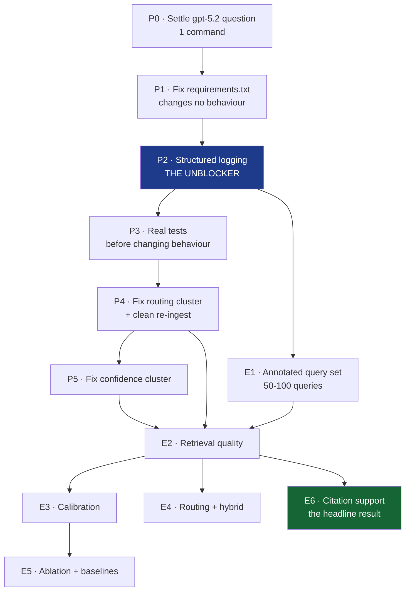

# Legal MVP — Evaluation Plan

**What this document is:** Prof. Joshi's five directives turned into experiments you can actually run — what each measures, what it needs first, and what table or figure it produces.

**Read first:** [`GAPS.md`](GAPS.md) (why some of this is blocked) and [`RESEARCH_CONTEXT.md`](RESEARCH_CONTEXT.md) (why we're doing it).

---

## The dependency graph

The single most important thing on this page: **you cannot run the experiments in the order they were listed.**



| Supervisor's item | Becomes | Prerequisites |
|---|---|---|
| 1 · Annotated eval set | **E1** | none — start today |
| 2 · Complete logging | **P2** | P0, P1 |
| 3 · Retrieval, calibration, correctness | **E2, E3, E6** | P2, P4, P5, E1 |
| 4 · Routing investigation + hybrid | **E4** | P2, E1 |
| 5 · Ablation + baselines | **E5** | P5, E3 |

**Why the reordering.** Items 3 and 5 measure the confidence score. That score is currently miscomputed ([`GAPS.md`](GAPS.md) #1–2) in a way that saturates it near 1.0. Running calibration now produces a reliability diagram that is a spike at 1.0, and an ablation over weights that aren't comparable. The numbers would be worse than no numbers, because they'd look publishable.

---

# Prerequisites

## P0 · Settle the model-configuration question

**Effort:** 2 minutes.

```bash
python -c "from clients.openai_client import chat_json; print(chat_json([{'role':'user','content':'hi'}]))"
```

Success → close [`OPEN_QUESTIONS.md`](OPEN_QUESTIONS.md) Q1 and move on.
Failure with a temperature error → `.env`'s `MODEL_NAME=gpt-5.2` is incompatible with `temperature=0`, both Intake and Answer have been failing into silent fallbacks, and **every recorded run under this configuration is void.** Decide the model, record it in [`DECISIONS.md`](DECISIONS.md), and note the implication for the 23 baseline runs.

Do this first because it is binary and cheap, and several other findings need reinterpreting if it fails.

## P1 · Regenerate `requirements.txt`

**Effort:** 15 minutes. **Changes no behaviour**, so it cannot invalidate anything.

```bash
./venv/Scripts/pip.exe freeze > requirements.lock.txt   # exact reproduction
```

Then hand-write a `requirements.txt` of direct dependencies only: `fastapi`, `uvicorn`, `streamlit`, `qdrant-client`, `openai`, `fpdf2`, `pymupdf`, `pdfplumber`, `python-docx`, `pytesseract`, `langdetect`, `python-multipart`, `jinja2`, `python-dotenv`, `pydantic`, `requests`, `pytest`. Drop the CV stack (`torch`, `ultralytics`, `opencv-python`, `pycocotools`, `thop`) — nothing imports it.

A reviewer must be able to install and run this. Right now they cannot.

## P2 · Structured logging — the unblocker

**Effort:** half a day. **This is Prof. Joshi's item 2 and everything downstream depends on it.**

`core/logging.py` already exists with a `req_id` formatter and is imported by nothing ([`GAPS.md`](GAPS.md) #11). Wire it up and emit **one JSON record per query**.

Required fields — this schema is what makes E2–E6 possible, so get it right once:

```jsonc
{
  "req_id": "a3f9c21b4d0e",
  "timestamp": "2026-08-17T14:22:03Z",
  "query_id": "Q042",                    // links to the annotated set
  "query_raw": "Police are arresting my brother without a warrant right now.",

  "intake": {
    "scenario": "General Query", "persona": "Layman",
    "urgency": "Immediate", "complexity": "Low",
    "domain": "Criminal", "issues": [...], "missing_facts": [...],
    "llm_ok": true, "fallback_used": false        // ← catches the silent Intake failure
  },

  "router": {
    "matched_corpora": [], "target_corpus": "BNS",
    "entities": [], "intent": "general",
    "rewritten_query": "...",
    "decision_path": "domain_fallback"            // ← WHY, not just what
  },

  "retrieval": {
    "filter_applied": {"corpus": "BNS"},
    "filter_fallback_fired": false,               // ← the silent filter drop
    "n_retrieved": 15,
    "scores_raw": [0.412, 0.404, ...],            // ← pre-rerank, pre-filter
    "rerank_applied": false,
    "adaptive_threshold": 0.35,
    "n_after_filter": 15,
    "chunks": [{"doc": "...", "page": 47, "corpus": "BNS", "score": 0.412,
                "chunk_id": "...", "text_head": "..."}]
  },

  "confidence": {
    "top_k_mean": 0.4004, "score_gap": 0.021,
    "entity_coverage": 1.0,
    "entity_coverage_default_used": true,         // ← distinguishes measured from default
    "composite": 0.6597, "tier": "HIGH", "clamped": false
  },

  "answer": {
    "refused": false, "prompt_variant": "HIGH",
    "llm_ok": true, "latency_ms": 35016,
    "answer_text": "...", "citations": [...]
  }
}
```

Four fields deserve emphasis because they exist specifically to catch things that currently fail silently:

| Field | Catches |
|---|---|
| `intake.fallback_used` | The Intake LLM failing and returning a hardcoded context ([`GAPS.md`](GAPS.md) #23) |
| `router.decision_path` | *Which* rule set the corpus — `act_map` / `domain_fallback` / `multi_corpus_none` |
| `retrieval.filter_fallback_fired` | The filter being silently dropped ([`GAPS.md`](GAPS.md) #5) |
| `confidence.entity_coverage_default_used` | The free 0.30 ([`GAPS.md`](GAPS.md) #2) |

**Insertion points:** `clients/` is the only code touching OpenAI and Qdrant, so instrumentation goes there plus `agents/retriever.py`. Write to JSONL — one object per line, one file per run — so analysis is `pandas.read_json(..., lines=True)`.

**Also build a batch runner** (`scripts/run_eval.py`) that reads the query set, POSTs each to `/query`, and collects the JSONL. Without it, running 100 queries five times is unbearable.

## P3 · Real tests

**Effort:** 2–3 hours. Before behaviour changes, not after.

`tests/test_router.py` currently raises `AttributeError` on its first case ([`GAPS.md`](GAPS.md) #12). Replace with pytest covering:

- `RouterAgent.route()` with a real `CaseContext` — one case per decision path (`act_map` single, `act_map` multi, `domain_fallback`, no-match)
- `compute_confidence()` — **including the pathological cases**: entity coverage with 1 entity and 3 matching chunks; the no-entity default; empty scores
- `guess_corpus()` — one case per document, asserting the *intended* tag

That confidence test is the one that would have caught [`GAPS.md`](GAPS.md) #1 in February.

## P4 · Fix the routing cluster, then re-ingest

**Effort:** half a day. Four defects, one entangled problem — fixing any alone leaves the others masking it.

1. `ingest/chunk.py::guess_corpus` — promote the better version from `scripts/ingest_cli.py` (explicit filename mapping, `ConsumerProtection`)
2. `agents/router.py::ACT_MAP` — `"consumer protection" → "ConsumerProtection"`
3. `agents/router.py:67-71` — the domain fallback conflating criminal with penal
4. `agents/retriever.py:93` — the filter fallback must *record* that it fired

**Then delete `fix_corpus_tags.py` and re-ingest from scratch.** Fixing data instead of code is what hid this for six months.

**Verify before proceeding** — the corpus audit should show 100% correct tags on all four documents, and `Constitution` / `BSA` / `Judgments` should have **zero** chunks (no such document is ingested).

## P5 · Fix the confidence cluster

**Effort:** 2 hours code, plus a real design decision.

- **#1** `entity_coverage` — iterate entities, not chunks. Mechanical.
- **#7** `top_score = max(all_scores)`. Mechanical.
- **#2** the neutral default — **not mechanical.** Options: renormalise the other weights when no entity exists; make it a penalty rather than a bonus; or make "no entity" an explicit state. Whichever you pick needs a [`DECISIONS.md`](DECISIONS.md) entry with the reasoning, because a reviewer will ask.

> **Keep the old implementation available behind a flag.** E5's ablation wants to compare against it, and E3 can then show a before/after reliability diagram — a genuinely compelling figure.

---

# Experiments

## E1 · The annotated query set

*Supervisor's item 1. No prerequisites — start today, in parallel with P0–P5.*

**Target:** 50–100 queries. Below 50 the calibration bins are too sparse; you need ≥10 per confidence tier.

**Schema** — one row per query:

| Field | Example |
|---|---|
| `query_id` | `Q042` |
| `query_text` | "Police are arresting my brother without a warrant right now." |
| `category` | straightforward / vague / complex / reasoning |
| `expected_corpus` | `BNSS` |
| `expected_sections` | `["CrPC 41", "CrPC 41A", "CrPC 50", "CrPC 57"]` |
| `answerable_from_corpus` | `true` / `false` |
| `phrasing_register` | layman / technical |
| `notes` | why these sections; edge cases |

**Two fields that matter more than they look:**

`answerable_from_corpus` — the corpus holds four statutes. No Constitution, no Evidence Act, no case law, no NI Act, no Contract Act, no Limitation Act. A query about the Limitation Act **cannot** be answered correctly, and the ideal behaviour is refusal. Without this flag you will score unanswerable queries as retrieval failures and understate the system. **With** it, you get a clean measure of a different thing: *does the system know when it doesn't know?* Given the refusal gate is structurally unreachable ([`GAPS.md`](GAPS.md) #9), the expected answer is "no" — and that is a result.

`phrasing_register` — the routing hypothesis is that keyword-based routing fails on layman phrasing. This field lets you test that directly rather than assert it.

**Composition suggestion:**

| Slice | n | Purpose |
|---|---|---|
| Technical, answerable | 20 | Best case — establishes the ceiling |
| Layman, answerable | 25 | The real target population |
| Procedural (arrest/bail/FIR/jurisdiction) | 15 | Tests the penal/procedural confusion directly |
| Consumer | 10 | Tests the CPA routing path |
| Unanswerable | 15 | Tests refusal |
| Multi-corpus comparison | 10 | Tests the no-filter path |

**Ground truth must be annotated in advance**, before seeing any output. Annotating after the fact means grading the system against its own behaviour.

You already have 23 queries in `testing_results/` and a further ~20 in `Queries .docx` — reuse the *text*, re-annotate from scratch.

**Deliverable:** `eval/queryset.jsonl` + `eval/ANNOTATION_GUIDE.md` (so the labelling is reproducible and defensible).

---

## E2 · Retrieval quality

*Part of item 3. Needs P2, P4, E1.*

**Question:** when the right provision exists in the corpus, does retrieval find it?

**Metrics**, over the `answerable_from_corpus == true` subset:

| Metric | Definition |
|---|---|
| Recall@k | fraction of expected sections appearing in the top-k, for k ∈ {1, 3, 5, 10, 15} |
| Precision@k | fraction of top-k chunks that are relevant |
| MRR | mean of 1/(rank of first correct chunk) |
| Corpus accuracy | fraction where `target_corpus == expected_corpus` |

**Matching rule needs deciding and documenting.** A retrieved chunk "contains section 41" if — the normalised string `"Section 41"` appears? The chunk spans the page where s.41 begins? Substring matching is confounded by the section-normaliser injecting false markers ([`GAPS.md`](GAPS.md) #16). Recommendation: match on `(doc_name, page)` against an annotated page range, and record the rule in `ANNOTATION_GUIDE.md`.

**Output:** Table — metrics overall and broken down by category and `phrasing_register`.

**Expected finding:** low corpus accuracy on layman phrasing. The pre-fix baseline is 1/11.

---

## E3 · Confidence calibration

*Item 3. Needs E2 + P5. **Blocked until the confidence fixes land.***

**Question:** when the system says 66%, is it right 66% of the time?

**Method.** For each query define a binary correctness label — recommendation: `retrieval_correct = (expected section appears in the chunks sent to the LLM)`. This measures what confidence *claims* to measure (retrieval quality), keeping it separate from generation quality in E6.

1. Bin by predicted confidence (10 bins of 0.1, or quantile bins if sparse)
2. Per bin: mean confidence vs observed accuracy
3. Plot the **reliability diagram**; the diagonal is perfect calibration
4. Compute **ECE** = Σ (n_bin/N) × |confidence_bin − accuracy_bin|
5. Report **tier separation**: accuracy within HIGH vs MEDIUM vs LOW

**Tier separation is the honest headline.** If HIGH and LOW queries have similar accuracy, the score is not doing its job — regardless of what ECE says.

**Output:** Reliability diagram (Figure) + ECE and per-tier accuracy (Table).

**Do this twice** — old implementation and fixed. The before/after is a strong figure and directly evidences the finding.

---

## E4 · Routing investigation and hybrid comparison

*Item 4. Needs P2, E1. Can run before the confidence fixes.*

**Question:** how often does routing pick the right corpus, why does it fail, and does hybrid retrieval help?

**Part A — characterise the current router.** Using `router.decision_path` from the logs:

| Decision path | n | Corpus accuracy |
|---|---|---|
| `act_map` (single match) | | |
| `act_map` (multi → no filter) | | |
| `domain_fallback` | | |
| `no_match` | | |

Cross-tabulate against `phrasing_register`. **Hypothesis to test:** `act_map` is accurate but only fires on technical phrasing; `domain_fallback` fires on layman phrasing and is systematically wrong for procedural queries.

**Part B — the base-rate confound.** When no filter is applied, the index is 48.1% CrPC ([`GAPS.md`](GAPS.md) #5). Report unfiltered retrieval's corpus distribution against corpus volume share, so drift can be separated from genuine relevance. Without this control, "unfiltered search drifts to CrPC" is unfalsifiable.

**Part C — hybrid routing.** Compare three conditions:

| Condition | Description |
|---|---|
| **Current** | regex `ACT_MAP` + domain fallback |
| **Dense-only** | no filter; pure vector search |
| **Hybrid** | BM25 over chunk text fused with dense scores (Reciprocal Rank Fusion) |

Hybrid should help most where embeddings blur exact tokens — section numbers, Act names. That is a specific, testable prediction rather than a vague hope.

**Optional fourth condition** worth the effort if time allows: **InLegalBERT embeddings** (Paul et al. 2022) instead of `text-embedding-3-small`. A domain-pretrained encoder vs a general one on Indian statutory text is a comparison the reviewing community will want.

**Output:** Routing accuracy by decision path (Table); three-condition comparison (Table); a confusion matrix of predicted vs expected corpus (Figure).

---

## E5 · Ablation and baselines

*Item 5. Needs E3, P5.*

**Question:** does each confidence signal earn its weight?

**Ablation** — recompute confidence from logged raw scores (no re-querying needed, which makes this cheap):

| Variant | Formula |
|---|---|
| Full | `0.55·mean + 0.15·(1−gap) + 0.30·entity` |
| − signal 1 | drop top-k mean, renormalise |
| − signal 2 | drop gap penalty, renormalise |
| − signal 3 | drop entity coverage, renormalise |
| Signal 1 only | mean of top-5 |
| **Old (pre-fix)** | the buggy implementation |
| **Naive baseline** | mean of all 15 scores — the pre-`ce1bded` method |

Report ECE and tier separation for each. **State the weight-sensitivity honestly**: were 0.55/0.15/0.30 tuned, or chosen? If chosen, say so and show sensitivity across a small grid.

**Baselines for the system as a whole:**

| Baseline | Tests |
|---|---|
| No routing (dense over everything) | Does routing help at all? |
| No confidence gating (always plain prompt) | Do the tiers change output quality? |
| No retrieval (LLM alone) | **Important.** If the LLM alone scores comparably, retrieval is adding little — and given [`GAPS.md`](GAPS.md) #8, that is a live possibility worth confronting directly |

**Output:** Ablation table (ECE + tier separation per variant); baseline comparison table.

---

## E6 · Citation support — the headline

*Part of item 3, but the strongest result available. Needs P2, E1.*

**Question:** is each legal proposition in the answer supported by what was retrieved?

**Method** — adapt Gao et al.'s ALCE protocol (EMNLP 2023, arXiv:2305.14627) rather than inventing one:

1. Extract every statutory citation from the answer (the "Relevant Legal Provisions" table is conveniently structured; parse the prose too)
2. For each, check whether the cited provision appears in the chunks sent to the LLM
3. Report:
   - **Citation precision** — fraction of cited provisions present in retrieved context
   - **Citation recall** — fraction of retrieved relevant provisions actually cited
   - **Unsupported citation rate** — the headline number
   - **Out-of-corpus citation rate** — cites an Act not in the index *at all* (the most severe class)

**Pre-fix baseline from the recorded runs:** citation precision **1/7 ≈ 14%**; out-of-corpus citations in 3 of 7.

**Extra analysis specific to India, and possibly the most novel thing here.** Add a fourth category: **numbering-scheme errors** — where the answer is substantively right about the law but cites the wrong scheme (BNSS §35 when the corpus holds CrPC §41). The 2023–24 recodification means both schemes are in live use, so a system can be *right about the law and wrong about the citation*. This failure mode does not exist in US/EU legal RAG and is not captured by Dahl et al. or Magesh et al.

**Output:** Citation-support table by category (Table); the arrest query as a worked failure trace (Figure 1 of the paper).

---

# Suggested sequence

Eight weeks to ARR on 12 October. Not a commitment — a shape.

| Week | Focus |
|---|---|
| 1 | P0, P1, P2 · start E1 annotation |
| 2 | P3, P4 · clean re-ingest · continue E1 |
| 3 | P5 · finish E1 (50–100 annotated) |
| 4 | E2, E4 Part A/B — first real numbers |
| 5 | E3, E6 — calibration and the headline |
| 6 | E4 Part C (hybrid), E5 |
| 7 | Figures, tables, draft |
| 8 | Revision, supervisor review, submit |

**Report to Prof. Joshi at the end of week 2** — the routing diagnosis and the corpus-tagging measurement are concrete progress on his item 4 and worth sharing before the full results.

---

# Rules for the whole evaluation

Written down because they are easy to violate under deadline pressure.

1. **Never mix pre-fix and post-fix numbers.** Every result carries the git SHA that produced it.
2. **Annotate ground truth before seeing output.** Otherwise you grade the system against itself.
3. **Fix code, never data.** [`GAPS.md`](GAPS.md) #4 is what happens otherwise.
4. **Log everything, delete nothing.** Storage is free; a re-run is not.
5. **Report what failed.** A negative result honestly reported is this paper's contribution — the framing your supervisor endorsed.
6. **One variable at a time.** Changing the router and the confidence formula together makes the delta uninterpretable.
7. **Every number in the paper must be regenerable** by a script in this repo, from the logs, without manual steps.
