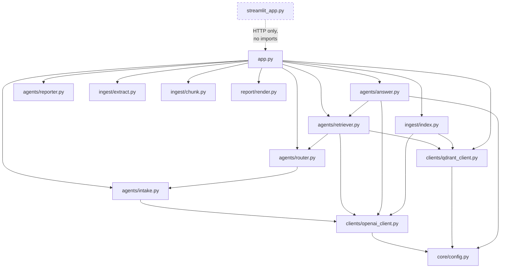

# Legal MVP — File Structure

**What this document is:** every path in this repository, classified by whether it actually does anything.

**Why it exists:** the repo has 84 tracked files. A meaningful fraction are dead code, one-off debug scripts, or debris from earlier attempts. When you open a file here you should immediately know whether changing it affects the running system. This document is the answer to *"does this file matter?"*

Companion: [`ARCHITECTURE.md`](ARCHITECTURE.md) explains what the live files *do*.

---

## The six classifications

| Class | Meaning | If you change it… |
|---|---|---|
| 🟢 **LIVE** | On the request path today | …the running system changes |
| ⚪ **ORPHANED** | Real code, imported by nothing that runs | …nothing happens |
| 🔧 **DEBUG** | One-off scripts you ran manually to diagnose something | …nothing happens unless you run it |
| 📁 **DATA** | Inputs and recorded outputs | …you change the corpus or the record |
| ⚙️ **GENERATED** | Produced by the system or the toolchain | …it gets overwritten |
| 🗑️ **CRUFT** | Debris that should not be in the repo | …nothing; consider deleting |

---

## Top-level map

```
legal-mvp/
├── app.py                     🟢 FastAPI app — the orchestrator
├── streamlit_app.py           🟢 Streamlit UI (separate process, port 8501)
├── requirements.txt           🟢 Dependency pins  ⚠ see GAPS.md #5
├── docker-compose.yml         🟢 Qdrant container definition
├── .env                       🟢 Secrets & model config (gitignored, never committed)
├── .gitignore                 🟢
├── README.md                  🟢 Public-facing overview  ⚠ overstates the system
│
├── agents/                    🟢 The five-agent pipeline — the heart of the system
├── clients/                   🟢 External service wrappers (OpenAI, Qdrant)
├── ingest/                    🟢 Document → chunks → vectors
├── core/                      🟢 Config, schemas, logging
├── report/                    🟢 HTML rendering
├── docs/                      🟢 This documentation set
│
├── retrieve/                  ⚪ ORPHANED — superseded by agents/
├── answer/                    ⚪ ORPHANED — superseded by agents/
├── app_backup.py              ⚪ ORPHANED — the only thing importing the two above
│
├── scripts/                   🔧 CLI helpers, mixed live-ish and stale
├── tests/                     📁🔧 Corpus PDFs + one broken test
├── testing_results/           📁 The 23 recorded query runs (Word docs)
│
├── qdrant_storage/            ⚙️ Qdrant's on-disk database (gitignored)
├── static/                    ⚙️ Generated PDF reports (gitignored)
├── venv/                      ⚙️ Virtual environment (gitignored)
├── __pycache__/ (all dirs)    ⚙️ Bytecode  ⚠ tracked in git despite .gitignore
│
├── full_codebase.py           🗑️ 41 MB blob, still tracked in git
├── debug_*.py, fix_*.py, …    🔧 One-off diagnostics
└── .env~, x, out.html, …      🗑️ Debris
```

---

## 🟢 LIVE — the running system

### `agents/` — the five-agent pipeline

| File | Lines | Role |
|---|---|---|
| `intake.py` | 142 | Agent 1. LLM triage → `CaseContext`. Contains the paralegal regex override. |
| `router.py` | 94 | Agent 2. Pure regex. `CaseContext` → `QueryPlan`. Holds `ACT_MAP` and `SEC_RE`. |
| `retriever.py` | 155 | Agent 3. Qdrant search, reranking, adaptive filtering, `compute_confidence()`. The most consequential file in the repo. |
| `answer.py` | 142 | Agent 4. Confidence-tiered prompts, refusal gate, LLM generation, citation assembly. |
| `reporter.py` | 143 | Agent 5. `fpdf2` PDF with Latin-1 sanitisation. |
| `__init__.py` | 0 | Empty package marker. |

### `clients/` — external services

| File | Role |
|---|---|
| `openai_client.py` | `embed_texts()` and `chat_json()`. Constructs `OpenAI()` **at import time**, which is why `app.py` must load `.env` first. |
| `qdrant_client.py` | `qdrant()` (new client per call) and `ensure_collection()`. Hard-codes `COLLECTION = "legal_mvp"` and `dim=1536`. |
| `__init__.py` | Empty package marker. |

### `ingest/` — document pipeline

| File | Role |
|---|---|
| `extract.py` | Byte-based PDF/DOCX/TXT extraction, OCR fallback guarded by `shutil.which("tesseract")`. Lines 39–61 are unused path-based variants. |
| `chunk.py` | `chunk_page()` (~450-token chunks, 1-sentence overlap, section-header normalisation) and `guess_corpus()`. |
| `index.py` | Batches of 64 → embed → `PointStruct` with UUID → Qdrant upsert. |
| `extract_backup.py` | ⚪ Older copy of `extract.py`. Not imported. |

> **No `__init__.py`.** `ingest/`, `report/`, `retrieve/`, `answer/`, and `tests/` rely on Python 3 implicit namespace packages. This works, but means these directories are not formally packages — relevant if packaging is ever attempted.

### `core/` — shared plumbing

| File | Role |
|---|---|
| `config.py` | Reads `.env`. Exports `EMBED_MODEL`, `GEN_MODEL`, `QDRANT_URL`, `TOP_K`, `USE_TRANSLATION`, `LANGS_OCR`. Note `GEN_MODEL` prefers `MODEL_NAME` over `GEN_MODEL`. |
| `schemas.py` | `Citation` and `AnswerJSON` Pydantic models. ⚠ `AnswerJSON` is imported in `app.py:19` but never used — nothing validates the response shape. |
| `logging.py` | Configures a `req_id` log formatter. ⚠ **Nothing imports it.** All agents use bare `print()`. |
| `__init__.py` | Empty package marker. |

### `report/` — HTML output

| File | Role |
|---|---|
| `render.py` | Jinja2 environment + `render_html()`. Used only by the `?format=html` branch. |
| `templates/answer.html.j2` | The HTML report template. Expects `query`, `answer`, `citations`. |

### Root-level live files

| File | Role |
|---|---|
| `app.py` | FastAPI app. `.env` load must stay at the top (line 6). Instantiates all five agents at module level. |
| `streamlit_app.py` | The UI. Separate process; imports **nothing** from the backend, talks HTTP only. Duplicates the 0.55/0.38 confidence thresholds client-side. |
| `requirements.txt` | ⚠ Does not currently list the project's actual dependencies — see [`GAPS.md`](GAPS.md). |
| `docker-compose.yml` | Qdrant v1.12.4, port 6333, volume-mounted at `./qdrant_storage`. |
| `.env` | `OPENAI_API_KEY`, `MODEL_NAME`, `EMBED_MODEL`. Gitignored and verified never committed. |

---

## ⚪ ORPHANED — real code that nothing runs

These are the **previous generation** of the system, superseded when `agents/` was introduced. They still import cleanly, which is why nothing has flagged them.

| File | What it was | Superseded by |
|---|---|---|
| `app_backup.py` | The earlier FastAPI app | `app.py` |
| `retrieve/decision.py` | Earlier router — corpus filter + section boosting | `agents/router.py` |
| `retrieve/search.py` | Qdrant search wrapper (`top_k=24`) | `agents/retriever.py` |
| `retrieve/pack.py` | Evidence packer — numbered `[1]`, `[2]` snippets | inline in `agents/answer.py` |
| `answer/prompt.py` | Strict-JSON prompt templates | `agents/answer.py` prompts |
| `answer/llm.py` | Thin LLM wrapper | `clients/openai_client.py` |
| `answer/validate.py` | JSON parser with LLM-based auto-repair | ⚠ **nothing** — this capability was dropped, not replaced |
| `ingest/extract_backup.py` | Older extraction code | `ingest/extract.py` |

**Verify this yourself:**
```bash
grep -rn "from retrieve\|from answer\." --include=*.py . | grep -v venv
```
Every hit is inside `app_backup.py`.

> `README.md` documents a `retrieve/mmr.py` implementing Maximal Marginal Relevance. **That file does not exist** and never did on this branch.

---

## 🔧 DEBUG — one-off scripts

Run manually, never imported. Most are gitignored but still present on disk. They are historically informative — each one marks a problem you were chasing.

| File | What it was for | Still useful? |
|---|---|---|
| `fix_corpus_tags.py` | Rewrote `corpus` payload on existing Qdrant points to correct labels | ⚠ **Important.** It patched the *database* but not `ingest/chunk.py`, so re-ingesting reverts. See [`GAPS.md`](GAPS.md). |
| `fix_embeddings.py` | Re-embedded all points after all stored vectors were found to be zeros | Historically significant — any evaluation run before this is void |
| `debug_qdrant.py` | Search a query against the index, print hits | Yes, quick sanity check |
| `debug_scores.py` | Batch of targeted queries to find which score well | Yes, precursor to a real eval harness |
| `check_pdfs.py` | Verify PDFs are readable | Occasionally |
| `parse_results.py` / `extract_results.py` | Pull results out of recorded runs into `results.csv` | Superseded by the planned logging work |
| `test_ingest.py` | POSTs three PDFs to `/ingest` | ⚠ Hardcodes `C:\Users\uniya\Downloads` paths; not a pytest test |
| `smoke_ingest.sh` | Shell smoke test (duplicated at root and in `scripts/`) | Marginal |

### `scripts/`

| File | Status |
|---|---|
| `query_cli.py` | 🔧 Useful — interactive CLI against `/query` |
| `ingest_cli.py` | ⚠ **Misleading name.** Not a CLI — it is a *copy of `ingest/chunk.py`* with a **different, better** `guess_corpus()` that knows about `ConsumerProtection` and maps filenames explicitly. The live pipeline does not use it. This divergence matters — see [`GAPS.md`](GAPS.md). |
| `ingest_cli_debug.py` | 🔧 Older debug variant |
| `smoke_ingest.sh`, `smoke_query.sh` | 🔧 Shell smoke tests |

---

## 📁 DATA

### `tests/`

| Path | Size | Role |
|---|---|---|
| `data/Bharatiya_Nyaya_Sanhita_2023.pdf` | 1.3 MB | BNS 2023 — 102 pages → 209 chunks |
| `data/repealedfileopen.pdf` | 1.1 MB | IPC 1860 (repealed) — 119 pages → 248 chunks |
| `data/the_code_of_criminal_procedure,_1973.pdf` | 1.9 MB | CrPC 1973 — 263 pages → 482 chunks |
| `data/a2019-35.pdf` | 727 KB | Consumer Protection Act 2019 — 39 pages → 72 chunks |
| `test_router.py` | 1.3 KB | ⚠ The repo's only test. **It does not run** — it calls `route()` with a string, but the signature takes a `CaseContext`. See [`GAPS.md`](GAPS.md). |

**Total corpus: 1,011 chunks.** This matches the count in `ingest_debug.log`, confirming the four PDFs above are exactly what was indexed.

> Note the corpus contains **no case law and no Constitution**, despite the Router being able to route to `Judgments` and `Constitution`.

### `testing_results/`

Four Word documents recording **23 query runs**: `Straightforward_Queries.docx` (7), `Reasoning_Queries.docx` (4), `Complex_Queries.docx` (6), `Vague_Tricky_Queries.docx` (6). Duplicates of the same four also sit in `C:\Users\uniya\Downloads`.

⚠ These runs **predate the confidence system**. Treat as a pre-fix baseline only — see [`GAPS.md`](GAPS.md) and [`OPEN_QUESTIONS.md`](OPEN_QUESTIONS.md).

---

## ⚙️ GENERATED

| Path | Produced by | Notes |
|---|---|---|
| `qdrant_storage/` | Qdrant container | The actual vector database. Gitignored. Bulk of the 2.7 GB working tree. |
| `static/` | `agents/reporter.py` | `report_<8hex>.pdf` per query. Gitignored, never cleaned up. ⚠ Contains user queries verbatim, served without auth. |
| `venv/` | `python -m venv` | Gitignored |
| `__pycache__/` | CPython | ⚠ **36 `.pyc` files are tracked in git** across two Python versions, including for the orphaned `retrieve/` modules. `.gitignore` doesn't untrack already-tracked files. |
| `out.html` | An early HTML render | Stale |
| `ingest_debug.log` | `scripts/ingest_cli_debug.py` | UTF-16 encoded; confirms the 1,011-chunk ingest |
| `debug_output.txt` | `debug_qdrant.py` | Contains `"BNS Search Results: 0"` — a historical trace of the corpus-tagging problem |
| `results.csv` | `parse_results.py` | Extracted run data |

---

## 🗑️ CRUFT

| Path | Size | Why it should go |
|---|---|---|
| `full_codebase.py` | **41 MB** | A concatenation of the codebase generated for sharing. Gitignored *but still tracked* — it is the reason `.git` is 27 MB. Needs `git rm --cached`. |
| `.env~` | 0 B | Editor backup |
| `x` | 0 B | Accidental file |
| `debug_report.pdf` | 3.4 KB | A one-off generated report |
| `app_backup.py` | 3.2 KB | See ORPHANED — kept only as history git already has |

---

## The import graph

What actually depends on what, in the live system:



Three observations worth carrying forward:

1. **The agent chain is linear and typed.** `router.py` imports `CaseContext` from `intake.py`; `retriever.py` imports `QueryPlan` from `router.py`; `answer.py` imports `RetrievalResult` from `retriever.py`. Each stage's output type is the next stage's input type — which is why the pipeline is easy to reason about, and why changing one contract ripples forward.

2. **`clients/` is the only thing touching the outside world.** Every OpenAI and Qdrant call funnels through two files. That is a good property — it means instrumentation (your professor's item #2) has exactly two natural insertion points.

3. **Streamlit is fully decoupled.** It could be replaced entirely without touching the backend.

---

## Quick reference: "does this file matter?"

| If you're… | Touch |
|---|---|
| Changing how queries are routed | `agents/router.py` |
| Changing how confidence is computed | `agents/retriever.py` (`compute_confidence`) |
| Changing what the model is told | `agents/answer.py` (the prompt constants) |
| Changing how documents are labelled | `ingest/chunk.py` (`guess_corpus`) — **and** note `scripts/ingest_cli.py` holds a divergent copy |
| Adding logging | `clients/openai_client.py` + `clients/qdrant_client.py` + `agents/retriever.py`; `core/logging.py` already exists unused |
| Changing the UI | `streamlit_app.py` |
| Changing the PDF | `agents/reporter.py` |
| Adding a dependency | `requirements.txt` — but read [`GAPS.md`](GAPS.md) first |
