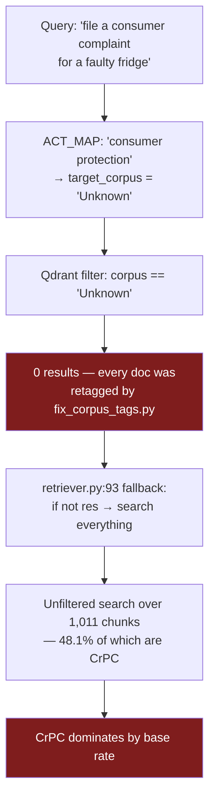

# Legal MVP — Gaps

**Read [`ARCHITECTURE.md`](ARCHITECTURE.md), [`FILE_STRUCTURE.md`](FILE_STRUCTURE.md), and [`DATAFLOW.md`](DATAFLOW.md) first.** Those describe the system neutrally. This document is where I argue that specific behaviours diverge from what you intended.

**Read this adversarially.** Every claim below carries the exact command or arithmetic that produces it, so you can check it yourself. If you disagree with a conclusion, the evidence is there to disagree *with*. Several of these are design consequences rather than mistakes — reasonable choices whose interaction produces an unreasonable result. Those are the interesting ones.

**Nothing here has been fixed.** No source file has been modified.

---

## Severity key

| | Meaning |
|---|---|
| 🔴 **BLOCKING** | Evaluation numbers generated before this is fixed will be meaningless |
| 🟠 **HIGH** | Wrong or unsafe output reaching users |
| 🟡 **MEDIUM** | Real defect, not blocking the research |
| 🔵 **INFRA** | Blocks the research workflow rather than the system |
| ⚫ **UNCONFIRMED** | Suspected; needs one command to settle |

---

## Summary table

| # | Finding | Severity | Blocks |
|---|---|---|---|
| [1](#1--entity_coverage-divides-chunks-by-entities) | `entity_coverage` divides chunks by entities | 🔴 | Calibration (item 3), ablation (item 5) |
| [2](#2--the-neutral-default-hands-out-30-for-free) | Neutral default hands out 0.30 for free | 🔴 | Calibration, tier semantics |
| [3](#3--guess_corpus-leaves-two-statutes-untaggable) | `guess_corpus` mis-tags IPC and CPA | 🔴 | Routing (item 4), all retrieval metrics |
| [4](#4--the-database-was-patched-the-code-was-not) | DB patched, code not — reverts on re-ingest | 🔴 | Reproducibility of everything |
| [5](#5--the-router-still-maps-consumer-protection--unknown) | Stale `ACT_MAP` entry → silent unfiltered fallback | 🔴 | Routing analysis |
| [6](#6--the-domain-fallback-conflates-criminal-with-penal) | Domain fallback conflates criminal with penal | 🔴 | Routing analysis |
| [7](#7--reranking-corrupts-top_score-and-max_score) | Reranking corrupts `top_score` (`retriever.py:119`) / `max_score` | 🔴 | Filtering behaviour, reported metrics |
| [8](#8--answers-cite-authority-that-was-never-retrieved) | 6/7 answers cite unretrieved authority | 🟠 | — (this is the paper's core result) |
| [9](#9--the-refusal-gate-is-structurally-unreachable) | Refusal gate structurally unreachable | 🟠 | The safety claim |
| [10](#10--three-corpora-exist-with-no-source-document) | Phantom corpora with no source document | 🟠 | Safety; routing analysis |
| [11](#11--nothing-is-logged) | Nothing is logged | 🔵 | **Everything** — item 2 |
| [12](#12--the-only-test-does-not-run) | The only test does not run | 🔵 | Regression safety |
| [13](#13--requirementstxt-cannot-install-this-project) | `requirements.txt` can't install the project | 🔵 | Reproducibility for reviewers |
| [14](#14--formathtml-renders-a-blank-question) | `?format=html` renders a blank question | 🟡 | — |
| [15](#15--the-static-mount-fails-silently-on-a-fresh-clone) | Static mount fails silently on fresh clone | 🟡 | — |
| [16](#16--the-section-normaliser-injects-false-markers) | Section normaliser injects false markers | 🟡 | Confounds signal 3 |
| [17](#17--a-divergent-duplicate-of-guess_corpus) | Divergent duplicate of `guess_corpus` | 🟡 | — |
| [18](#18--dead-parameters-and-unenforced-schemas) | Dead parameters, unenforced schemas | 🟡 | — |
| [19](#19--no-auth-no-limits-tracebacks-and-pdfs-leak) | No auth, no limits, tracebacks/PDFs leak | 🟠 | Deployment |
| [20](#20--repo-hygiene) | 41 MB blob + 36 `.pyc` tracked | 🟡 | — |
| [21](#21--the-architecture-pdf-does-not-reconcile) | Architecture PDF §8 doesn't reconcile | 🟠 | **Publication integrity** |
| [22](#22--readmemd-documents-a-file-that-does-not-exist) | README documents a nonexistent file | 🟡 | — |
| [23](#23--gpt-52-with-temperature0) | `gpt-5.2` with `temperature=0` | ⚫ | Possibly everything |

---

# 🔴 Blocking

## 1 · `entity_coverage` divides chunks by entities

**Where:** `agents/retriever.py:42-49`

**What was intended.** Your architecture document §7.2.3 defines it precisely:

> entity_coverage = count(top-5 chunks containing any entity) / count(entities)

and describes it in the `RetrievalResult` schema as *"Fraction of entities found in top 5 chunk texts."* A fraction — bounded in [0, 1].

**What the code computes:**

```python
entity_hits = sum(
    1 for c in chunks[:5]
    if any(e.lower() in c.payload.get("text", "").lower() for e in entities)
)
entity_coverage = entity_hits / len(entities)
```

The loop iterates **chunks**, so `entity_hits` ranges 0–5. The divisor is **entities**, typically 1. The two are different units.

**The arithmetic.** One entity (`"Section 41"`), three of the top-5 chunks containing it:

```
entity_hits     = 3
len(entities)   = 1
entity_coverage = 3 / 1 = 3.0        ← not a fraction

contribution    = 0.30 × 3.0 = 0.90
```

Against a HIGH threshold of 0.55, that single term alone clears the tier. Add signal 1 at a typical 0.55 × 0.42 ≈ 0.23 and signal 2 at ~0.14, and the total is ~1.27 — clamped by `min(confidence, 1.0)` to exactly **1.0**.

**Why it went unnoticed:** the clamp at line 60 hides it. You never see 3.0; you see 100%.

**The consequence, stated carefully.** Enumerate the cases:

| Situation | `entity_coverage` | Signal-3 contribution |
|---|---|---|
| No entity extracted | `1.0` (default branch) | 0.30 |
| Entity extracted, 0 chunks match | `0.0` | 0.00 |
| Entity extracted, 1 chunk matches | `1.0` | 0.30 |
| Entity extracted, 3 chunks match | `3.0` | 0.90 → clamps |

Signal 3 pays 0.30 or more in every case **except** "entity extracted and nothing matched." So the composite is, in effect, **a binary detector of entity-match failure** wearing the clothes of a continuous three-signal score. Signals 1 and 2 together span only 0.55 × (0.35→0.55) + 0.15 ≈ 0.19–0.30 — rarely enough to move a tier on their own.

**Blocks:** Prof. Joshi's item 3 (calibration) and item 5 (ablation). A reliability diagram would show a degenerate spike at 1.0. An ablation over weights `(0.55, 0.15, 0.30)` is not interpretable when one term isn't bounded in [0, 1].

**Verify:**
```python
from agents.retriever import compute_confidence
class C:
    def __init__(s, t): s.payload = {"text": t}
chunks = [C("Section 41 arrest")] * 3 + [C("unrelated")] * 2
print(compute_confidence([0.5]*5, ["Section 41"], chunks))
# entity_coverage prints as 3.0; confidence clamps to 1.0
```

**Fix direction:** iterate entities, not chunks —
`sum(1 for e in entities if any(e.lower() in c.payload.get("text","").lower() for c in chunks[:5])) / len(entities)`

---

## 2 · The neutral default hands out 0.30 for free

**Where:** `agents/retriever.py:48-49`

Separate from finding 1, and it survives fixing it.

```python
else:
    entity_coverage = 1.0  # No entities to match — neutral
```

"Neutral" is doing a lot of work. Assigning 1.0 means the signal contributes its **full 0.30 weight** whenever no section number was mentioned — which is the majority of layman queries, exactly the population the system exists for.

**What that does to the tier.** To reach HIGH (0.55) with the 0.30 already banked:

```
0.55 × top_k_mean + 0.15 × (1 − gap_penalty) ≥ 0.25
```

With typical tight gaps (signal 2 ≈ 0.14), you need `top_k_mean ≥ 0.20`. Your own §7.3 states legal scores sit at **0.35–0.55**. So **every no-entity query with any retrieval at all lands in HIGH.**

**Confirmed in the real trace.** [`DATAFLOW.md`](DATAFLOW.md) works it end to end: an arrest query retrieving fifteen chunks about child trafficking, riots, and election expenses scores **0.66 — HIGH tier, no disclaimer.**

Your architecture document §8.1 reports the dowry-death case at 70.6% HIGH and reads it as validation. The arithmetic checks out exactly (`0.55×0.499 + 0.15×0.8767 + 0.30×1.0 = 0.7060`) — but 0.30 of that 0.706 was the default, not a measurement. That test case demonstrates the free grant, not retrieval quality.

**Fix direction:** this is a design decision, not a one-line fix. Options: renormalise the remaining weights when no entity exists; treat entity coverage as a *penalty* rather than a *bonus*; or make "no entity extracted" its own state. Whichever you choose belongs in [`DECISIONS.md`](DECISIONS.md) with the reasoning.

---

## 3 · `guess_corpus` leaves two statutes untaggable

**Where:** `ingest/chunk.py:47`

**Evidence** — running the live ingest path over your four PDFs:

| Document | Chunks | Tags actually assigned |
|---|---|---|
| Bharatiya Nyaya Sanhita 2023 | 209 | `BNS` **100%** ✅ |
| CrPC 1973 | 482 | `BNSS` **100%** ✅ |
| IPC 1860 (`repealedfileopen.pdf`) | 248 | **`Unknown` 95.2%**, `BSA` 2.4%, `Judgments` 1.6% |
| Consumer Protection Act 2019 | 72 | **`Unknown` 86.1%**, `Judgments` 5.6%, `BNSS` 4.2% |

**Reproduce:**
```python
from ingest.extract import extract_text_pdf_bytes
from ingest.chunk import chunk_page
from pathlib import Path
import collections
for pdf in sorted(Path("tests/data").glob("*.pdf")):
    t = collections.Counter()
    for page, text in extract_text_pdf_bytes(pdf.read_bytes()):
        for c in chunk_page(pdf.name, page, text): t[c["corpus"]] += 1
    print(pdf.name, dict(t))
```

**Mechanism.** `guess_corpus` inspects `doc_name + text[:200]` for `"bns"`, `"nyaya"`, `"ipc"`. Two things defeat it:

1. The filename is `repealedfileopen.pdf` — it contains none of those strings.
2. **A statute never names itself by acronym.** The IPC's own text says *"this Code"*, never *"IPC"*. The same applies to the CPA.

The two documents that tag correctly do so by accident of filename: `Bharatiya_Nyaya_Sanhita_2023.pdf` contains `"nyaya"`, and `the_code_of_criminal_procedure,_1973.pdf` contains `"procedure"`.

**Consequence.** `ACT_MAP` maps `"ipc" → "BNS"`. So a query mentioning IPC filters to `corpus == "BNS"` — which contains only the BNS 2023 document. **The 248 chunks of actual IPC 1860 text are unreachable through any IPC query.** The system answers IPC questions from the replacement statute, silently.

**Blocks:** every retrieval metric, and item 4 (routing).

---

## 4 · The database was patched; the code was not

**Where:** `fix_corpus_tags.py` vs `ingest/chunk.py`

`fix_corpus_tags.py` rewrites the `corpus` payload on existing Qdrant points:

```python
DOC_CORPUS = {
    "repealedfileopen.pdf": "BNS",
    "Bharatiya_Nyaya_Sanhita_2023.pdf": "BNS",
    "the_code_of_criminal_procedure,_1973.pdf": "BNSS",
    "a2019-35.pdf": "ConsumerProtection",
}
```

It works. It also **never touches `guess_corpus`**. So the live index is correct while the code that produced it is not.

**Consequence:** any re-ingestion — adding a document, rebuilding the collection, running on another machine — silently reverts to finding 3. Your index and your code disagree, and nothing detects the disagreement.

**Why this matters more than it looks.** For a paper, the pipeline must be reproducible from source. Right now, reproducing your setup requires running an undocumented one-off script that is gitignored. A reviewer could not reproduce your results, and neither could you on a fresh machine.

**Fix direction:** move the mapping into `guess_corpus`, re-ingest from scratch, and **delete `fix_corpus_tags.py`** so the divergence cannot recur.

---

## 5 · The Router still maps `"consumer protection" → "Unknown"`

**Where:** `agents/router.py:24`

```python
"consumer protection": "Unknown",
```

This was a workaround for finding 3 — CPA chunks were tagged `Unknown`, so the Router routed there. But `fix_corpus_tags.py` then retagged them `ConsumerProtection`, and `ACT_MAP` was never updated.

**The full chain:**



**This is the drift you reported to your professor** — and the mechanism is not the one you hypothesised. You wrote that you suspected "the Router only matches keywords like ipc and crpc." The keyword *is* matching. It maps to a corpus that no longer exists, the fallback silently removes all filtering, and an index that is **48.1% CrPC by volume** does the rest.

**Confirmed in the record:** `Straightforward_Queries.docx` Q2, *"How do I file a consumer court complaint for a faulty fridge?"* — all 15 citations from `the_code_of_criminal_procedure,_1973.pdf`.

**Index composition** (from finding 3's measurement):

| Corpus | Chunks | Share |
|---|---|---|
| `BNSS` | 486 | **48.1%** |
| `Unknown` | 298 | 29.5% |
| `BNS` | 209 | 20.7% |
| `Judgments` | 8 | 0.8% |
| `BSA` | 7 | 0.7% |
| `Constitution` | 3 | 0.3% |

**Two separable defects here**, worth measuring independently for the paper: the stale mapping, and the fact that the fallback drops filtering *silently* with no signal in the response.

---

## 6 · The domain fallback conflates "criminal" with "penal"

**Where:** `agents/router.py:67-71`

```python
if "Criminal" in context.predicted_legal_domain:
    target_corpus = "BNS"
```

**The category error.** Criminal law has two halves:

- **Penal** (IPC / BNS) — what is an offence, what is the punishment
- **Procedural** (CrPC / BNSS) — arrest, bail, FIR, jurisdiction, trial

Questions like *"can police arrest without a warrant?"*, *"where do I file an FIR?"*, *"how do I get bail?"* are **procedural**. The fallback routes all of them to the penal code.

**Evidence** — from the recorded runs, every query that hit this fallback:

| Query | Routed to | Should have been |
|---|---|---|
| "Police are arresting my brother without a warrant right now" | BNS | BNSS |
| "Cyber crime committed in Bangalore, victim in Delhi. Where to file FIR?" | BNS | BNSS |
| "A builder cheated me (Contract Act) and threatened me (IPC)" | BNS | Contract Act (absent) |

The first is traced hop by hop in [`DATAFLOW.md`](DATAFLOW.md). Fifteen chunks about trafficking, riots, and election expenses, returned for an arrest question, at HIGH confidence.

**Why this is the most interesting finding for the paper:** nothing malfunctioned. Intake correctly classified the domain as Criminal. The fallback correctly applied its rule. The filter correctly restricted to BNS. The retriever correctly returned the nearest chunks. Every component behaved as specified, and the composition produced a dangerous answer. That is a much stronger result than "there was a bug."

---

## 7 · Reranking corrupts `top_score` and `max_score`

**Where:** `agents/retriever.py:105-127`

Step 5 reorders results by entity presence, **independent of score**:

```python
res = prioritized + others
```

Step 6 then reads position 0 as if it were still the maximum:

```python
top_score = res[0].score
adaptive_threshold = max(top_score - ADAPTIVE_DROP, MIN_SCORE_FLOOR)
```

After reranking, `res[0]` is *the first entity-matching chunk*, which may have scored well below the true maximum.

**Worked example.** Scores `[0.62, 0.58, 0.41, 0.39]`, entity `"Section 41"` present only in the 0.41 chunk:

```
After rerank:  [0.41, 0.62, 0.58, 0.39]
top_score      = 0.41                      ← not the max (0.62)
threshold      = max(0.41 − 0.15, 0.35) = 0.35
```

The correct threshold would have been `max(0.62 − 0.15, 0.35) = 0.47`, which excludes 0.41 and 0.39. Instead everything passes. **The filter loosens exactly when reranking fires.**

`max_score` at line 149 has the same defect:
```python
max_score = round(all_scores[0], 4) if all_scores else 0.0
```
`all_scores` is built from the reranked list, so `[0]` is not the maximum. The value reported to the UI and to any future logging is wrong.

**Note this does *not* affect `compute_confidence`** — that re-sorts internally (`sorted(scores, reverse=True)`). Only the threshold and the reported max are affected.

**Fix direction:** `top_score = max(all_scores)`.

---

# 🟠 High

## 8 · Answers cite authority that was never retrieved

**Where:** the interaction of `agents/answer.py` and reality. Not localisable to a line.

**Evidence** — every straightforward query, comparing the answer's "Relevant Legal Provisions" table against what retrieval actually returned:

| Query | Answer cites | Present in retrieved chunks |
|---|---|---|
| Landlord withholding deposit | Contract Act s.73, CPC Order 37, LSA Act s.12 | **0/3** — none of those Acts are in the corpus |
| Consumer court, faulty fridge | CPA ss. 2(6), 2(10), 2(11), 35, 39, 47/58 | **0/6** — CPA *is* indexed but wasn't retrieved |
| Dowry harassment non-bailable? | IPC 498A, DP Act 3–4, CrPC 41/41A/438/439 | **1/6** |
| NI Act s.138 ingredients | NI Act 138, 139, 142, 146 | **0/4** — Act absent from corpus |
| Anticipatory bail s.438 CrPC | CrPC 438, 437(3), 439 | **3/3** ✅ |
| Culpable homicide vs murder | IPC 299, 300, 302, 304, 304A | **0/5** — retrieved BNS, cited IPC |
| Arrest without warrant | BNSS 35, 47, 48, 58 + Art. 22(1) | **0/5** |

**Six of seven answers assert statutory authority that was never retrieved.**

**Mechanism.** Grounding is *requested*, not *enforced*. The prompt asks the model to use the search results; no mechanism checks that it did. When retrieval returns nothing useful, the model falls back on parametric knowledge — fluently, without announcing the switch.

Meanwhile the citation panel is built mechanically from retrieved chunks (`answer.py:129`), independent of the answer text. So the UI shows:

> **Answer:** cites BNSS §35, §47, §48, §58, Article 22(1)
> **Citations / Sources:** 15 excerpts on child trafficking, riots, dowry

Two lists with nothing to do with each other, presented as though one supports the other.

**Your design principle, from the architecture document §2.1:**

> *"Every claim in the system's response must be traceable to a specific document, page, and text snippet in the vector database."*

Measured rate: **1 of 7**.

**This is not only a defect — it is the strongest empirical result you have.** It reproduces Dahl et al. (2024) and Magesh et al. (2025) on your own system, with a measurable rate and a mechanistic explanation. See [`EVALUATION_PLAN.md`](EVALUATION_PLAN.md) for turning it into a metric.

**Caveat:** n=7 on one category, from a code version that predates confidence scoring. Directionally strong, not yet publishable.

---

## 9 · The refusal gate is structurally unreachable

**Where:** `agents/retriever.py:136`, `agents/answer.py:83`

```python
refused = len(filtered) == 0
```

For `filtered` to be empty, `res` must be empty — because `retriever.py:123` forces at least 3 chunks through whenever 3 exist. And for `res` to be empty, Qdrant must return nothing for a `limit=15` search over a 1,011-chunk collection.

The only path is: a corpus filter matching zero points **and** the unfiltered retry also returning zero. The retry searches everything, so it returns zero only if the collection is empty.

**In practice: refusal cannot fire on a populated index.**

**Evidence:** 0 refusals across all 23 recorded runs, including queries about Acts entirely absent from the corpus.

**The design intent** (architecture document §12.2) was that low confidence should still answer, with disclaimers — reasonable, and I'd defend it. But the *stated* fail-safe is:

> *"When zero usable chunks pass filtering, the system refuses to answer rather than hallucinate."*

"Usable" implies a quality judgement. The implementation only asks "does anything exist." Those are very different guarantees, and the gap between them is where finding 8 lives.

---

## 10 · Three corpora exist with no source document

**Where:** `ingest/chunk.py:47` + `agents/router.py`

The keyword rules produce tags for documents that were never ingested:

| Tag | Chunks | Actual source |
|---|---|---|
| `Constitution` | 3 | Fragments of CrPC/CPA containing the word "article " |
| `BSA` | 7 | Fragments containing "evidence" |
| `Judgments` | 8 | Fragments containing "appeal" or "air " |

**No constitutional document, no evidence act, and no case law was ever ingested.** These tags are pure artefacts of substring matching.

**The dangerous path.** The Router *can* route to all three (`ACT_MAP` has `"constitution"`, `"iea"`, `"bsa"`, `"evidence act"`). A query like *"What does Article 21 guarantee?"*:

1. `ACT_MAP` → `target_corpus = "Constitution"`
2. Filter admits **3 chunks**, all mis-tagged fragments of criminal procedure
3. Fallback doesn't fire — 3 ≠ 0
4. `retriever.py:123` forces all 3 through
5. `entities = ["Article 21"]`, 0 chunks match → coverage 0.0 → LOW tier → answer with a strong disclaimer

So it does hedge. But it answers a constitutional question from three random criminal-procedure fragments, and shows them as sources.

**`tests/test_router.py` asserts this path as correct behaviour** — it expects `"Explain Article 21 of Constitution"` to route to `Constitution`. The test encodes routing into an empty bucket as the desired outcome.

---

## 19 · No auth, no limits, tracebacks and PDFs leak

**Where:** `app.py`

Grouped because they share a cause — the app was built for local development and never hardened.

| Issue | Where | Risk |
|---|---|---|
| No authentication on any endpoint | all | Anyone reaching the port can query or ingest |
| No upload size cap; `await f.read()` loads whole files into memory | `app.py:56` | A few large PDFs OOM the process |
| No rate limiting | all | Each `/query` costs 2 OpenAI calls against your key |
| Full traceback returned to the client | `app.py:75` | Leaks absolute paths and internals |
| No CORS policy | — | Defaults apply |
| PDFs never cleaned up, served without auth | `app.py:132-138` | Reports contain the user's legal query verbatim at a guessable 8-hex path |

The last one deserves weight. A user asks *"my husband hits me when he drinks"*; the answer is written to `static/report_a3f9c21b.pdf` and served to anyone who requests that path. There is no expiry and no cleanup. For a system handling this category of query, that is a privacy exposure independent of any deployment plan.

---

# 🔵 Infrastructure

## 11 · Nothing is logged

**Where:** `core/logging.py` (unused) and every agent

`core/logging.py` configures a `req_id` formatter, a stdout handler, and a filter. **Nothing imports it.**

```bash
grep -rn "from core.logging\|import logging" --include=*.py . | grep -v venv
```
→ only the definition, plus one unused import in `app.py:16`.

Every agent uses bare `print()`:

```python
print(f"[Retrieval] Confidence: {conf['confidence']:.4f} ...")
```

Unstructured, uncorrelated, unparseable, gone when the terminal scrolls.

**Consequence:** the system has never recorded its own retrieval scores. That is why [`DATAFLOW.md`](DATAFLOW.md) has 🔷 illustrative values where it should have measurements, and why your architecture document §8 contains hedged values ("~0.40", "Small", "Low") rather than numbers.

**This is Prof. Joshi's item 2, and it is the true unblocker.** One structured record per query — all three signals, raw and filtered scores, routing decision, whether the fallback fired, retrieved doc/page/corpus, tier, refusal — feeds items 3, 4, and 5 simultaneously.

**The good news:** `clients/` is the only code touching OpenAI and Qdrant, so instrumentation has exactly two natural insertion points, plus `compute_confidence`.

---

## 12 · The only test does not run

**Where:** `tests/test_router.py:22`

```python
plan = router.route(q)     # q is a str
```

`RouterAgent.route()` takes a `CaseContext` and immediately does `context.original_query` → `AttributeError` on the first case.

Three further problems: it has no assertions (it prints `[PASS]`/`[FAIL]`), it is not pytest-discoverable in any meaningful sense, and its expectations are stale — it expects `Judgments` routing that `router.py:61-64` deliberately removed, and `Constitution` routing into the empty bucket from finding 10.

**Verify:** `python tests/test_router.py`

**Why it matters now:** you are about to change `guess_corpus`, `ACT_MAP`, the domain fallback, and `compute_confidence`. Without tests, you will not know what your fixes broke.

---

## 13 · `requirements.txt` cannot install this project

**Where:** `requirements.txt`

```
MISS fastapi  uvicorn  streamlit  qdrant-client  fpdf2  pymupdf
MISS pdfplumber  python-docx  pytesseract  langdetect  python-multipart  pytest
OK   jinja2
```

Every runtime dependency is absent. Present instead: `torch`, `torchvision`, `ultralytics`, `opencv-python`, `pycocotools`, `thop` — a YOLO computer-vision stack this project does not import.

**Consequence:** `pip install -r requirements.txt` downloads ~2.5 GB of unrelated packages and still cannot `import app`. Nobody — including a reviewer, including you on a new machine — can reproduce your environment.

**Your venv has the correct versions:** fastapi 0.115.0, qdrant-client 1.9.1, openai 1.97.1, fpdf2 2.8.5, streamlit 1.49.1, uvicorn 0.30.6, PyMuPDF 1.26.4, pdfplumber 0.11.4, python-docx 1.1.2, python-multipart 0.0.20, langdetect 1.0.9.

---

# 🟡 Medium

## 14 · `?format=html` renders a blank question

`app.py:146` calls `render_html(data)`; the template does `{{query}}`; `AnswerAgent.answer()` never puts `query` in its dict. Jinja renders undefined as empty, silently. `core/schemas.py:AnswerJSON` declares the field but is imported and unused.

## 15 · The static mount fails silently on a fresh clone

```python
try:
    app.mount("/static", StaticFiles(directory="static"), name="static")
except RuntimeError:
    pass
```

`static/` is gitignored, so on a fresh clone it doesn't exist; `StaticFiles` raises; the bare except swallows it; `/static` is never mounted; every `report_url` 404s with nothing logged. Create the directory before mounting.

## 16 · The section normaliser injects false markers

`ingest/chunk.py:8`:

```python
text = re.sub(r'(?m)^\s*(\d+\s?[A-Za-z]?)\s*\.', r'Section \1.', text)
```

Rewrites *any* line starting with a number and a period into `"Section N."` — including numbered lists, page numbers, and dates in statutory PDFs.

The purpose is sound (making "Section" literally present helps entity matching). But there is a research consequence: **signal 3 is measured against text that preprocessing synthetically altered.** A chunk can match `"Section 41"` because page 41 began with `41.`, not because it contains section 41. When you ablate signal 3, this is a confound you must control for or disclose.

## 17 · A divergent duplicate of `guess_corpus`

`scripts/ingest_cli.py` is not a CLI — it is a copy of `ingest/chunk.py` whose `guess_corpus` is **strictly better**: it knows `ConsumerProtection`, maps filenames explicitly (`repealedfileopen.pdf → BNS`), and has richer keyword lists.

The good version is in a script nothing imports; the deficient version is in the live pipeline. Fixing finding 3 largely means promoting this one.

## 18 · Dead parameters and unenforced schemas

- `style` is threaded `app.py:115` → `AnswerAgent.answer(style=...)` and never read. Streamlit doesn't send it either — it appends the hint to the query text (`streamlit_app.py:75`), so the style instruction becomes part of what gets embedded.
- `AnswerJSON` / `Citation` are defined and imported, never used. Nothing validates the response shape.
- `new_req_id`, `embed_texts` imported in `app.py`, unused.
- `TOP_K` and `USE_TRANSLATION` in `core/config.py` are read by nothing; `retrieve()` hard-codes `limit=15`.
- `ensure_collection(dim=1536)` is a hard-coded default with no guard against `EMBED_MODEL` changing.

## 20 · Repo hygiene

| Item | Detail |
|---|---|
| `full_codebase.py` | **41 MB**, gitignored *but still tracked* — `.gitignore` doesn't untrack. It is why `.git` is 27 MB. |
| `.pyc` files | **36 tracked**, across `cpython-311` and `cpython-313`, including for the orphaned `retrieve/` modules |
| Debris | `.env~`, `x`, `out.html`, `debug_report.pdf`, `results.csv`, `app_backup.py` |

`.env` was **never committed** — verified across full history. No secret leak.

---

# Documentation drift

## 21 · The architecture PDF does not reconcile

**This is the one with publication consequences.**

`Legal_MVP_Architecture_Document (2).pdf` §8 presents two validation cases.

**§8.1 (dowry death) checks out exactly:**
```
0.55 × 0.499 + 0.15 × (1 − 0.037/0.3) + 0.30 × 1.00
= 0.2745 + 0.1315 + 0.30 = 0.7060  →  70.6% ✓
```

**§8.2 (FIR quashing) cannot be produced by the formula.** Reported: top-5 mean ~0.40, "Small" gap, "Low" entity coverage, composite **43.3%**. With coverage at 0, the ceiling is:

```
0.55 × 0.40 + 0.15 × 1.0 = 0.22 + 0.15 = 0.37
```

0.37 < 0.433. To reach 43.3% you need a positive coverage term — contradicting *"'Narinder Singh' and 'Section 307' NOT found in top chunks."* The values are internally inconsistent.

The hedged notation ("~0.40", "Small", "Low") suggests these were reconstructed from memory rather than logged — consistent with finding 11, and with what you told your professor.

**Do not carry §8 into a paper.** Regenerate both cases from real logs. A reviewer who checks the arithmetic will find this, and it costs credibility disproportionate to the error.

**§9 also contradicts the code.** It states IPC 1860 → `BNS` and CPA 2019 → `Unknown`. Measured (finding 3): IPC is 95.2% `Unknown`, and the CPA is 86.1% `Unknown` with fragments scattered across four other tags.

## 22 · `README.md` documents a file that does not exist

| README claims | Reality |
|---|---|
| `retrieve/mmr.py` — MMR diversification | **File does not exist** |
| Retriever does "MMR, evidence packing" | Neither |
| Answer Agent does "JSON validation" | Removed; returns a raw dict |
| `retrieve/` + `answer/` as live modules | Orphaned — only `app_backup.py` imports them |

---

# ⚫ Unconfirmed

## 23 · `gpt-5.2` with `temperature=0`

`.env` sets `MODEL_NAME=gpt-5.2`. Both call sites pass `temperature=0`:

- `clients/openai_client.py:15` (Intake)
- `agents/answer.py:119` (Answer)

GPT-5-family models reject non-default `temperature` with a 400. **If that is happening here:**

- `IntakeAgent` catches it (`intake.py:92`), prints `[Intake] LLM CRASH`, and returns a hardcoded fallback `CaseContext` — `domain="General"`, `issues=[]`. Which would mean the domain fallback in finding 6 never fires and routing is even blunter than described.
- `AnswerAgent` catches it (`answer.py:123`) and returns `"I'm sorry, I encountered an error generating the answer."`

Both failures print and continue. Neither surfaces in the response.

Your architecture document says GPT-4o-mini throughout, so this may be an untracked `.env` change made after those documents were written.

**One command settles it:**
```bash
python -c "from clients.openai_client import chat_json; print(chat_json([{'role':'user','content':'hi'}]))"
```

**If it fails:** any test run made under this configuration is void, and that needs establishing before the 23 recorded runs are used for anything. Tracked in [`OPEN_QUESTIONS.md`](OPEN_QUESTIONS.md).

---

# What I'd fix first, and why

Not a plan — [`EVALUATION_PLAN.md`](EVALUATION_PLAN.md) has that. This is the reasoning about order.

**Settle finding 23 first.** One command. If the model call is failing, several other findings need reinterpreting.

**Then findings 11 and 13** — logging and dependencies. Neither changes system behaviour, so they cannot invalidate anything, and both are prerequisites for measuring. Logging first: it lets you *observe* the effect of every later fix.

**Then 12** — a real test suite, before you change behaviour, not after.

**Then the routing cluster (3, 4, 5, 6)** together. They are one entangled problem: corpus tags, the patch script, the stale mapping, the fallback. Fixing any one alone leaves the others masking it. Re-ingest cleanly afterwards.

**Then the confidence cluster (1, 2, 7).** Finding 1 is a line. Finding 2 is a design decision needing a `DECISIONS.md` entry. Finding 7 is a line.

**Then re-run the evaluation.** Only now do numbers mean anything.

**Findings 8, 9, 10 are results, not just defects.** Measure them before and after. The delta is your paper.

One caution: fix the *code*, never the *data*. Finding 4 is what happens otherwise, and it hid finding 3 for six months.
