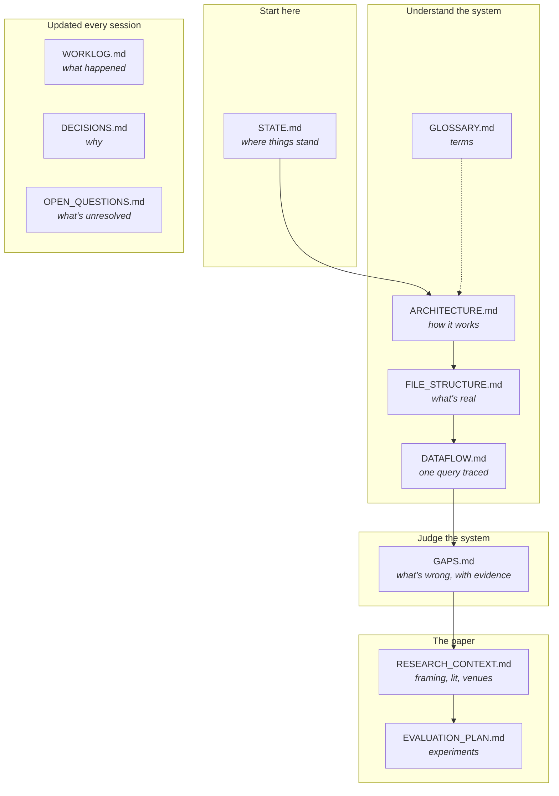

# Legal MVP — Documentation

Everything about this project that isn't code. Start with [`STATE.md`](STATE.md).

---

## The map

---

## Reference documents

Written once, revised when the system changes.

| Doc | Answers | Read when | Time |
|---|---|---|---|
| **[STATE.md](STATE.md)** | Where does this project stand *right now*? | **First, always.** Especially returning after a break | 10 min |
| **[ARCHITECTURE.md](ARCHITECTURE.md)** | How does the system work? | Understanding, or before changing anything | 45 min |
| **[FILE_STRUCTURE.md](FILE_STRUCTURE.md)** | Which files matter? Which are dead? | Before opening an unfamiliar file | 10 min |
| **[DATAFLOW.md](DATAFLOW.md)** | What does the data look like at each hop? | **The most useful single doc.** Debugging, or making it concrete | 20 min |
| **[GLOSSARY.md](GLOSSARY.md)** | What does this term mean? | Reference — dip in | — |
| **[GAPS.md](GAPS.md)** | What's broken, and how do I verify it? | After the four above | 40 min |
| **[RESEARCH_CONTEXT.md](RESEARCH_CONTEXT.md)** | Why is this research? What's the contribution? | Paper decisions, supervisor meetings | 20 min |
| **[EVALUATION_PLAN.md](EVALUATION_PLAN.md)** | What experiments, in what order? | Planning work | 20 min |

## Mirrored context — for readers outside Claude Code

Claude Code keeps the build plan and its project memory **outside** this repository. Open this project in Cursor, VS Code, or hand it to another model and none of that would be visible. These two files mirror it in, so the repo is self-contained.

| Doc | Holds | Regenerate with |
|---|---|---|
| **[PLAN.md](PLAN.md)** | The agreed build plan, verbatim — phases, decisions, verification | `python scripts/sync_context.py` |
| **[PROJECT_CONTEXT.md](PROJECT_CONTEXT.md)** | All 8 memory files — who's working on this, the working agreement, the supervisor's directive, known defects, token costs | same |

⚠ **Do not edit these two by hand** — they are overwritten on every sync. Edit the source, then re-run the script.

## Living documents

Appended to continuously. **These are the ones that make a cold start possible.**

| Doc | Holds | Update when |
|---|---|---|
| **[WORKLOG.md](WORKLOG.md)** | Dated session journal, newest first | **Every session**, at the end |
| **[DECISIONS.md](DECISIONS.md)** | *Why* each significant choice was made | Whenever a choice is made that a future reader would question |
| **[OPEN_QUESTIONS.md](OPEN_QUESTIONS.md)** | Unresolved items; resolved ones move to a Resolved section | When you hit an unknown, and when you settle one |

---

## The documentation protocol

Full rules in [`../CLAUDE.md`](../CLAUDE.md). The short version:

| You did this | Update this |
|---|---|
| Changed code | `WORKLOG.md` + whichever reference doc describes that code |
| Made a design choice | `DECISIONS.md` |
| Hit something you can't resolve | `OPEN_QUESTIONS.md` |
| Resolved an open question | Move it to `OPEN_QUESTIONS.md` → Resolved, with the answer and date |
| Ran an experiment | `WORKLOG.md` + the results file, with the git SHA |
| Ended a session | `WORKLOG.md`, always |

**Why this is non-negotiable here.** In February 2026 this project was left in working order. By August 2026 the reasoning behind `target_corpus = None` for civil queries, the `"consumer protection" → "Unknown"` mapping, and the choice of a 1.0 neutral default were all unrecoverable without re-deriving them from source. Six months erased context that took months to build. That is the failure this protocol exists to prevent — and it is why `DECISIONS.md` matters more than it looks.

---

## Reading paths

**Returning after a break** → `STATE.md` → `WORKLOG.md` (last 2–3 entries) → `OPEN_QUESTIONS.md`

**New to the project** → `STATE.md` → `ARCHITECTURE.md` → `FILE_STRUCTURE.md` → `DATAFLOW.md` → `GAPS.md`

**About to change code** → `FILE_STRUCTURE.md` (is this file live?) → the relevant `ARCHITECTURE.md` section → `DECISIONS.md` (was this deliberate?)

**Debugging** → `DATAFLOW.md` → `ARCHITECTURE.md` Pass 4 → `GAPS.md`

**Writing the paper** → `RESEARCH_CONTEXT.md` → `EVALUATION_PLAN.md` → `GAPS.md`

**Meeting the supervisor** → `STATE.md` → `WORKLOG.md` → `EVALUATION_PLAN.md` (progress against his five items)

---

## Elsewhere

| | |
|---|---|
| [`../CLAUDE.md`](../CLAUDE.md) | Project conventions, auto-loaded by Claude Code each session |
| [`../README.md`](../README.md) | Public-facing overview. ⚠ Overstates the system — see [`GAPS.md`](GAPS.md) #22 |
| `Legal_MVP_Architecture_Document (2).pdf` | Earlier architecture doc (on Desktop). ⚠ §8 doesn't reconcile, §9 contradicts the code — see [`GAPS.md`](GAPS.md) #21 |
| `../testing_results/` | The 23 recorded runs. Pre-fix baseline only |

---

*Documentation set created 2026-08-17.*
