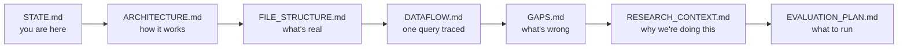

# Legal MVP — Current State

**Read this first.** Written 2026-08-17 for the version of you (or of Claude) opening this repo cold.

---

## Where things stand in one paragraph

The system is **built and runs end to end**: upload PDFs → ask a question in plain English → get a structured answer with citations and a downloadable PDF report. Five agents, FastAPI backend, Streamlit UI, Qdrant vector store, ~1,400 lines of source. What it does *not* yet do is work correctly on most queries: retrieval routes to the wrong statute in the large majority of recorded cases, the confidence score is miscomputed in a way that saturates it near the top, and six of seven sampled answers cite legal authority that was never retrieved. None of this was known before 2026-08-17. **No fixes have been applied** — the code is exactly as you left it in February.

---

## Reading order

Documentation is layered deliberately. Follow this order the first time.



| Doc | What it gives you | Time |
|---|---|---|
| [`ARCHITECTURE.md`](ARCHITECTURE.md) | How the system works, from plain language to line-level. Explains embeddings, cosine similarity, chunking as it goes. | 45 min |
| [`FILE_STRUCTURE.md`](FILE_STRUCTURE.md) | Which of the 84 files matter, which are dead, which are debris. | 10 min |
| [`DATAFLOW.md`](DATAFLOW.md) | One real query traced hop by hop with actual values. **The single most useful document if you read only one.** | 20 min |
| [`GLOSSARY.md`](GLOSSARY.md) | Legal and technical terms. Reference, not linear. | — |
| [`GAPS.md`](GAPS.md) | 23 findings with reproducible evidence. **Read adversarially.** | 40 min |
| [`RESEARCH_CONTEXT.md`](RESEARCH_CONTEXT.md) | The paper: framing, literature, supervisor's directive, venues. | 20 min |
| [`EVALUATION_PLAN.md`](EVALUATION_PLAN.md) | The five experiments and their prerequisites. | 20 min |

**Why architecture before gaps.** The gaps document argues that specific behaviours are wrong. You cannot evaluate that argument — or push back on it — without an independent picture of what the system does. Read the description first, form your own view, then read the critique.

Living documents, updated continuously rather than read once: [`WORKLOG.md`](WORKLOG.md), [`DECISIONS.md`](DECISIONS.md), [`OPEN_QUESTIONS.md`](OPEN_QUESTIONS.md).

---

## What works

- **The ingest pipeline runs.** 4 PDFs → 1,011 chunks → embedded → indexed. Reproducible, confirmed by `ingest_debug.log`.
- **The five-agent pipeline runs end to end.** Every stage produces its contract and hands off cleanly.
- **Intake triage is decent.** Urgency, persona, and complexity classification land sensibly on the recorded queries; the paralegal regex override behaves as designed.
- **The architecture is clean.** Linear, typed, single-responsibility stages. Every external call funnels through `clients/`. This is genuinely good design and it is why the fixes ahead are tractable.
- **Streamlit works.** Upload, query, dashboard, citations, PDF download.
- **PDF generation works**, including Unicode → Latin-1 sanitisation.

## What doesn't

| | Detail |
|---|---|
| **Routing** | 1 of 11 recorded queries routed to the right corpus |
| **Corpus tagging** | IPC 95.2% `Unknown`, CPA 86.1% `Unknown`; three corpora exist with no source document |
| **Confidence** | `entity_coverage` divides chunks by entities → exceeds 1.0 → saturates the clamp |
| **Grounding** | 6 of 7 answers cite authority never retrieved |
| **Refusal** | Structurally unreachable on a populated index; fired 0 times in 23 runs |
| **Logging** | None. `core/logging.py` exists and is imported by nothing |
| **Tests** | The one test file raises `AttributeError` on its first case |
| **Install** | `requirements.txt` lists no runtime dependency of this project |

Full evidence in [`GAPS.md`](GAPS.md).

---

## What changed since February 2026

The last commits were `ce1bded` (composite confidence scoring) and `57722ef` (merge). Since then: nothing, until 2026-08-17.

On **2026-08-17** a full review was performed. **No source code was modified.** What was produced:

- This documentation set (`docs/`), `CLAUDE.md`, and session hooks
- Three measurements that did not previously exist:
  1. Corpus tag distribution from running the live ingest path over the four PDFs
  2. Index composition — `BNSS` 48.1%, `Unknown` 29.5%, `BNS` 20.7%
  3. Citation-vs-retrieval comparison across the 7 straightforward recorded queries

---

## The 23 recorded runs — what they do and don't prove

`testing_results/` holds four Word documents: Straightforward (7), Reasoning (4), Complex (6), Vague/Tricky (6).

**They prove:**
- Routing was wrong in 10 of 11 cases where citations were captured
- 6 of 7 straightforward answers cite unretrieved authority
- The refusal gate never fired
- End-to-end latency runs 18–65 seconds

**They do not prove anything about the confidence system.** No `"confidence"` key appears in any captured Raw JSON, and every query returned exactly 15/15 citations — meaning `limit=15` with zero adaptive filtering. **These runs predate commit `ce1bded`.**

**Therefore:** usable as a labelled *pre-fix baseline*. Never as an evaluation of the current system, and never mixed with post-fix numbers. Whether to keep them as a baseline or discard and re-run is open — see [`OPEN_QUESTIONS.md`](OPEN_QUESTIONS.md).

---

## How to run it

```bash
# 1 · Vector database
docker compose up -d                          # Qdrant on :6333

# 2 · Backend
./venv/Scripts/activate                       # Windows
uvicorn app:app --reload                      # :8000

# 3 · UI (separate terminal)
streamlit run streamlit_app.py                # :8501
```

Checks:
```bash
curl http://127.0.0.1:8000/healthz            # {"ok":true,"build":"..."}
curl http://127.0.0.1:8000/diag/env           # {"openai_key_set":true}
```

Ingest the corpus:
```bash
python scripts/ingest_cli_debug.py            # posts tests/data/*.pdf to /ingest
```

> ⚠ **Do not `pip install -r requirements.txt`** — it lists none of this project's dependencies and pulls ~2.5 GB of unrelated CV packages. The existing `venv/` has the right versions. See [`GAPS.md`](GAPS.md) #13.

> ⚠ **Do not run `fix_corpus_tags.py`** on a fresh index. It patches the database instead of the code, which is what hid the corpus-tagging problem for six months. See [`GAPS.md`](GAPS.md) #4.

---

## Immediate next steps

Reasoning in [`GAPS.md`](GAPS.md#what-id-fix-first-and-why); experiments in [`EVALUATION_PLAN.md`](EVALUATION_PLAN.md).

| # | Step | Why now |
|---|---|---|
| 0 | Settle the `gpt-5.2` / `temperature=0` question — one command | Binary; if it fails, other findings need reinterpreting |
| 1 | Regenerate `requirements.txt` from the venv | Reproducibility; changes no behaviour |
| 2 | Wire up structured logging | **The unblocker.** Lets you observe every later fix |
| 3 | Write real tests for Router and `compute_confidence` | Before changing behaviour, not after |
| 4 | Fix the routing cluster (`guess_corpus`, `ACT_MAP`, domain fallback, silent filter drop), then re-ingest cleanly | One entangled problem; fixing one alone leaves the others masking it |
| 5 | Fix the confidence cluster (`entity_coverage`, neutral default, rerank/threshold ordering) | The neutral default is a design decision → needs a `DECISIONS.md` entry |
| 6 | Build the annotated evaluation set (50–100 queries, ground-truth sections) | Supervisor's item 1; can proceed in parallel with 1–5 |
| 7 | Re-run the full evaluation | Only now do the numbers mean anything |

---

## Deferred

Real, logged, not urgent.

| Task | Note |
|---|---|
| Reconcile `README.md` | Documents `retrieve/mmr.py`, which doesn't exist. Do it after the fixes, not before. |
| Delete orphaned code | `retrieve/`, `answer/`, `app_backup.py`, `scripts/ingest_cli.py` — but promote its better `guess_corpus` first |
| Repo hygiene | `git rm --cached full_codebase.py` (41 MB) and 36 tracked `.pyc` files |
| Regenerate the architecture PDF | §8 doesn't reconcile, §9 contradicts the code — see [`GAPS.md`](GAPS.md) #21 |
| Harden the API | Auth, rate limits, upload caps, PDF expiry — before any deployment |
| Decide on case law | The corpus has no judgments; some queries can only ever fail |

---

## Facts worth memorising

| | |
|---|---|
| Corpus | 4 PDFs, **1,011 chunks** |
| Composition | `BNSS` 48.1% · `Unknown` 29.5% · `BNS` 20.7% · `Judgments` 0.8% · `BSA` 0.7% · `Constitution` 0.3% |
| Embedding | `text-embedding-3-small`, 1536-d, cosine |
| Typical scores | **0.35–0.55** — not 0.8+; every threshold is calibrated to this |
| Confidence tiers | HIGH ≥ 0.55 · MEDIUM ≥ 0.38 · LOW < 0.38 |
| Retrieval | `limit=15`, adaptive threshold `max(top − 0.15, 0.35)`, ≥3 chunks forced through |
| Latency | 18–65 s end to end |
| Absent from corpus | Constitution, Evidence Act, case law, NI Act, Contract Act, Limitation Act |
