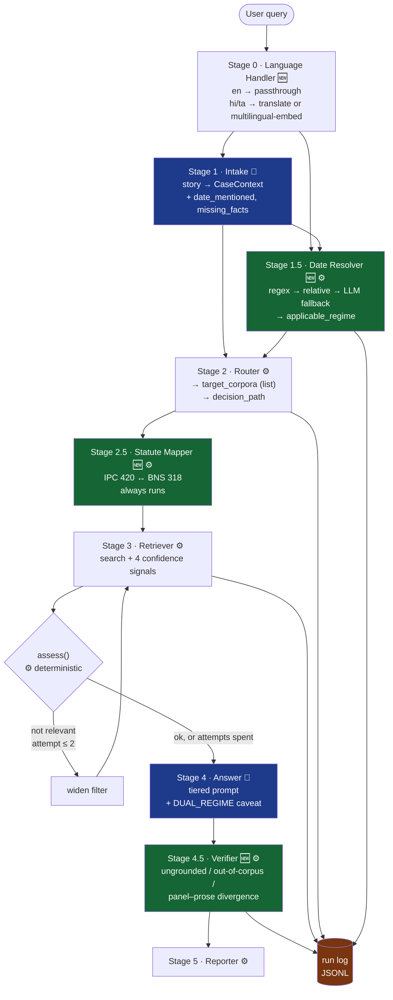

# Target Architecture

**What this is:** the system we are building, stage by stage, with exact inputs and outputs.

**What it is not:** [`ARCHITECTURE.md`](ARCHITECTURE.md) describes the system **as it exists today**. This describes where it is **going**. Read that one first if you want to know what's currently running.

**Status:** design agreed 2026-08-22. Nothing here is built yet.

---

## Notation

| Symbol | Meaning |
|---|---|
| 🤖 | Makes an LLM call — costs money, takes ~2s, output can vary between runs |
| ⚙️ | Deterministic — same input always gives the same output, free, instant |
| 🆕 | New stage |
| ✏️ | Existing stage, modified |

**Design rule: everything that produces a number for the paper must be ⚙️.** A measuring instrument that gives different answers on different runs is not a measuring instrument.

---

## Part 1 — What the system is actually doing

### In one paragraph

A person describes a legal problem in ordinary language. The system works out what kind of problem it is and *when it happened*, decides which body of law applies, finds the relevant passages in a database of statutes, writes an answer using only those passages, then **checks its own answer** to see whether the laws it cited were actually among the passages it found. It reports how confident it is — and, critically, it records everything so we can measure where that confidence is wrong.

### The two things that make this different from a normal RAG system

**① It knows that laws have dates.**

On 1 July 2024, India replaced the IPC with the BNS. Both are still valid law — which one applies depends on **when the offence happened**, not on when the question is asked. So the system has to work out a date from a story, and use it to choose a body of law.

**② It audits itself.**

After writing an answer, it extracts every section number it cited and checks whether that section was actually in the retrieved text. This is both a safety feature and the instrument that produces the paper's numbers.

---

## Part 2 — The ingest pipeline (changed)

Run rarely. Everything downstream depends on it.

### Stage I1 — Extract ⚙️

```
IN:   file_bytes: bytes, filename: str
OUT:  pages: list[tuple[int, str]]        (page_number, text)
```
Unchanged. PyMuPDF, with Tesseract OCR fallback for scanned pages.

### Stage I2 — Chunk ✏️ ⚙️

**Changed: structure-aware splitting instead of fixed 450-token windows.**

```
IN:   doc_name: str, page: int, text: str
OUT:  chunks: list[Chunk]
```

```python
Chunk:
    doc_name: str
    page: int
    chunk_index: int
    chunk_id: str
    text: str
    section_number: str | None      # 🆕 "41", "41A" — parsed from the heading
    section_heading: str | None     # 🆕 "When police may arrest without warrant"
    corpus: str
    statute_code: str               # 🆕 "IPC" | "BNS" | "CRPC" | "CPA"
    in_force_from: date             # 🆕
    in_force_until: date | None     # 🆕 None = still in force
    lang: str
```

**Why the change.** Statutes announce their own boundaries — `Section 41.` starts a provision. Cutting at a fixed token count splits provisions in half; cutting at section boundaries does not. The data already tells us where the seams are, so we use them.

**Rules:**
- Split on section headings; keep a whole section together where possible
- If a section exceeds ~800 tokens, split within it and mark the parts as siblings
- If a section is very short, keep it standalone anyway — do not merge unrelated provisions

**The new fields matter downstream.** `section_number` lets the verifier check citations exactly. `in_force_from` / `in_force_until` let the retriever filter by date.

### Stage I3 — Tag corpus ✏️ ⚙️

**Changed: explicit filename mapping instead of keyword guessing.**

```
IN:   doc_name: str, text: str
OUT:  corpus: str, statute_code: str, in_force_from: date, in_force_until: date | None
```

```python
DOCUMENT_REGISTRY = {
  "repealedfileopen.pdf":                     ("IPC",  date(1860,1,1), date(2024,6,30)),
  "Bharatiya_Nyaya_Sanhita_2023.pdf":         ("BNS",  date(2024,7,1),  None),
  "the_code_of_criminal_procedure,_1973.pdf": ("CRPC", date(1974,4,1),  date(2024,6,30)),
  "a2019-35.pdf":                             ("CPA",  date(2020,7,20), None),
}
```

Keyword guessing is what produced 95% `Unknown` on the IPC. A registry cannot be wrong about a document it names.

### Stage I4 — Embed & index ⚙️

```
IN:   chunks: list[Chunk]
OUT:  (written to Qdrant)
```
Batches of 64. Model pinned: `openai/text-embedding-3-small` via OpenRouter with `provider: {only: ["openai"], allow_fallbacks: false}`.

---

## Part 3 — The query pipeline

### Stage 0 — Language Handler 🆕 ⚙️/🤖

*Only active in the multilingual experiment. English queries pass straight through.*

```
IN:   raw_query: str
OUT:  LanguageContext
        raw_query: str
        detected_lang: str              "en" | "hi" | "ta"
        query_for_embedding: str
        translation_used: bool
        translation_model: str | None
        route: str                      "passthrough" | "translate" | "multilingual_embed"
```

Three routes, which are the experiment arms:

| Route | What happens | Type |
|---|---|---|
| `passthrough` | English, unchanged | ⚙️ |
| `translate` | Sarvam Mayura → English, then normal pipeline | 🤖 |
| `multilingual_embed` | Keep original text, embed with BGE-M3 | ⚙️ |

**Everything after this stage is identical regardless of language.** That is the whole point of putting it first.

---

### Stage 1 — Intake 🤖

**Goal:** turn an unstructured story into structured facts about the *situation*.

```
IN:   query: str

OUT:  CaseContext
        original_query: str
        scenario: str
        user_persona: str               "Layman" | "Paralegal"
        urgency: str
        financial_status: str
        complexity: str
        predicted_legal_domain: str
        legal_issues: list[str]
        missing_facts: list[str]        # ← now load-bearing
        date_mentioned: bool            # 🆕
        date_expression: str | None     # 🆕 verbatim: "last March", "in 2019"
        llm_ok: bool                    # 🆕 logging
        fallback_used: bool             # 🆕 logging
```

**Two new date fields.** The Intake agent already reads the whole story; asking it to also flag any time expression costs nothing extra and gives Stage 1.5 something to parse.

**`missing_facts` becomes functional.** It currently feeds only the display. Now:
- If it contains a date-related item → contributes to `date_unknown`
- Its contents are appended to the answer as *"to give you a precise answer, tell me: …"*
- It is logged, so we can measure whether it correlates with failure

Deterministic regex override on `user_persona` still applies afterwards.

---

### Stage 1.5 — Date Resolver 🆕 ⚙️ (🤖 fallback)

**Goal:** determine **when the events happened**, because that decides which code governs.

```
IN:   query: str, case_context: CaseContext, today: date

OUT:  DateContext
        event_date: date | None
        date_range: tuple[date, date] | None
        date_source: str          "explicit"|"relative"|"inferred"|"absent"
        date_confidence: float
        applicable_regime: str    "IPC_ERA"|"BNS_ERA"|"SPANS_BOUNDARY"|"UNKNOWN"
        reasoning: str            for the log
```

**Three passes, cheapest first:**

1. **⚙️ Explicit dates** — regex for `"15 March 2023"`, `"2019"`, `"15/03/2023"`
2. **⚙️ Relative expressions** — `"last year"`, `"two months ago"`, `"last March"` resolved against `today`
3. **🤖 LLM fallback** — only if 1 and 2 find nothing *and* `case_context.date_mentioned` is true

**The regime boundary:**

```
event_date <  2024-07-01   →  IPC_ERA
event_date >= 2024-07-01   →  BNS_ERA
range spans it             →  SPANS_BOUNDARY
no date at all             →  UNKNOWN     ← the common case
```

---

### Stage 2 — Router ✏️ ⚙️

**Goal:** decide *where to look* and *what to look for*. No LLM — routing errors happen before retrieval and cannot be recovered from, so it must be inspectable.

```
IN:   CaseContext, DateContext

OUT:  QueryPlan
        original_query: str
        rewritten_query: str
        intent: str
        target_corpora: list[str]       # ✏️ was a single str|None
        corpus_reason: str              # 🆕 why these
        entities: list[Entity]          # ✏️ was list[str]
        boost_terms: list[str]
        decision_path: str              # 🆕 which rule fired
        case_context: CaseContext
        date_context: DateContext
```

```python
Entity:
    raw: str                # "Section 420 IPC"
    kind: str               # "section" | "article" | "order" | "rule"
    number: str             # "420"
    statute_hint: str|None  # "IPC"
```

**Two structural changes:**

- **`target_corpora` is a list.** The old single-value field forced "one corpus" or "everything." A list allows "IPC **and** BNS, labelled."
- **`decision_path` is recorded.** Not just *what* was chosen, but *which rule chose it* — `act_map` / `date_regime` / `domain_fallback` / `both_codes_date_unknown`. This turns "it picked BNS" into "it picked BNS *because the domain fallback fired*", which is the difference between a fact and a finding.

**Corpus selection order:**

```
1. Explicit act named ("IPC", "BNS")     → that code (+ its counterpart, see Stage 2.5)
2. DateContext gives a regime            → the code in force then
3. Date UNKNOWN + criminal domain        → BOTH codes, flagged      ← your decision D
4. Domain is procedural (arrest/bail/FIR)→ CRPC
5. Consumer terms                        → CPA
6. Nothing matched                       → all corpora, no filter
```

**Fixing the old bug:** the domain fallback used to send *all* criminal queries to the penal code. It now distinguishes penal from procedural, because "can police arrest without a warrant" is procedure, not an offence definition.

---

### Stage 2.5 — Statute Mapper 🆕 ⚙️

**Goal:** handle the fact that the same offence has two different section numbers depending on era.

```
IN:   entities: list[Entity], DateContext, target_corpora: list[str]

OUT:  ResolvedStatutes
        query_provisions: list[str]
        mapped_provisions: list[MappedProvision]
        target_corpora: list[str]          # possibly widened
        mapping_note: str | None           # user-facing explanation
```

```python
MappedProvision:
    source: str            # "IPC 420"
    target: str            # "BNS 318"
    relation: str          # "one_to_one"|"one_to_many"|"many_to_one"|"new"|"omitted"
    confidence: str        # "official"|"derived"|"uncertain"
```

**It always runs, but does different work:**

| Situation | Action |
|---|---|
| Section number given | Look up the counterpart; search both; label results |
| No section number | Cannot translate — but still ensures both corpora are searched and labelled |

**The mapping table** is built from official government comparison documents (BPRD, state police directories) as a data artifact in `data/ipc_bns_mapping.csv`. It is a releasable resource.

**Why one-to-many matters.** `IPC 354 → BNS 74, 75, 76, 77, 78`. So "Section 354 IPC" does not have *an* answer — it has five candidates, and which one applies depends on the facts. The `relation` field records this so the answer can say so instead of silently picking one.

---

### Stage 3 — Retriever ✏️ ⚙️ (with loop)

**Goal:** find the relevant passages — and notice when it has failed.

```
IN:   QueryPlan, ResolvedStatutes

OUT:  RetrievalResult
        chunks: list[ScoredChunk]
        confidence: float
        top_k_mean: float
        score_gap: float
        entity_coverage: float
        entity_coverage_default_used: bool   # 🆕
        statute_consistency: float           # 🆕 4th signal
        max_score: float
        total_retrieved: int
        total_chunks: int
        refused: bool
        attempts: int                        # 🆕
        attempt_log: list[Attempt]           # 🆕
        loop_fired: bool                     # 🆕
        scores_raw: list[float]              # 🆕 pre-filter, for offline ablation
```

**The loop:**

```
attempt = 1
while attempt <= 2:
    hits = qdrant.search(vector, filter=current_filter, limit=15)
    verdict = assess(hits, plan)          # ⚙️ deterministic
    if verdict.ok or attempt == 2:
        break
    current_filter = widen(current_filter, verdict.reason)
    attempt += 1
```

**The assessment is deterministic** — your decision, and the right one, because this sits inside the measuring instrument:

```python
def assess(hits, plan) -> Verdict:
    # 1. corpus match: do hits come from the corpora we asked for?
    # 2. term overlap: do query content words appear in hit text?
    # 3. entity presence: if a section was named, is it there?
    # 4. score floor: is the top score above MIN_SCORE_FLOOR?
```

**The fourth confidence signal — statute consistency:**

```
statute_consistency = fraction of retrieved chunks whose statute_code
                      is in the set implied by the query + date
```

This is the signal that would have caught every routing failure in the recorded runs. It is *also* the thing the paper argues generic confidence signals lack.

---

### Stage 4 — Answer 🤖

**Goal:** write the answer using only the retrieved passages.

```
IN:   original_query: str, RetrievalResult, ResolvedStatutes, DateContext, CaseContext

OUT:  AnswerResult
        answer: str
        prompt_variant: str            "HIGH"|"MEDIUM"|"LOW"|"DUAL_REGIME"
        citations_from_chunks: list[Citation]
        date_caveat: str | None        # 🆕
        missing_facts_prompt: str|None # 🆕
        refused: bool
        llm_ok: bool
        latency_ms: int
        provider_name: str             # 🆕 which company actually served it
        cost_usd: float                # 🆕
```

**New prompt variant `DUAL_REGIME`** — used when `applicable_regime == "UNKNOWN"` and both codes were searched. This is your decision D, made concrete:

> *"Your answer depends on when this happened. If before 1 July 2024, IPC §420 applies. If on or after, BNS §318 applies. Both say broadly the same thing about cheating, but the section number you quote in any complaint must match the correct code."*

**`missing_facts_prompt`** turns Intake's `missing_facts` into a closing line asking for what's missing — with the date first when it's unknown.

---

### Stage 4.5 — Verifier 🆕 ⚙️

**Goal:** check whether the answer's citations are supported by the retrieved text. This is the measuring instrument.

```
IN:   answer: str, chunks: list[ScoredChunk], corpus_index: CorpusIndex, ResolvedStatutes

OUT:  CitationAudit
        cited_provisions: list[CitedProvision]
        n_cited: int
        n_grounded: int
        n_ungrounded: int
        n_out_of_corpus: int
        ungrounded_rate: float          # ← metric 1
        out_of_corpus_rate: float       # ← metric 2
        panel_prose_jaccard: float      # ← metric 3 (new to the literature)
        vintage_errors: list[VintageError]
        substantively_ok: bool | None   # human-annotated later
```

```python
CitedProvision:
    raw: str            # "BNSS Section 35"
    statute: str        # "BNSS"
    number: str         # "35"
    status: str         # "grounded"|"ungrounded"|"out_of_corpus"

VintageError:
    cited: str          # "BNSS 35"
    corpus_has: str     # "CRPC 41"
    relation: str       # "old_to_new"|"new_to_old"|"unrelated"
```

**How it works — no LLM, ~50 lines:**

1. Regex every statutory reference out of the answer prose
2. For each: is it in the retrieved chunks? → grounded / ungrounded
3. Is it anywhere in the corpus at all? → out_of_corpus
4. Compare the set cited in prose against the set shown in the citation panel → `panel_prose_jaccard`
5. If cited statute ≠ corpus statute but the mapping table relates them → `vintage_error`

**Metric 3 has no published baseline.** That is the one that is yours.

---

### Stage 5 — Reporter ✏️ ⚙️

```
IN:   query, QueryPlan, AnswerResult, CitationAudit
OUT:  pdf_path: str
```
Adds a **Citation Audit** section showing which cited provisions were supported. Unicode font support (Noto) replaces the Latin-1 coercion so Devanagari survives.

---

## Part 4 — The whole pipeline



**Two LLM calls total** (blue). Everything new is deterministic (green).

---

## Part 5 — Goal of every stage, in one line

| Stage | Goal | Type |
|---|---|---|
| **0 · Language** | Get any language to a form the pipeline can search | ⚙️/🤖 |
| **1 · Intake** | Understand the *situation*: what kind of problem, what's missing | 🤖 |
| **1.5 · Date** | Work out *when*, because that decides which law | ⚙️ |
| **2 · Router** | Decide *where to look*, and record *why* | ⚙️ |
| **2.5 · Mapper** | Bridge the two numbering schemes | ⚙️ |
| **3 · Retriever** | Find passages, judge quality, retry once if bad | ⚙️ |
| **4 · Answer** | Write using only what was found; flag date ambiguity | 🤖 |
| **4.5 · Verifier** | Check the answer's citations against the evidence | ⚙️ |
| **5 · Reporter** | Produce the PDF, including the audit | ⚙️ |

---

## Part 6 — The phases

Each phase ends with something usable, because available time is unpredictable.

### Phase 0 · Instrument what exists — *no fixes yet*
Build the **Verifier** and run it over the 23 recorded answers.
**Why first:** needs no fixes, no re-ingest, no new queries. Produces the first real numbers in days. If the out-of-corpus rate is near zero, the paper's premise is wrong and we find out now.
**Deliverable:** three metrics on existing data.

### Phase 1 · Unblock
OpenRouter migration (pinned) · structured JSONL logging · `requirements.txt` · real tests · `scripts/run_eval.py`.
**Deliverable:** every query produces a complete, reproducible record.

### Phase 2 · Fix and re-ingest
Structure-aware chunking · document registry · Router corpus list + decision_path · confidence bug fixes · clean re-ingest.
**Deliverable:** a system whose corpus tags are correct and whose numbers mean something.

### Phase 3 · The evaluation set
100+ queries, **paired** IPC-numbered / BNS-numbered / no-number. Gold sections annotated in advance. ~30 expert-validated.
**Deliverable:** `eval/queryset.jsonl` — a releasable resource.

### Phase 4 · Core experiments
Cross-statute confusion · citation grounding · confidence blindness (AUROC) · routing comparison · ablations.
**Deliverable:** the paper's tables and figures.

### Phase 5 · Intervention
Date Resolver · Statute Mapper · corrective loop · measure before/after.
**Deliverable:** "we found a failure and fixed it" — the strongest form of the paper.

### Phase 6 · Multilingual *(optional)*
Hindi + Tamil, 50 queries, five arms.
**Deliverable:** a paper section. Droppable without harming the core.

---

## Part 7 — Design decisions taken

Recorded here; each gets an ADR in [`DECISIONS.md`](DECISIONS.md) when implemented.

| # | Decision | Rationale |
|---|---|---|
| 1 | Date unknown → **search both codes and say so** | Legally correct; a silent default would be wrong for any pre-July-2024 fact pattern |
| 2 | Loop assessment **deterministic** | It sits inside the measuring instrument; must be reproducible |
| 3 | Statute mapper **always runs** | Follows from #1 — corpus labelling is needed even with no section number |
| 4 | **Structure-aware chunking** | Statutes announce their own boundaries; fixed windows split provisions |
| 5 | `missing_facts` becomes **functional** | The date is a missing fact, and it is the one that decides the applicable code |
| 6 | `target_corpora` is a **list** | Single-value forced "one corpus or everything"; dual-regime needs both |
| 7 | Only **2 LLM calls** | Cost, latency, and reproducibility |
| 8 | Multilingual at **Stage 0 only** | Keeps it droppable; gold labels transfer unchanged |
